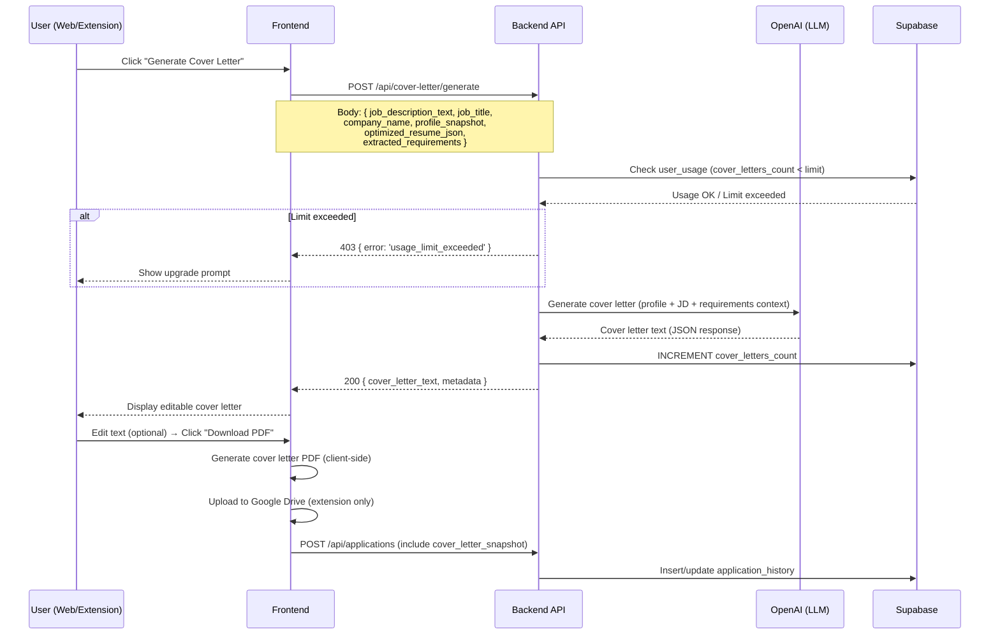
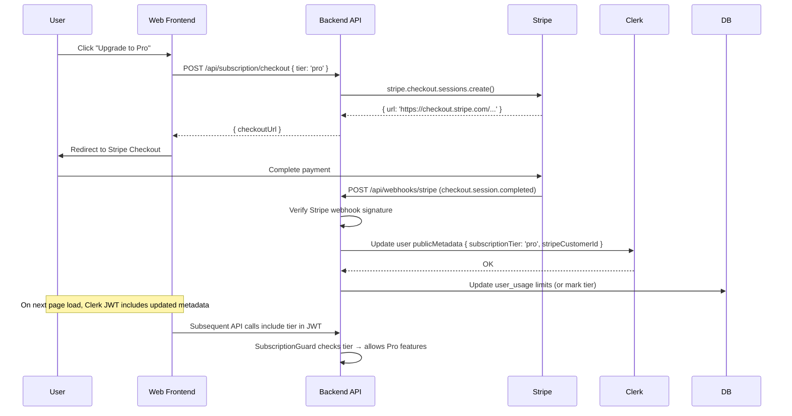
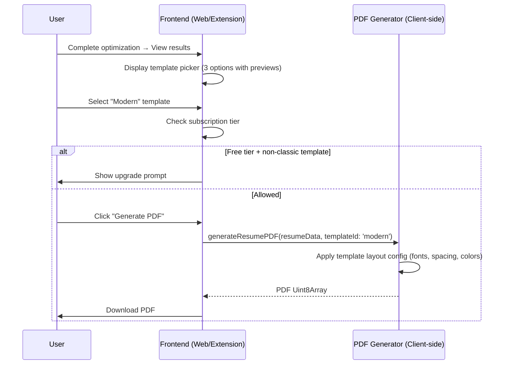

# High-Level Design — MVP Phase 06

**Version:** 1.0  
**Date:** 2026-03-31  
**Source:** BRD-MVP-06 (REQ-06-01, REQ-06-02, REQ-06-03)  
**Author:** Architect Agent  
**Review Status:** DRAFT  

---

## 1. Phase Objective

### Business Goal
Transform Smart Apply from a free single-feature MVP into a monetisable product with a complete application package (resume + cover letter), tiered subscription pricing, and professional template selection — closing the three most critical competitive gaps identified against AIApply.co.

### User-Facing Outcome After This Phase
1. Users can generate a tailored cover letter alongside their optimized resume for each job application.
2. Users choose from 3+ resume templates before generating a PDF.
3. A freemium model gates advanced features behind Pro/Premium tiers while preserving a generous free tier for acquisition.

### In-Scope Requirements (BRD-MVP-06 Phase 6A)

| REQ | Title | Priority |
|:---|:---|:---|
| REQ-06-01 | AI Cover Letter Generation | P0 |
| REQ-06-02 | Subscription & Payment Model (Freemium) | P0 |
| REQ-06-03 | Resume Template Selection | P0 |

### Out of Scope (Phase 6B / 6C)
- REQ-06-04: AI Interview Preparation (P1)
- REQ-06-05: Auto-Apply Job Submission (P1)
- REQ-06-06: Landing Page & SEO Foundation (P1)
- REQ-06-07 through REQ-06-10: P2 future roadmap

---

## 2. Component Scope

### Affected Repositories

| Repository | Impact | Reason |
|:---|:---|:---|
| `smart-apply-shared` | MODIFIED | New schemas: cover letter types, subscription tier enum, usage types, template types |
| `smart-apply-backend` | MODIFIED | New modules: CoverLetterModule, SubscriptionModule. Modified: OptimizeModule (optional cover letter), LlmService (cover letter prompt). New guard: SubscriptionGuard. New table: user_usage |
| `smart-apply-web` | MODIFIED | New routes: /pricing. Modified: optimize flow (cover letter generation step, template picker). New components: CoverLetterPreview, TemplatePicker, PricingPage, UpgradePrompt |
| `smart-apply-extension` | MODIFIED | Modified: popup results screen (cover letter generation, template selection), PDF generator (multi-template), service-worker (cover letter save) |
| `supabase` | MODIFIED | New migration: user_usage table, cover_letter_snapshot column on application_history |

### Explicitly Out of Scope for This Phase
- Stripe Customer Portal (self-service subscription management) — Phase 6B
- Invoice PDF generation — not needed for MVP
- Annual billing toggle — Phase 6B
- Cover letter template selection (separate from resume templates) — Phase 6B
- Bulk cover letter generation — Phase 6B

---

## 3. Architecture Decisions

### AD-06-01: Cover Letter as Extension of Optimize Flow (Not Separate Endpoint)

**Decision:** The cover letter is generated via a new `POST /api/cover-letter/generate` endpoint that takes a reference to a completed optimization (the `OptimizeResponse` context) rather than duplicating the optimization pipeline.

**Rationale:**
- Cover letters require the same context (profile + JD + extracted requirements + optimized resume) already produced by the optimize endpoint
- Decoupled from optimize so users can generate a cover letter after-the-fact without re-running optimization
- The endpoint accepts the optimization context as input, avoiding a second LLM call for extraction/scoring

**Alternative Considered:** Embed cover letter generation into `POST /api/optimize` response.  
**Rejected Because:** Forces cover letter generation on every optimization; increases latency for users who only want resume optimization; violates single-responsibility principle.

### AD-06-02: Stripe Checkout for Payment (No Custom Payment UI)

**Decision:** Use Stripe Checkout Sessions for payment collection. No credit card form is rendered in Smart Apply.

**Rationale:**
- PCI compliance handled entirely by Stripe
- Minimal frontend code (redirect to Stripe-hosted checkout page)
- Consistent with zero-storage privacy principle (no payment data touches our servers)
- Follows existing webhook pattern (Clerk webhooks) for lifecycle events

**Implementation:**
- `POST /api/subscription/checkout` — Creates a Stripe Checkout Session, returns the checkout URL
- `POST /api/webhooks/stripe` — Receives Stripe events (checkout.session.completed, customer.subscription.updated, customer.subscription.deleted)
- Clerk user public metadata stores `subscriptionTier` and `stripeCustomerId`

### AD-06-03: Subscription Tier Enforcement at API Boundary (SubscriptionGuard)

**Decision:** Create a `SubscriptionGuard` NestJS guard that reads the user's subscription tier from Clerk JWT claims and enforces feature access per endpoint.

**Rationale:**
- Server-side enforcement prevents bypass via direct API calls
- JWT claims include Clerk public metadata (no extra DB query needed)
- Client-side gating is cosmetic only — displays upgrade prompts but does not enforce

**Implementation:**
- `@RequiresTier('pro')` decorator on protected endpoints
- Guard reads `publicMetadata.subscriptionTier` from JWT verification result
- Returns HTTP 403 `{ error: 'upgrade_required', required_tier: 'pro', current_tier: 'free' }`

### AD-06-04: Usage Tracking in Supabase (user_usage Table)

**Decision:** Track monthly feature usage (optimizations, cover letters) in a new `user_usage` Supabase table, enforced server-side before executing paid operations.

**Rationale:**
- RLS-protected usage data per user
- Simple monthly reset via compound key (`clerk_user_id`, `usage_month`)
- Backend checks usage before executing LLM calls (fail-fast, don't waste tokens)

**Schema:**
```sql
CREATE TABLE user_usage (
  id UUID DEFAULT gen_random_uuid() PRIMARY KEY,
  clerk_user_id TEXT NOT NULL,
  usage_month TEXT NOT NULL,           -- '2026-03' format
  optimizations_count INTEGER DEFAULT 0,
  cover_letters_count INTEGER DEFAULT 0,
  created_at TIMESTAMPTZ DEFAULT now(),
  updated_at TIMESTAMPTZ DEFAULT now(),
  UNIQUE (clerk_user_id, usage_month)
);

ALTER TABLE user_usage ENABLE ROW LEVEL SECURITY;
CREATE POLICY "Users can manage own usage" ON user_usage
  FOR ALL USING (requesting_clerk_user_id() = clerk_user_id);
```

### AD-06-05: Resume Templates as Data-Driven Layouts (Template Registry)

**Decision:** Define resume templates as a registry of layout configurations (font, spacing, section order, color scheme) consumed by the PDF generator. Templates are code-defined, not database-stored.

**Rationale:**
- No runtime template fetching (templates ship with the build)
- Type-safe template definitions via shared types
- PDF generation remains client-side (both web and extension)
- Easy to add new templates without database migrations

**Template Structure:**
```typescript
interface ResumeTemplate {
  id: 'classic' | 'modern' | 'minimal';
  name: string;
  description: string;
  previewImageUrl: string;
  layout: {
    fontFamily: string;
    headingFontFamily: string;
    fontSize: number;
    headingSize: number;
    nameSize: number;
    margins: { top: number; bottom: number; left: number; right: number };
    lineSpacing: number;
    sectionSpacing: number;
    accentColor: { r: number; g: number; b: number };
    sectionOrder: ('contact' | 'summary' | 'experience' | 'education' | 'skills')[];
    showSectionDividers: boolean;
    headerAlignment: 'left' | 'center';
  };
}
```

### AD-06-06: Cover Letter PDF Uses Standard Letter Format

**Decision:** Cover letters generate as a single-page PDF with a standard business letter layout (sender info, date, recipient, body paragraphs, sign-off). The layout is fixed (not template-selectable in this phase).

**Rationale:**
- Cover letters have a standard format across industries
- Template selection for cover letters is lower priority than for resumes
- Keeps phase scope manageable

---

## 4. Data Flow

### 4.1 Cover Letter Generation Flow



### 4.2 Subscription & Payment Flow



### 4.3 Resume Template Selection Flow



---

## 5. API Contracts

### 5.1 New Endpoints

#### POST /api/cover-letter/generate

**Auth:** ClerkAuthGuard + SubscriptionGuard (free: 1/month, pro/premium: unlimited)

**Request:**
```typescript
interface GenerateCoverLetterRequest {
  job_description_text: string;   // Full JD text
  job_title: string;              // Target role
  company_name: string;           // Target company
  profile_snapshot: MasterProfile; // User's current profile
  optimized_resume_json?: OptimizedResume; // Optional — if available from prior optimize
  extracted_requirements?: ExtractedRequirements; // Optional — reuse if available
}
```

**Response (200):**
```typescript
interface GenerateCoverLetterResponse {
  cover_letter_text: string;      // Full cover letter body
  metadata: {
    word_count: number;
    estimated_read_time_seconds: number;
    key_skills_highlighted: string[];
  };
}
```

**Error Responses:**
- 400: Invalid request body (Zod validation)
- 401: Missing/invalid auth token
- 403: `{ error: 'usage_limit_exceeded', limit: 1, used: 1, tier: 'free' }`
- 500: LLM service failure

---

#### POST /api/subscription/checkout

**Auth:** ClerkAuthGuard

**Request:**
```typescript
interface CreateCheckoutRequest {
  tier: 'pro' | 'premium';
  success_url?: string;   // Default: WEB_BASE_URL/dashboard?upgraded=true
  cancel_url?: string;    // Default: WEB_BASE_URL/pricing
}
```

**Response (200):**
```typescript
interface CreateCheckoutResponse {
  checkout_url: string;   // Stripe Checkout session URL
}
```

---

#### GET /api/subscription/status

**Auth:** ClerkAuthGuard

**Response (200):**
```typescript
interface SubscriptionStatusResponse {
  tier: 'free' | 'pro' | 'premium';
  usage: {
    optimizations: { used: number; limit: number | null }; // null = unlimited
    cover_letters: { used: number; limit: number | null };
  };
  stripe_customer_id?: string;
  current_period_end?: string;  // ISO date
}
```

---

#### POST /api/webhooks/stripe

**Auth:** Stripe webhook signature verification (no ClerkAuthGuard)

**Handled Events:**
- `checkout.session.completed` → Set subscription tier in Clerk metadata
- `customer.subscription.updated` → Update tier on plan change
- `customer.subscription.deleted` → Revert to free tier

---

### 5.2 Modified Endpoints

#### POST /api/applications (Modified)

**Change:** Accept optional `cover_letter_snapshot` field.

```typescript
interface CreateApplicationRequest {
  // ... existing fields ...
  cover_letter_snapshot?: string;   // NEW — cover letter text at time of application
  template_id?: string;             // NEW — which resume template was used
}
```

---

## 6. Security Considerations

### 6.1 Payment Security

| Concern | Mitigation |
|:---|:---|
| PCI compliance | All payment data handled by Stripe Checkout — no card data touches our servers |
| Stripe webhook authenticity | Verify webhook signatures using `stripe.webhooks.constructEvent()` with raw body (same pattern as Clerk webhooks in main.ts `rawBody: true`) |
| Subscription tier spoofing | Enforced server-side via `SubscriptionGuard` reading Clerk JWT claims. Client-side tier display is cosmetic |
| Checkout session hijacking | Stripe Checkout sessions are one-time-use and expire after 24h. `success_url` and `cancel_url` are validated server-side (must match WEB_BASE_URL) |

### 6.2 Usage Limit Enforcement

| Concern | Mitigation |
|:---|:---|
| Rate limit bypass via concurrent requests | Usage check + increment in a single Supabase RPC call (atomic) or optimistic increment before LLM call |
| Account cycling for free tier abuse | Usage tied to Clerk user ID with email verification. Rate-limit account creation via Clerk |
| LLM token cost explosion | Usage limits prevent unlimited LLM calls on free tier. Backend enforces limits before calling LLM |

### 6.3 Cover Letter Security

| Concern | Mitigation |
|:---|:---|
| PII in cover letter LLM prompts | Same safeguards as existing profile parsing — no PII logged, LLM responses validated |
| Cover letter storage | Zero-storage principle maintained — cover_letter_snapshot stored only in application_history (user-owned, RLS-protected) |
| XSS in cover letter display | Cover letter text rendered as plain text (not HTML). Use CSS `white-space: pre-wrap` |

---

## 7. Dependencies & Integration Points

### 7.1 Phase Dependencies

| Dependency | Status | Impact |
|:---|:---|:---|
| P7 Release Gate (BRD-MVP-05) | ✅ COMPLETE | Backend deployed to Render, CI pipeline complete, health checks working |
| Existing LLM service | ✅ AVAILABLE | Extend with cover letter prompt template |
| Existing PDF generator | ✅ AVAILABLE | Refactor to accept template configuration |
| Existing application history API | ✅ AVAILABLE | Extend schema for cover letter snapshot |

### 7.2 External Service Integrations

| Service | Purpose | New in This Phase |
|:---|:---|:---|
| **Stripe** | Payment processing & subscription management | ✅ NEW — Checkout Sessions, Webhooks, Customer objects |
| **Clerk** | Auth & user metadata (subscription tier storage) | MODIFIED — Write `publicMetadata.subscriptionTier` via Backend SDK |
| **OpenAI (LLM)** | Cover letter text generation | MODIFIED — New prompt template for cover letter generation |
| **Supabase** | Usage tracking, application history | MODIFIED — New `user_usage` table, new columns on `application_history` |
| **Google Drive** | Cover letter PDF upload | MODIFIED — Upload cover letter PDF alongside resume |

### 7.3 New Environment Variables

| Variable | Package | Purpose |
|:---|:---|:---|
| `STRIPE_SECRET_KEY` | Backend | Stripe API authentication |
| `STRIPE_WEBHOOK_SECRET` | Backend | Stripe webhook signature verification |
| `STRIPE_PRO_PRICE_ID` | Backend | Stripe Price ID for Pro plan |
| `STRIPE_PREMIUM_PRICE_ID` | Backend | Stripe Price ID for Premium plan |
| `NEXT_PUBLIC_STRIPE_PUBLISHABLE_KEY` | Web | Stripe.js initialization (optional — only if using Stripe Elements in future) |

---

## 8. Database Changes

### 8.1 New Table: user_usage

```sql
-- Migration: 00003_user_usage.sql

CREATE TABLE user_usage (
  id UUID DEFAULT gen_random_uuid() PRIMARY KEY,
  clerk_user_id TEXT NOT NULL,
  usage_month TEXT NOT NULL,
  optimizations_count INTEGER DEFAULT 0,
  cover_letters_count INTEGER DEFAULT 0,
  created_at TIMESTAMPTZ DEFAULT now(),
  updated_at TIMESTAMPTZ DEFAULT now(),
  UNIQUE (clerk_user_id, usage_month)
);

ALTER TABLE user_usage ENABLE ROW LEVEL SECURITY;

CREATE POLICY "Users can read own usage"
  ON user_usage FOR SELECT
  USING (requesting_clerk_user_id() = clerk_user_id);

CREATE POLICY "Service role manages usage"
  ON user_usage FOR ALL
  USING (true)
  WITH CHECK (true);

-- Note: Usage increments are done by backend service role
-- to ensure atomicity. Users can only SELECT their own usage.
```

### 8.2 Modified Table: application_history

```sql
-- Migration: 00004_application_cover_letter.sql

ALTER TABLE application_history
  ADD COLUMN cover_letter_snapshot TEXT,
  ADD COLUMN resume_template_id TEXT DEFAULT 'classic';
```

---

## 9. Acceptance Criteria Summary

### REQ-06-01: AI Cover Letter Generation

| # | Criterion | Test Type |
|:---|:---|:---|
| AC-01-1 | Cover letter generated within 10 seconds | Integration |
| AC-01-2 | Cover letter references profile skills that match JD | Manual / LLM output validation |
| AC-01-3 | User can edit cover letter text before download | UI test |
| AC-01-4 | Cover letter PDF downloads with professional formatting | Unit (PDF gen) |
| AC-01-5 | Extension uploads cover letter to Google Drive | Integration |
| AC-01-6 | Application record includes cover_letter_snapshot | Unit |
| AC-01-7 | Free tier limited to 1 cover letter/month | Unit |

### REQ-06-02: Subscription & Payment Model

| # | Criterion | Test Type |
|:---|:---|:---|
| AC-02-1 | New users assigned Free tier by default | Unit |
| AC-02-2 | Free tier users see upgrade prompt at usage limit | UI test |
| AC-02-3 | Stripe Checkout redirect succeeds for Pro/Premium | Integration |
| AC-02-4 | Checkout webhook updates Clerk metadata to correct tier | Unit |
| AC-02-5 | Subscription cancellation reverts to Free tier | Unit |
| AC-02-6 | SubscriptionGuard returns 403 for insufficient tier | Unit |
| AC-02-7 | Usage counts reset monthly | Unit |

### REQ-06-03: Resume Template Selection

| # | Criterion | Test Type |
|:---|:---|:---|
| AC-03-1 | Template picker displays 3+ options with previews | UI test |
| AC-03-2 | Selected template applied to generated PDF layout | Unit (PDF gen) |
| AC-03-3 | Template preference persisted across sessions | Unit |
| AC-03-4 | All templates produce ATS-parseable PDFs | Manual |
| AC-03-5 | Free tier restricted to Classic template only | Unit |
| AC-03-6 | Template ID saved in application record | Unit |

---

## 10. Risk Assessment

| Risk | Likelihood | Impact | Mitigation |
|:---|:---|:---|:---|
| Stripe integration delays core feature delivery | Medium | High | Implement cover letter + templates first (no Stripe dependency). Stripe can be phase 6A.2 |
| Cover letter LLM quality is generic | Medium | High | Use multi-context prompt (profile + JD + optimized resume + requirements). Include examples in prompt |
| PDF template refactor breaks existing generation | Medium | High | Template 'classic' must exactly replicate current PDF output. Regression test with existing PDF snapshots |
| Clerk metadata sync latency after Stripe webhook | Low | Medium | Force-refresh user session after checkout via `success_url` with cache-bust parameter |
| Supabase RPC atomicity for usage tracking | Low | Medium | Use service role for usage increments (not user-scoped RLS). Optimistic increment before LLM call |

---

## 11. Implementation Sequence

| Order | Component | Dependencies |
|:---|:---|:---|
| 1 | Shared types & schemas (cover letter, subscription, template) | None |
| 2 | Supabase migrations (user_usage, application_history columns) | Shared types |
| 3 | Resume template registry & refactored PDF generator | Shared types |
| 4 | Cover letter LLM prompt & backend CoverLetterModule | Shared types, LLM service |
| 5 | Usage tracking service (UsageService) | Supabase migration |
| 6 | SubscriptionGuard & SubscriptionModule (Stripe) | Usage service, Clerk SDK |
| 7 | Web: template picker, cover letter UI, pricing page | Backend APIs, shared types |
| 8 | Extension: template selection, cover letter generation, Drive upload | Backend APIs, PDF generator |
| 9 | Integration tests across all surfaces | All components |
