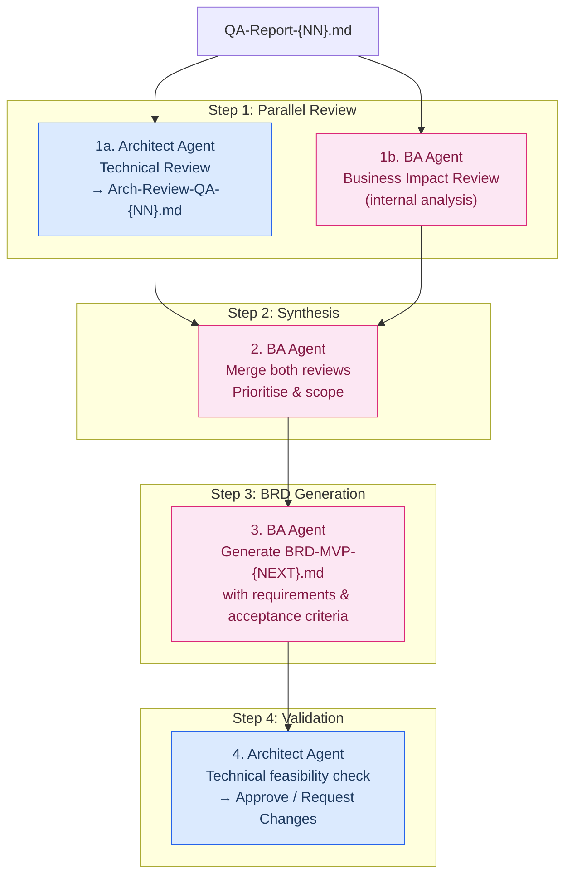

# BRD from QA Report — Dual-Agent Review Prompt

> **Purpose:** Two agents (Architect + BA) review a QA report independently; the BA then merges both assessments into the next-version BRD that scopes and prioritises the next development phase.
> **Input:** `smart-apply-doc/QA-Report-{NN}.md`
> **Output:**
>   1. Architect Review — `smart-apply-doc/Arch-Review-QA-{NN}.md` (intermediate artefact)
>   2. Next-version BRD — `smart-apply-doc/BRD-MVP-{NEXT}.md`

---

## Table of Contents

1. [When To Use This Prompt](#1-when-to-use-this-prompt)
2. [Pipeline Overview](#2-pipeline-overview)
3. [Agent Role Definitions](#3-agent-role-definitions)
4. [Step-by-Step Execution](#4-step-by-step-execution)
5. [Output Templates](#5-output-templates)
6. [Parameterisation Guide](#6-parameterisation-guide)
7. [Follow-On Prompts](#7-follow-on-prompts)

---

## 1. When To Use This Prompt

- After the QA pipeline (`qa-pipeline.md`) has produced a `QA-Report-{NN}.md`.
- When the team needs to translate QA findings into actionable, prioritised business requirements for the next phase.
- When the previous BRD's requirements have been partially or fully addressed and a new iteration is due.
- Before starting the development pipeline (`development-pipeline.md`) for a new phase — this prompt produces the BRD that feeds into HLD creation.

---

## 2. Pipeline Overview



---

## 3. Agent Role Definitions

### 3.1 Architect Agent

**Role:** Technical authority. Evaluates QA findings for architectural impact, assesses technical feasibility, estimates effort, and identifies systemic patterns behind individual defects.

**Prompt Prefix:**
```text
You are the Architect Agent for the Smart Apply project. You evaluate quality
findings through a technical and systems-design lens.

Your knowledge base:
- architecture.md (system architecture, component responsibilities, data model)
- TRD_Resume_Flow_AI.md (technical requirements and constraints)
- HLD-MVP-P{NN}.md (high-level designs for each completed phase)
- LLD-MVP-P{NN}.md (low-level designs and test specifications)
- implementation-plan.md (phase scope and sequencing)
- The QA Report under review

Your responsibilities:
1. Classify each QA finding by architectural impact (localised vs. systemic)
2. Identify root causes — determine if multiple findings share one underlying issue
3. Flag findings that require architectural changes vs. simple code fixes
4. Estimate implementation effort (S / M / L / XL) for each recommendation
5. Highlight technical risks and dependencies between fixes
6. Suggest the optimal sequencing of fixes to minimise rework

You are NOT a business stakeholder. Focus on technical feasibility, correctness,
and system health — not business priority. Leave prioritisation to the BA Agent.
```

### 3.2 BA (Business Analyst) Agent

**Role:** Business requirements owner. Translates QA findings into user-impact language, prioritises based on business value, and authors the next BRD.

**Prompt Prefix:**
```text
You are the Business Analyst Agent for the Smart Apply project. You translate
technical quality findings into business requirements and prioritise work for
the next development phase.

Your knowledge base:
- BRD-MVP-{PREV}.md (the previous BRD that drove the phase under review)
- PRD_Resume_Flow_AI.md (product goals, user journeys, success metrics)
- QA-Report-{NN}.md (the QA report being reviewed)
- Arch-Review-QA-{NN}.md (the Architect Agent's technical review)

Your responsibilities:
1. Map each QA finding to a user journey impact
2. Assess business severity independently of technical severity
3. Determine which findings are launch blockers vs. quality improvements
4. Carry forward any unmet requirements from the previous BRD
5. Introduce new requirements discovered through QA (e.g., missing test coverage
   that blocks confidence in a feature)
6. Prioritise: P0 (launch blocker), P1 (high value), P2 (nice to have)
7. Write acceptance criteria that are testable and specific
8. Scope the next phase to a realistic amount of work

You own the BRD output. The Architect Agent advises on feasibility — you decide
what goes in and at what priority.
```

---

## 4. Step-by-Step Execution

### Step 1a — Architect Agent: Technical Review

**Purpose:** Produce a structured technical review of the QA report that the BA can consume.

```text
@architect-agent

## Task: Technical Review of QA-Report-{NN}.md

Read the full QA report. For each section, produce technical analysis.

### 1. Risk Register Review
For each risk in §6 of the QA report:

| Risk ID | Architect Assessment | Root Cause | Systemic? | Fix Type | Effort | Dependencies |
|:---|:---|:---|:---|:---|:---|:---|
| RISK-{NN} | {agree / disagree / escalate severity} | {root cause analysis} | Yes / No | Arch Change / Code Fix / Config Fix | S/M/L/XL | {list} |

### 2. Technical Debt Triage
Review §5 Technical Debt Register. Group items by root cause:

| Root Cause | Debt Items | Suggested Fix | Effort | Phase Recommendation |
|:---|:---|:---|:---|:---|
| {cause} | TD-{NN}, TD-{NN} | {approach} | S/M/L | Next Phase / Backlog |

### 3. Architecture Compliance Gaps
Review §4.3 Architecture Compliance. For any ⚠️ or ❌ items:

| Check | Current State | Required Change | Impact if Deferred | Effort |
|:---|:---|:---|:---|:---|
| {check} | {state} | {change} | {risk of deferral} | S/M/L |

### 4. Test Coverage Strategy
Review §3.3 Test Coverage Gaps. Recommend which tests to prioritise:

| Priority | Test Description | Rationale | Effort |
|:---|:---|:---|:---|
| P0 | {test} | {why this is critical} | S/M/L |
| P1 | {test} | {why this is important} | S/M/L |
| P2 | {test} | {why this can wait} | S/M/L |

### 5. Sequencing Recommendation
Given all the above, what is the recommended order of work?
List the top 10 items in priority order with brief justification.
Consider: dependency chains, risk reduction per effort, and rework avoidance.

### 6. Architectural Recommendations
Any broader architectural changes needed that are NOT captured by individual
QA findings? (e.g., missing observability layer, logging strategy, error
boundary patterns, shared utility extractions)

Save as: smart-apply-doc/Arch-Review-QA-{NN}.md
```

---

### Step 1b — BA Agent: Business Impact Review

**Purpose:** Independently assess every QA finding for its business impact before seeing the Architect's review.

```text
@ba-agent

## Task: Business Impact Review of QA-Report-{NN}.md

Read the full QA report. Do NOT read the Architect's review yet.

### 1. User Journey Impact Map
For each risk and gap in the QA report, map to the Smart Apply user journeys:
  - J1: Sign In / Authentication
  - J2: Sync Profile (LinkedIn → Master Profile)
  - J3: Optimise Resume for Job Description
  - J4: Generate ATS-Friendly PDF
  - J5: Save Application to History / Google Drive
  - J6: View Dashboard / Track Applications
  - J7: Edit Profile / Settings
  - J8: Account Management (deletion, export)

| QA Finding | Affected Journey(s) | User Impact | Workaround Exists? | Business Severity |
|:---|:---|:---|:---|:---|
| {finding} | J{N} | {impact description} | Yes / No | P0 / P1 / P2 |

### 2. Previous BRD Carry-Forward
Read BRD-MVP-{PREV}.md. Identify requirements that were:
  - ✅ FULLY MET — can be closed
  - ⚠️ PARTIALLY MET — must carry forward with narrowed scope
  - ❌ NOT MET — must carry forward at same or elevated priority
  - 🆕 NEW — discovered through QA, not in the previous BRD

| REQ ID | Title | Previous Priority | QA Status | Next BRD Action |
|:---|:---|:---|:---|:---|
| REQ-{PREV}-{NN} | {title} | P0/P1/P2 | MET / PARTIAL / NOT MET | Close / Carry P0 / Carry P1 / Carry P2 |

### 3. New Requirements Discovery
Based on the QA report, what NEW requirements should exist that were not in the
previous BRD? Consider:
  - Test coverage mandates (e.g., "web package must have ≥ 10 component tests")
  - Security hardening revealed by QA findings
  - Deployment readiness gaps
  - Compliance gaps (data deletion audit, etc.)

### 4. Phase Scoping
Given all findings, what is a realistic scope for the next development phase?
Apply these constraints:
  - A phase should contain 3–6 P0 requirements max
  - Total effort should not exceed ~2 weeks of focused work
  - Dependencies should flow left-to-right (no circular deps between requirements)

Hold this analysis — you will use it in Step 2.
```

---

### Step 2 — BA Agent: Merge & Prioritise

**Purpose:** After reading the Architect's review, the BA merges both perspectives and makes final prioritisation decisions.

```text
@ba-agent

## Task: Merge Reviews and Finalise Priorities

### Inputs
1. Your own Business Impact Review (from Step 1b)
2. smart-apply-doc/Arch-Review-QA-{NN}.md (from Step 1a)

### Merge Process

For each finding that appears in both reviews, produce a merged assessment:

| Finding | BA Priority | Architect Effort | Architect Sequence | Final Priority | Phase Assignment | Rationale |
|:---|:---|:---|:---|:---|:---|:---|
| {finding} | P0/P1/P2 | S/M/L/XL | {position} | P0/P1/P2 | Next / Backlog | {why} |

### Conflict Resolution Rules
When the BA and Architect disagree:
- **BA says P0, Architect says XL effort:** Keep P0 but flag as "needs decomposition" —
  the Architect must break it into smaller tasks in the HLD.
- **Architect escalates severity, BA says P2:** Elevate to at least P1 if the Architect
  identifies a security or data-integrity root cause.
- **Architect says "backlog", BA says P0:** BA wins — business priority overrides
  engineering preference. Note the tension in the BRD's "Open Questions" section.
- **Both agree:** Use shared assessment directly.

### Scope Decision
From the merged list, select:
- **Next Phase P0:** 3–6 requirements (launch blockers or high-risk items)
- **Next Phase P1:** 4–8 requirements (important but not blocking)
- **Next Phase P2:** 2–5 requirements (if capacity allows)
- **Backlog:** Everything else — documented but deferred

Proceed to Step 3 with this finalised list.
```

---

### Step 3 — BA Agent: Generate Next-Version BRD

**Purpose:** Produce the formal BRD document for the next development phase.

```text
@ba-agent

## Task: Generate BRD-MVP-{NEXT}.md

Using the merged priorities from Step 2 and the carry-forward analysis from
Step 1b, produce a complete BRD.

### Required BRD Structure

---

# Business Requirements Document — MVP {NEXT}

**Version:** 1.0
**Date:** {YYYY-MM-DD}
**Source:** QA-Report-{NN}.md, Arch-Review-QA-{NN}.md, BRD-MVP-{PREV}.md
**Author:** Business Analyst Agent
**Reviewed By:** Architect Agent

---

## 1. Executive Summary
Two-to-three paragraphs covering:
- What the previous phase delivered (reference QA report §1 Executive Summary)
- What gaps remain and their business impact
- What this BRD scopes as the next phase of work
- Release readiness trajectory (e.g., "After this phase, the product will be
  CONDITIONALLY READY for beta deployment")

## 2. Stakeholder Goals
| Stakeholder | Goal | Success Metric |
|:---|:---|:---|
| Job Seeker | {goal for this phase} | {measurable outcome} |
| Product Owner | {goal for this phase} | {measurable outcome} |
| Engineering Team | {goal for this phase} | {measurable outcome} |

## 3. Previous Phase Outcomes

### 3.1 Requirements Closed (from BRD-MVP-{PREV})
| REQ ID | Title | QA Verdict |
|:---|:---|:---|
| REQ-{PREV}-{NN} | {title} | ✅ MET — closing |

### 3.2 Requirements Carried Forward
| REQ ID | Original Priority | New Priority | Change Reason |
|:---|:---|:---|:---|
| REQ-{PREV}-{NN} | P1 | P0 | {why escalated or maintained} |

## 4. Functional Requirements

### 4.1 Must-Have (P0 — Launch Blockers)
For each P0 requirement:

```
REQ-{NEXT}-{NN}
Title: {short name}
Source: {QA finding ID, previous REQ ID, or "NEW"}
User Story: As a {persona}, I want to {action} so that {business outcome}.
Current State: {what the QA report found}
Required State: {what must be true}
Acceptance Criteria:
  - AC-1: Given {context}, when {action}, then {result}
  - AC-2: Given {context}, when {action}, then {result}
Architect Notes: {effort estimate, dependencies, sequencing from Arch Review}
Dependencies: {other REQ IDs}
```

### 4.2 Should-Have (P1 — High Value)
Same format as 4.1.

### 4.3 Could-Have (P2 — Nice To Have)
Same format as 4.1, abbreviated if needed.

## 5. Non-Functional Requirements
| # | Category | Requirement | Source | QA Finding |
|:---|:---|:---|:---|:---|
| NFR-{NN} | {category} | {requirement} | TRD §{NN} | {related QA finding if any} |

## 6. Test Coverage Requirements
New section driven by QA report §3.3 and §8:

| # | Package | Required Tests | Priority | Addresses |
|:---|:---|:---|:---|:---|
| TC-01 | {package} | {what must be tested} | P0/P1/P2 | {QA gap #} |

## 7. Technical Debt to Address
Items from the QA report's debt register that are scoped into this phase:

| TD ID | Description | Fix Approach (from Arch Review) | Priority |
|:---|:---|:---|:---|
| TD-{NN} | {description} | {approach} | P0/P1/P2 |

## 8. Out of Scope
Explicitly list what this BRD does NOT cover:
- {item}: {reason}
Includes deferred items from the merge in Step 2.

## 9. Open Questions
| # | Question | Origin | Owner | Due |
|:---|:---|:---|:---|:---|
| 1 | {question} | {QA finding / Arch Review / merge conflict} | {role} | {phase} |

## 10. Approval Checklist
- [ ] All P0 requirements have at least two acceptance criteria
- [ ] Every carried-forward requirement references its original REQ ID
- [ ] Every new requirement traces to a QA finding or Arch Review recommendation
- [ ] No requirement contradicts the Zero-Storage Policy (PRD §1)
- [ ] No requirement contradicts Clerk auth model
- [ ] Test coverage requirements address all P0 gaps from QA report §3.3
- [ ] Technical debt items reference original TD IDs from QA report
- [ ] NFRs traceable to TRD sections
- [ ] Out-of-scope list reviewed to prevent unintended inclusions
- [ ] Architect Agent has validated technical feasibility (Step 4)

---

Save as: smart-apply-doc/BRD-MVP-{NEXT}.md
```

---

### Step 4 — Architect Agent: Feasibility Validation

**Purpose:** The Architect reviews the generated BRD for technical feasibility before it is finalised.

```text
@architect-agent

## Task: Validate BRD-MVP-{NEXT}.md

Read the BRD produced in Step 3. For each requirement, verify:

### Feasibility Checklist

| REQ ID | Title | Effort Accurate? | Dependencies Correct? | AC Testable? | Technically Sound? | Verdict |
|:---|:---|:---|:---|:---|:---|:---|
| REQ-{NEXT}-{NN} | {title} | ✅ / ⚠️ {correction} | ✅ / ⚠️ {missing dep} | ✅ / ⚠️ {issue} | ✅ / ⚠️ {concern} | APPROVE / REVISE |

### Phase Scope Assessment
- Is the total effort realistic for the phase timeline?
  - {YES: proceed} / {NO: recommend what to defer}
- Are there hidden dependencies between requirements that create sequencing risk?
  - {list any}
- Are there requirements that should be decomposed into smaller tasks?
  - {list any with suggested breakdown}

### Verdict
{ APPROVED — BRD is ready for HLD creation }
OR
{ REVISE — list specific changes the BA must make before proceeding }

If REVISE: the BA Agent applies changes and re-submits for a second validation.
Maximum 2 revision cycles — after that, escalate unresolved items to Open Questions.
```

---

## 5. Output Templates

### Architect Review Output (`Arch-Review-QA-{NN}.md`)

```text
---
title: Architect Review — QA Report {NN}
description: Technical review of QA-Report-{NN} with root cause analysis, effort estimates, and sequencing.
permalink: /arch-review-qa-{nn}/
---

# Architect Review — QA Report {NN}

**Date:** {YYYY-MM-DD}
**QA Report:** QA-Report-{NN}.md
**Reviewer:** Architect Agent

## 1. Risk Register Review
{table from Step 1a §1}

## 2. Technical Debt Triage
{table from Step 1a §2}

## 3. Architecture Compliance Gaps
{table from Step 1a §3}

## 4. Test Coverage Strategy
{table from Step 1a §4}

## 5. Sequencing Recommendation
{ordered list from Step 1a §5}

## 6. Architectural Recommendations
{freeform from Step 1a §6}
```

### BRD Output (`BRD-MVP-{NEXT}.md`)

See the full structure in Step 3 above. Use the same YAML frontmatter format as
other docs in `smart-apply-doc/`.

---

## 6. Parameterisation Guide

Before running the prompt, replace these placeholders:

| Placeholder | What To Put | Example |
|:---|:---|:---|
| `{NN}` | QA report number being reviewed | `01` |
| `{PREV}` | Previous BRD number | `01` |
| `{NEXT}` | Next BRD number (`{PREV}` + 1) | `02` |
| `{YYYY-MM-DD}` | Current date | `2026-03-28` |

---

## 7. Follow-On Prompts

After the BRD is generated and approved by the Architect:

1. **Architecture Update (`architecture-update.md`)** — If the Architect Review flagged architecture drift, update `architecture.md` before proceeding.
2. **Development Pipeline (`development-pipeline.md`)** — Feed the new BRD's P0 requirements into the Architect Agent to create the HLD for the next phase.
3. **QA Pipeline (`qa-pipeline.md`)** — After the next development phase completes, run the QA pipeline again to produce `QA-Report-{NN+1}.md`, restarting the cycle.

### Full Lifecycle

```mermaid
flowchart LR
    MVP["MVP Status Review"] --> BRD1["brd-from-mvp-status.md<br/>→ BRD-MVP-01"]
    BRD1 --> DEV1["development-pipeline.md<br/>→ Phase 1–N"]
    DEV1 --> QA1["qa-pipeline.md<br/>→ QA-Report-01"]
    QA1 --> THIS["brd-from-qa-report.md<br/>→ BRD-MVP-02"]
    THIS --> DEV2["development-pipeline.md<br/>→ Phase N+1"]
    DEV2 --> QA2["qa-pipeline.md<br/>→ QA-Report-02"]
    QA2 --> NEXT["brd-from-qa-report.md<br/>→ BRD-MVP-03"]
    NEXT --> CYCLE["...continues"]

    classDef current fill:#fef3c7,stroke:#d97706,color:#78350f
    class THIS current
```


