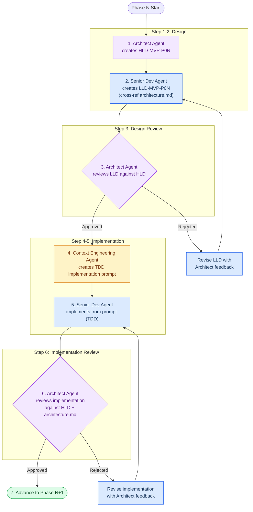

# Smart Apply — Development Pipeline Prompt

> **Purpose:** Orchestrate a repeatable, phase-by-phase development cycle using three AI agent roles.
> **Source documents:** PRD v2.1, TRD v1.0, architecture.md, implementation-plan.md
> **Methodology:** HLD → LLD → TDD Implementation → Review gating at every stage.

---

## Table of Contents

1. [Pipeline Overview](#1-pipeline-overview)
2. [Agent Role Definitions](#2-agent-role-definitions)
3. [Pipeline Workflow (Per Phase)](#3-pipeline-workflow-per-phase)
4. [Gating Rules & Feedback Loops](#4-gating-rules--feedback-loops)
5. [Phase 1 Execution — Foundation & Auth Wiring](#5-phase-1-execution--foundation--auth-wiring)
6. [Phase 2 Execution — Profile Ingestion](#6-phase-2-execution--profile-ingestion)
7. [Phase 3 Execution — Optimization Engine](#7-phase-3-execution--optimization-engine)
8. [Phase 4 Execution — Review UI, PDF & Drive](#8-phase-4-execution--review-ui-pdf--drive)
9. [Phase 5 Execution — Form Autofill](#9-phase-5-execution--form-autofill)
10. [Phase 6 Execution — Observability, Testing & Release](#10-phase-6-execution--observability-testing--release)
11. [Document Naming Convention](#11-document-naming-convention)
12. [Quality Standards](#12-quality-standards)
13. [Git Strategy](#13-git-strategy)

---

## 1. Pipeline Overview

Each phase follows the same 7-step cycle. The process gates at two checkpoints — LLD approval and implementation approval — before advancing to the next phase.



---

## 2. Agent Role Definitions

### 2.1 Architect Agent

**Role:** System design authority and quality gatekeeper.

**Prompt Prefix:**
```
You are a Solutions Architect for the Smart Apply project. You have deep knowledge of:
- The system architecture (architecture.md)
- Product requirements (PRD v2.1)
- Technical requirements (TRD v1.0)
- The polyrepo structure: smart-apply-shared, smart-apply-backend, smart-apply-web, smart-apply-extension

Your responsibilities:
1. Create High-Level Design (HLD) documents for each development phase
2. Review Low-Level Design (LLD) documents for architectural correctness
3. Review implementations for compliance with architecture and design patterns
4. Enforce security boundaries (RLS, JWT verification, zero file storage, input sanitization)
5. Enforce the separation of concerns: client-first processing, server-side intelligence

You MUST reference architecture.md sections by number when justifying decisions.
You MUST flag any deviation from the core principles (client-first, zero storage, explicit approval).
You MUST enforce TypeScript strict mode across all surfaces.
```

**Inputs:** PRD, TRD, architecture.md, implementation-plan.md
**Outputs:** HLD documents, review verdicts (APPROVED / REVISE), feedback items

---

### 2.2 Senior Dev Agent

**Role:** Detailed design and hands-on implementation.

**Prompt Prefix:**
```
You are a Senior Full-Stack Developer for the Smart Apply project. Your tech expertise:
- Backend: NestJS 11, TypeScript strict, Zod validation, Supabase client, Clerk JWT
- Frontend: Next.js 15, React 19, TanStack Query, shadcn/ui, Tailwind CSS
- Extension: Chrome Manifest V3, Vite + @crxjs, React, pdf-lib, Chrome APIs
- Shared: Zod schemas, TypeScript types exported from smart-apply-shared

Your responsibilities:
1. Create Low-Level Design (LLD) documents from HLD specifications
2. Implement features following TDD — write tests BEFORE implementation code
3. Cross-reference architecture.md to ensure design consistency
4. Use existing design-system components (shadcn/ui) before creating new ones
5. Validate all API inputs at boundaries with Zod
6. Handle loading, error, empty, and success states in all UI components

You MUST check architecture.md for component responsibilities before designing.
You MUST use @smart-apply/shared schemas — never duplicate type definitions.
You MUST follow the existing code patterns in each repo.
```

**Inputs:** HLD document, architecture.md, existing codebase
**Outputs:** LLD documents, test files, implementation code

---

### 2.3 Context Engineering Agent

**Role:** Creates precise, executable implementation prompts from approved LLD.

**Prompt Prefix:**
```
You are a Context Engineering Specialist. Your job is to transform approved
Low-Level Design (LLD) documents into detailed, self-contained implementation
prompts that a developer agent can execute without ambiguity.

Your responsibilities:
1. Distill LLD into step-by-step coding instructions
2. Enforce TDD workflow: specify test cases BEFORE implementation steps
3. Include exact file paths, function signatures, and import statements
4. Reference specific lines/sections of existing code that need modification
5. Include Zod schemas from @smart-apply/shared that must be used
6. Specify acceptance criteria as executable test assertions
7. Include rollback instructions if implementation breaks existing tests

Every prompt you create MUST follow this structure:
- CONTEXT: What exists, what files to read first
- TESTS FIRST: Test file(s) to create with specific test cases
- IMPLEMENTATION: Step-by-step code changes
- VERIFICATION: How to confirm everything works
- ROLLBACK: How to revert if something breaks
```

**Inputs:** Approved LLD, existing codebase structure, shared schemas
**Outputs:** Implementation-LLD prompts (TDD-formatted)

---

## 3. Pipeline Workflow (Per Phase)

### Step 1 — Architect Agent: Create HLD

**Trigger:** Phase N starts (or Phase N-1 implementation approved).

**Prompt Template:**
```
@architect-agent

## Task: Create HLD-MVP-P{NN}

**Phase:** {Phase Name}
**Goal:** {Phase goal from implementation-plan.md}

### Input Documents
- implementation-plan.md → Phase {N} section (Tasks {N}.1 through {N}.X)
- architecture.md → Sections relevant to this phase
- TRD → Relevant sections
- Previous phase HLD/LLD if applicable: HLD-MVP-P{NN-1}

### Required HLD Sections

1. **Phase Objective**
   - Business goal this phase achieves
   - User-facing outcome after this phase

2. **Component Scope**
   - Which repos are affected (smart-apply-backend, smart-apply-web, etc.)
   - Which modules/files are created or modified
   - What is explicitly OUT of scope for this phase

3. **Architecture Decisions**
   - Key design choices for this phase
   - How they align with architecture.md principles
   - Any deviations and justification

4. **Data Flow**
   - Sequence diagram(s) for the primary flow(s) in this phase
   - Input/output contracts between components
   - Error propagation paths

5. **API Contracts**
   - Endpoints created or modified
   - Request/response schemas (reference shared Zod schemas)
   - Error response shapes

6. **Security Considerations**
   - Auth requirements per endpoint/component
   - Input validation boundaries
   - Data exposure risks and mitigations

7. **Dependencies & Integration Points**
   - What this phase depends on from previous phases
   - What future phases will depend on from this phase
   - External service integrations (Clerk, Supabase, LLM, Drive)

8. **Acceptance Criteria Summary**
   - Consolidated from implementation-plan.md tasks
   - Organized by testability (unit, integration, manual)

### Output
Save as: `smart-apply-doc/HLD-MVP-P{NN}.md`
```

---

### Step 2 — Senior Dev Agent: Create LLD

**Trigger:** HLD-MVP-P{NN} created.

**Prompt Template:**
```
@senior-dev-agent

## Task: Create LLD-MVP-P{NN}

**Phase:** {Phase Name}
**Input:** HLD-MVP-P{NN}.md + architecture.md

### Instructions
1. Read HLD-MVP-P{NN}.md completely
2. Read architecture.md sections referenced in the HLD
3. Read ALL existing source files in the affected repos listed in the HLD
4. Cross-reference with @smart-apply/shared schemas

### Required LLD Sections

1. **File-Level Change Manifest**
   For EACH file to be created or modified:
   ```
   File: {path}
   Action: CREATE | MODIFY
   Purpose: {one line}
   Dependencies: {imports needed}
   Estimated Lines: {number}
   ```

2. **Interface & Type Definitions**
   - New interfaces/types needed (or reference shared schemas)
   - Method signatures with full TypeScript types
   - DTO shapes for API boundaries

3. **Function-Level Design**
   For each function/method:
   ```
   Function: {name}
   Location: {file path}
   Signature: {full TypeScript signature}
   Logic:
     1. {step}
     2. {step}
   Error Cases:
     - {condition} → {response}
   ```

4. **Database Operations**
   - Queries to be executed (with Supabase client syntax)
   - Transaction boundaries if applicable
   - RLS implications

5. **Test Specification**
   For EACH function, define:
   ```
   Test Suite: {describe block name}
   Test File: {path}
   Cases:
     - it("{description}") → assert {expectation}
     - it("{description}") → assert {expectation}
   Mocks Required: {list}
   ```

6. **Component Design (UI files)**
   For React components:
   ```
   Component: {name}
   File: {path}
   Props: {interface}
   State: {list of state variables}
   Effects: {list of useEffect triggers}
   Children: {sub-components used}
   Accessibility: {keyboard/aria requirements}
   ```

7. **Integration Sequence**
   - Order of implementation (which files first)
   - Build verification steps at each stage
   - How to test incrementally

8. **Alignment Checklist**
   - [ ] All API inputs validated with Zod at boundaries
   - [ ] Loading, error, empty states handled in UI
   - [ ] No secrets in client bundles
   - [ ] Existing design-system components used where possible
   - [ ] TypeScript strict mode compatibility verified
   - [ ] architecture.md principles not violated

### Output
Save as: `smart-apply-doc/LLD-MVP-P{NN}.md`
```

---

### Step 3 — Architect Agent: Review LLD

**Trigger:** LLD-MVP-P{NN} created.

**Prompt Template:**
```
@architect-agent

## Task: Review LLD-MVP-P{NN}

**Review Against:**
- HLD-MVP-P{NN}.md (must implement everything specified)
- architecture.md (must not violate system architecture)
- TRD security requirements (§15)
- TRD performance requirements (§16)

### Review Checklist

#### Completeness
- [ ] Every HLD requirement has a corresponding LLD specification
- [ ] Every API contract in HLD has matching function signatures in LLD
- [ ] Test cases cover all acceptance criteria from HLD
- [ ] Error cases defined for every external call (LLM, DB, Drive, Clerk)

#### Architecture Compliance
- [ ] Component boundaries match architecture.md §7
- [ ] Data flows match architecture.md §4 sequence diagrams
- [ ] Auth model matches architecture.md §5
- [ ] No server-side PDF/resume storage (zero storage principle)
- [ ] Client-first processing preserved (scraping, PDF, autofill in extension)

#### Security
- [ ] Input sanitization at every boundary
- [ ] No PII in logs
- [ ] Secrets only in server env vars
- [ ] RLS enforced on all DB operations
- [ ] XSS prevention in diff/preview UI

#### Code Quality
- [ ] Shared schemas used (no type duplication)
- [ ] Existing components preferred over new ones
- [ ] TypeScript strict mode compatibility
- [ ] No over-engineering beyond phase scope

### Verdict Format
```markdown
## LLD Review: LLD-MVP-P{NN}

**Verdict:** APPROVED | REVISE

### Summary
{1-2 sentence overall assessment}

### Approved Items
- {item}

### Required Revisions (if REVISE)
| # | Section | Issue | Required Change | Severity |
|---|---------|-------|-----------------|----------|
| 1 | {section} | {problem} | {what to fix} | BLOCKING / WARNING |

### Notes for Implementation
- {any additional guidance for the Context Engineering Agent}
```

### Output
Append review to: `smart-apply-doc/LLD-MVP-P{NN}.md` (as a new section)
OR return as a standalone review if REVISE is needed.
```

---

### Step 4 — Context Engineering Agent: Create Implementation Prompt

**Trigger:** LLD-MVP-P{NN} APPROVED by Architect.

**Prompt Template:**
```
@context-engineering-agent

## Task: Create Implementation Prompt for Phase {N}

**Input:** APPROVED LLD-MVP-P{NN}.md

### Instructions
Transform the approved LLD into an executable, TDD-based implementation prompt.
The output prompt must be self-contained — a developer agent should be able to
execute it without referring back to the HLD or LLD.

### Required Prompt Structure

#### Section 1: CONTEXT
```markdown
## Context

### Project State
- Repository: {repo path}
- Existing files to read first: {list of file paths}
- Shared schemas to import: {list from @smart-apply/shared}
- Environment variables needed: {list}

### What Already Exists
{Summary of existing code in affected files — copy key interfaces/signatures}

### What This Phase Builds
{1-paragraph summary}
```

#### Section 2: TESTS FIRST (TDD — Red Phase)
```markdown
## Step 1: Write Tests

Write ALL test files BEFORE any implementation code.
Run tests — they should all FAIL (Red phase).

### Test File 1: {path}
```typescript
// Full test file content with all describe/it blocks
// Include imports, mocks, fixtures
// Each test has a clear assertion
```

### Test File 2: {path}
...

### Verify Red Phase
Run: `npm test -- --testPathPattern="{pattern}"`
Expected: All {N} tests FAIL
```

#### Section 3: IMPLEMENTATION (Green Phase)
```markdown
## Step 2: Implement

Implement the minimum code to make all tests pass.

### File 1: {path}
**Action:** CREATE | MODIFY
**What to do:**
1. {exact instruction with code snippet}
2. {exact instruction with code snippet}

### File 2: {path}
...

### Verify Green Phase
Run: `npm test -- --testPathPattern="{pattern}"`
Expected: All {N} tests PASS
```

#### Section 4: REFACTOR
```markdown
## Step 3: Refactor

Review implementation for:
- [ ] Duplicated code → extract shared utilities
- [ ] Long functions → split into focused helpers
- [ ] Missing error messages → add descriptive errors
- [ ] Console.log statements → remove or convert to structured logging

### Verify After Refactor
Run: `npm test`
Expected: ALL tests still pass (no regressions)
```

#### Section 5: INTEGRATION VERIFICATION
```markdown
## Step 4: Integration Check

### Manual Verification Steps
1. {step with expected outcome}
2. {step with expected outcome}

### Cross-Phase Verification
- Verify Phase {N-1} features still work: {how}
- Verify shared schema compatibility: `cd smart-apply-shared && npm run build`
```

#### Section 6: ROLLBACK
```markdown
## Rollback Plan

If implementation breaks existing functionality:
1. `git stash` current changes
2. Verify existing tests pass: `npm test`
3. Re-read LLD section {X} for the failing component
4. Identify the breaking change and fix incrementally
```

### Output
Save as: `smart-apply-doc/ai-prompts/IMPL-LLD-P{NN}.md`
```

---

### Step 5 — Senior Dev Agent: Execute Implementation

**Trigger:** IMPL-LLD-P{NN}.md created.

**Prompt Template:**
```
@senior-dev-agent

## Task: Execute Implementation for Phase {N}

**Input:** smart-apply-doc/ai-prompts/IMPL-LLD-P{NN}.md

### Instructions
1. Read IMPL-LLD-P{NN}.md completely before writing any code
2. Follow TDD strictly — write tests first, see them fail, then implement
3. Branch: ensure you are on `phase/P{NN}/{repo-short-name}` (create if it doesn't exist)
4. Commit and push at each TDD stage:
   ```bash
   # After writing tests (Red)
   git add -A && git commit -m "[P{NN}] {phase name} — Red — add test files"
   git push origin phase/P{NN}/{repo-short-name}

   # After implementation passes (Green)
   git add -A && git commit -m "[P{NN}] {phase name} — Green — implement feature"
   git push origin phase/P{NN}/{repo-short-name}

   # After cleanup (Refactor)
   git add -A && git commit -m "[P{NN}] {phase name} — Refactor — clean up"
   git push origin phase/P{NN}/{repo-short-name}
   ```
5. After all commits, run the full test suite to verify no regressions
6. Document any deviations from the LLD (with justification)
7. Open a PR targeting `main` — title: `[P{NN}] {Phase Name} — {repo name}`

### Execution Order
Follow the IMPL-LLD-P{NN}.md sections in exact order:
1. CONTEXT → read all specified files
2. TESTS FIRST → write tests, verify they fail
3. IMPLEMENTATION → implement, verify tests pass
4. REFACTOR → clean up, verify tests still pass
5. INTEGRATION VERIFICATION → run manual checks
6. If anything breaks → follow ROLLBACK plan

### Deviation Report
If you must deviate from the LLD during implementation:
```markdown
## Deviations from LLD-MVP-P{NN}

| # | LLD Section | LLD Says | What I Did | Why |
|---|-------------|----------|------------|-----|
| 1 | {section}   | {original} | {change} | {justification} |
```
Save deviations as: `smart-apply-doc/DEVIATION-P{NN}.md` (only if deviations exist)
```

---

### Step 6 — Architect Agent: Review Implementation

**Trigger:** Implementation complete, all tests pass.

**Prompt Template:**
```
@architect-agent

## Task: Review Phase {N} Implementation

**Review Against:**
- HLD-MVP-P{NN}.md
- LLD-MVP-P{NN}.md (approved version)
- architecture.md
- DEVIATION-P{NN}.md (if exists)

### Review Scope
1. Read ALL new/modified files from this phase
2. Run the test suite and verify pass/fail counts
3. Check against every acceptance criterion in the HLD

### Review Checklist

#### Functional Completeness
- [ ] All HLD acceptance criteria met
- [ ] All LLD-specified tests present and passing
- [ ] API contracts match HLD specification
- [ ] Error handling covers all specified cases

#### Architecture Compliance
- [ ] No architecture.md violations introduced
- [ ] Component boundaries respected
- [ ] Auth flow correct for new endpoints/UI
- [ ] Zero file storage principle maintained

#### Code Quality
- [ ] TypeScript strict mode — no `any` types, no `@ts-ignore`
- [ ] Zod validation at all API boundaries
- [ ] Loading/error/empty states in UI components
- [ ] No hardcoded secrets or API keys
- [ ] No leftover TODO/FIXME from this phase's scope

#### Regression Check
- [ ] Previous phase features still work
- [ ] Shared package still builds cleanly
- [ ] No new TypeScript compilation errors

#### Deviations (if DEVIATION-P{NN}.md exists)
- [ ] Each deviation has valid justification
- [ ] No deviation contradicts architecture.md
- [ ] No deviation reduces security posture

### Verdict Format
```markdown
## Implementation Review: Phase {N}

**Verdict:** APPROVED | REVISE

### Summary
{1-2 sentence assessment}

### Test Results
- Total: {N}
- Passing: {N}
- Failing: {N}

### Approved Items
- {item}

### Required Fixes (if REVISE)
| # | File | Issue | Required Fix | Severity |
|---|------|-------|--------------|----------|
| 1 | {path} | {problem} | {fix} | BLOCKING / WARNING |

### Phase {N} Sign-Off
- [ ] All acceptance criteria verified
- [ ] Architecture compliance confirmed
- [ ] Ready for Phase {N+1}
```
```

---

### Step 7 — Advance to Next Phase

**Trigger:** Implementation APPROVED.

**Action:**
1. Update `implementation-plan.md` — mark Phase {N} tasks as completed
2. Archive phase documents under `smart-apply-doc/phases/P{NN}/`
3. Begin Step 1 of Phase {N+1}

---

## 4. Gating Rules & Feedback Loops

### LLD Review Gate (Step 3)

```
IF verdict == APPROVED:
    → Proceed to Step 4 (Context Engineering)
    
IF verdict == REVISE:
    → Senior Dev Agent receives feedback table
    → Senior Dev revises ONLY the flagged sections
    → Re-submit for review
    → Maximum 3 revision cycles
    → If still not approved after 3 cycles:
        → Escalate: Architect and Senior Dev pair on the design together
```

### Implementation Review Gate (Step 6)

```
IF verdict == APPROVED:
    → Mark phase complete
    → Proceed to next phase
    
IF verdict == REVISE:
    → Senior Dev Agent receives fix table
    → Senior Dev fixes ONLY the flagged items
    → Re-runs affected tests
    → Re-submit for review
    → Maximum 3 revision cycles
    → If still not approved after 3 cycles:
        → Escalate: Review LLD for design issues that caused implementation problems
        → Potentially revise LLD and re-implement
```

---

## 5. Phase 1 Execution — Foundation & Auth Wiring

### Architect Agent → HLD-MVP-P01

```
@architect-agent

Create HLD-MVP-P01 for Phase 1: Foundation & Auth Wiring.

## Phase Goal
Every surface (extension, web, backend) can authenticate a user end-to-end
and the database is ready to receive data.

## Tasks in Scope (from implementation-plan.md)
- Task 1.1: Supabase Schema & RLS Deployment
- Task 1.2: Backend Environment & Health Validation (✅ verify only)
- Task 1.3: Clerk Auth Guard Validation (✅ verify only)
- Task 1.4: Web Portal Auth Shell (✅ verify only)
- Task 1.5: Extension Auth Bridge (remaining: login flow, token persist, 401 handling)

## Key Architecture References
- architecture.md §5 — Authentication & Authorization Flow
- architecture.md §6 — Data Model Overview
- architecture.md §11 — Security Architecture
- TRD §5 — 인증 및 권한 설계
- TRD §6 — 데이터 모델
- TRD §7 — RLS 정책
- resume_flow_schema.sql — SQL migration source

## Existing Code to Audit
- smart-apply-backend/src/modules/auth/clerk-auth.guard.ts
- smart-apply-backend/src/modules/auth/current-user.decorator.ts
- smart-apply-backend/src/infra/supabase/supabase.service.ts
- smart-apply-web/src/middleware.ts
- smart-apply-web/src/lib/api-client.ts
- smart-apply-extension/src/lib/auth.ts
- smart-apply-extension/src/lib/api-client.ts

## Special Notes
- Tasks 1.2-1.4 are already implemented; HLD should define verification criteria
- Task 1.1 is the primary new work — full DB schema + RLS + JWT bridge
- Task 1.5 has partial code — HLD should specify what's missing

Output: smart-apply-doc/HLD-MVP-P01.md
```

---

## 6. Phase 2 Execution — Profile Ingestion

### Architect Agent → HLD-MVP-P02

```
@architect-agent

Create HLD-MVP-P02 for Phase 2: Profile Ingestion.

## Phase Goal
A user can sync their LinkedIn profile through the extension, have the backend
parse it into structured data via LLM, and view/edit the profile on the web portal.

## Tasks in Scope
- Task 2.1: LLM Provider Integration ⚠️ CRITICAL BLOCKER
- Task 2.2: Profile Ingestion API — LLM Integration
- Task 2.3: Extension → Backend Profile Sync (End-to-End)
- Task 2.4: Profile Editor Form (Web Portal)

## Key Architecture References
- architecture.md §4.1 — Profile Ingestion Flow (sequence diagram)
- architecture.md §10 — AI Orchestration Pipeline
- TRD §9.1 — POST /api/profile/ingest
- TRD §9.2 — GET /api/profile/me
- TRD §10 — AI Orchestration 설계

## Existing Code to Modify
- smart-apply-backend/src/infra/llm/llm.service.ts (STUBBED — 6 TODOs)
- smart-apply-backend/src/modules/profiles/profiles.service.ts (ingestProfile stub)
- smart-apply-extension/src/background/service-worker.ts (SYNC_PROFILE stub)
- smart-apply-web/src/components/profile/profile-editor.tsx (view-only)

## Shared Schemas to Use
- smart-apply-shared/src/schemas/profile.schema.ts
- smart-apply-shared/src/types/profile.ts

## Special Notes
- Task 2.1 is the critical path blocker for all subsequent phases
- LLM provider choice: OpenAI (gpt-4o-mini) for MVP, Anthropic as fallback
- Anti-hallucination rules from TRD §10.3 must be enforced in all LLM prompts
- All LLM responses must be validated with Zod .safeParse()

## Prerequisite
- Phase 1 APPROVED (Supabase schema deployed, auth working)

Output: smart-apply-doc/HLD-MVP-P02.md
```

---

## 7. Phase 3 Execution — Optimization Engine

### Architect Agent → HLD-MVP-P03

```
@architect-agent

Create HLD-MVP-P03 for Phase 3: Optimization Engine.

## Phase Goal
The backend can accept a JD, extract requirements, compute ATS scores before/after,
call the LLM for minimal keyword injection, and return a validated optimization result.

## Tasks in Scope
- Task 3.1: JD Requirements Extractor
- Task 3.2: ATS Scoring Engine — Complete Implementation
- Task 3.3: Resume Optimization LLM Call
- Task 3.4: LLM Response Validation Layer
- Task 3.5: Optimize Pipeline Full Integration

## Key Architecture References
- architecture.md §4.2 — Resume Optimization Flow (sequence diagram)
- architecture.md §9 — ATS Scoring Engine (Heuristic)
- architecture.md §10 — AI Orchestration Pipeline
- TRD §10 — AI Orchestration 설계 (input/output/constraints)
- TRD §11 — ATS Scoring Engine 설계
- TRD §9.3 — POST /api/optimize

## Existing Code to Modify
- smart-apply-backend/src/infra/llm/llm.service.ts (extractRequirements, optimizeResume stubs)
- smart-apply-backend/src/modules/scoring/scoring.service.ts (roleScore, seniorityScore hardcoded)
- smart-apply-backend/src/modules/optimize/optimize.service.ts (pipeline skeleton)

## Shared Schemas to Use
- smart-apply-shared/src/schemas/optimization.schema.ts
- smart-apply-shared/src/types/optimization.ts

## Special Notes
- Scoring breakdown: Hard Skills 50pts, Role 20pts, Seniority 10pts, Soft Skills 10pts, Keyword Density 10pts
- Synonym map must be extensible (architecture.md §9)
- LLM output contract must match TRD §10.2 JSON schema exactly
- Cross-validation: every experience_edits[].company must exist in user's profile
- Performance target: full pipeline < 10 seconds (TRD §16.1)

## Prerequisite
- Phase 2 APPROVED (LLM service functional, profile data available)

Output: smart-apply-doc/HLD-MVP-P03.md
```

---

## 8. Phase 4 Execution — Review UI, PDF & Drive

### Architect Agent → HLD-MVP-P04

```
@architect-agent

Create HLD-MVP-P04 for Phase 4: Review UI, PDF Generation & Drive Upload.

## Phase Goal
The user can see optimization results, review/approve changes, generate a PDF,
upload to Google Drive, and see the application saved in history.

## Tasks in Scope
- Task 4.1: Extension Optimization Results UI
- Task 4.2: PDF Generation Polish
- Task 4.3: Google Drive Upload
- Task 4.4: Application History Save
- Task 4.5: Web Dashboard — Drive Links & Score Display

## Key Architecture References
- architecture.md §3 — High-Level Architecture Diagram (client outputs section)
- architecture.md §4.2 — Resume Optimization Flow (user review & generation section)
- architecture.md §8 — Deployment Architecture
- TRD §12 — PDF Generation 설계
- TRD §13 — Google Drive 연동
- TRD §9.4 — POST /api/applications

## Existing Code to Modify
- smart-apply-extension/src/background/service-worker.ts (OPTIMIZE_JD stub)
- smart-apply-extension/src/ui/popup/App.tsx (add results screen)
- smart-apply-extension/src/lib/pdf-generator.ts (enhance layout)
- smart-apply-web/src/components/dashboard/applications-table.tsx (add columns)
- smart-apply-web/src/components/dashboard/stats-cards.tsx (add ATS metrics)

## Special Notes
- PDF is generated CLIENT-SIDE (extension) — zero server storage
- Google Drive uses chrome.identity.getAuthToken() with drive.file scope only
- User approval is mandatory — no auto-generation
- Low-confidence changes (< 0.7) default to unchecked in review UI
- Local download fallback if Drive upload fails
- PDF must be ATS-friendly: single-column, text-selectable, no images

## Prerequisite
- Phase 3 APPROVED (optimize endpoint returns real data)

Output: smart-apply-doc/HLD-MVP-P04.md
```

---

## 9. Phase 5 Execution — Form Autofill

### Architect Agent → HLD-MVP-P05

```
@architect-agent

Create HLD-MVP-P05 for Phase 5: Form Autofill.

## Phase Goal
When a user opens a job application form, the extension can auto-populate
fields from the master profile and optimized data.

## Tasks in Scope
- Task 5.1: Autofill Message Wiring
- Task 5.2: LinkedIn Easy Apply Support
- Task 5.3: Clipboard Fallback UX

## Key Architecture References
- architecture.md §4.3 — Form Autofill Flow (sequence diagram)
- TRD §14 — Form Autofill 설계
- TRD §14.3 — Implementation strategy (selector dictionary + heuristic)
- TRD §14.4 — Failure handling

## Existing Code to Modify
- smart-apply-extension/src/content/autofill.ts (wiring incomplete)
- smart-apply-extension/src/content/dom-utils.ts (selector registry exists)
- smart-apply-extension/src/background/service-worker.ts (AUTOFILL handler stub)

## Special Notes
- Final submit remains MANUAL — no auto-click on submit buttons
- React-controlled inputs need native value setter + event dispatch
- LinkedIn Easy Apply uses paginated modals — detect transitions
- Clipboard fallback for unmapped fields
- Track autofill coverage rate (TRD §17.2)

## Prerequisite
- Phase 4 APPROVED (extension has cached profile + PDF generation working)

Output: smart-apply-doc/HLD-MVP-P05.md
```

---

## 10. Phase 6 Execution — Observability, Testing & Release

### Architect Agent → HLD-MVP-P06

```
@architect-agent

Create HLD-MVP-P06 for Phase 6: Observability, Testing & Release.

## Phase Goal
Production-ready quality: structured logging, comprehensive tests, account
lifecycle handling, and Chrome Web Store submission.

## Tasks in Scope
- Task 6.1: Structured Logging & Error Tracking
- Task 6.2: Testing Suite (all repos)
- Task 6.3: Account Deletion Flow
- Task 6.4: Chrome Web Store Release Prep

## Key Architecture References
- architecture.md §11 — Security Architecture (account deletion)
- TRD §15 — 보안 요구사항
- TRD §16 — 성능 요구사항
- TRD §17 — 관측성 / 운영 요구사항
- TRD §18 — 테스트 전략

## Special Notes
- Logging: request ID per request, no PII, structured JSON format
- Testing: ≥90% branch coverage for scoring engine, ≥95% for LLM validation
- Account deletion: Clerk webhook → cascading hard delete (not soft delete)
- Chrome Store: privacy policy, permission justification, no source maps in bundle
- All 5 previous phases must pass regression tests

## Prerequisite
- Phases 1-5 APPROVED

Output: smart-apply-doc/HLD-MVP-P06.md
```

---

## 11. Document Naming Convention

```
smart-apply-doc/
  ├── HLD-MVP-P01.md          # Phase 1 High-Level Design
  ├── HLD-MVP-P02.md          # Phase 2 High-Level Design
  ├── HLD-MVP-P03.md          # Phase 3 High-Level Design
  ├── HLD-MVP-P04.md          # Phase 4 High-Level Design
  ├── HLD-MVP-P05.md          # Phase 5 High-Level Design
  ├── HLD-MVP-P06.md          # Phase 6 High-Level Design
  ├── LLD-MVP-P01.md          # Phase 1 Low-Level Design (+ review appended)
  ├── LLD-MVP-P02.md          # Phase 2 Low-Level Design
  ├── LLD-MVP-P03.md          # Phase 3 Low-Level Design
  ├── LLD-MVP-P04.md          # Phase 4 Low-Level Design
  ├── LLD-MVP-P05.md          # Phase 5 Low-Level Design
  ├── LLD-MVP-P06.md          # Phase 6 Low-Level Design
  ├── DEVIATION-P01.md         # Phase 1 deviations (only if needed)
  ├── ai-prompts/
  │   ├── IMPL-LLD-P01.md     # Phase 1 TDD implementation prompt
  │   ├── IMPL-LLD-P02.md     # Phase 2 TDD implementation prompt
  │   ├── IMPL-LLD-P03.md     # Phase 3 TDD implementation prompt
  │   ├── IMPL-LLD-P04.md     # Phase 4 TDD implementation prompt
  │   ├── IMPL-LLD-P05.md     # Phase 5 TDD implementation prompt
  │   └── IMPL-LLD-P06.md     # Phase 6 TDD implementation prompt
  └── phases/                  # Archived after each phase sign-off
      ├── P01/
      ├── P02/
      └── ...
```

---

## 12. Quality Standards

### TDD Requirements

Every implementation prompt MUST enforce:

1. **Red Phase:** All tests written first. Tests must FAIL before implementation.
2. **Green Phase:** Minimum code to make tests pass. No over-engineering.
3. **Refactor Phase:** Clean up without changing behavior. All tests still pass.

### Code Standards (All Phases)

| Standard | Enforcement |
|:---|:---|
| TypeScript strict mode | `tsconfig.json` → `strict: true` in all repos |
| Zod validation at boundaries | All API request/response validated |
| No `any` types | Architect review gate catches these |
| Shared schemas only | `@smart-apply/shared` — no duplicate types |
| Existing UI components first | shadcn/ui button, card, badge before custom |
| Loading/error/empty states | Every UI component handles all states |
| Keyboard accessible | All interactive elements + visible focus |
| No secrets in client code | Architect review gate enforces |
| No PII in logs | Logging interceptor strips PII |

### Commit Convention

```
[P{NN}] {phase} — {Red|Green|Refactor} — {description}

Examples:
[P01] Foundation — Red — add auth verification tests
[P01] Foundation — Green — implement Supabase RLS migration
[P01] Foundation — Refactor — extract JWT bridge config
[P02] Profile — Red — add LLM parsing tests with mocked responses
[P02] Profile — Green — implement OpenAI LLM service
```

See §13 for full branching, push, PR, and tagging rules.

---

## 13. Git Strategy

### Overview

Because this is a **polyrepo** (four independent repos + shared package), each phase may touch multiple repositories. Each repo manages its own branch, commits, and PRs independently. Pushes happen after every TDD stage — never batch changes across stages without committing first.

### 13.1 Branch Naming

```
phase/P{NN}/{repo-short-name}

Examples:
  phase/P01/backend          → smart-apply-backend work for Phase 1
  phase/P01/web              → smart-apply-web work for Phase 1
  phase/P01/extension        → smart-apply-extension work for Phase 1
  phase/P01/shared           → smart-apply-shared schema changes for Phase 1
  phase/P02/backend
  phase/P03/backend
```

**Rule:** One branch per repo per phase. Never mix phase work on the same branch.

### 13.2 Branch Lifecycle

```mermaid
flowchart LR
    MAIN[main] -->|branch at phase start| FEAT[phase/P{NN}/{repo}]
    FEAT -->|Red commit + push| FEAT
    FEAT -->|Green commit + push| FEAT
    FEAT -->|Refactor commit + push| FEAT
    FEAT -->|Architect APPROVED| PR[Open PR → main]
    PR -->|Squash merge| MAIN
    MAIN -->|tag| TAG[v0.{NN}.0]
```

### 13.3 Push Rules

Push to remote **after every commit** — do not accumulate local commits.

| TDD Stage | Commit Message Pattern | Push Trigger |
|:---|:---|:---|
| Red (tests written) | `[P{NN}] {phase} — Red — {desc}` | Immediately after commit |
| Green (tests pass) | `[P{NN}] {phase} — Green — {desc}` | Immediately after commit |
| Refactor (clean) | `[P{NN}] {phase} — Refactor — {desc}` | Immediately after commit |
| Doc update | `[P{NN}] docs — {desc}` | Immediately after commit |
| Deviation logged | `[P{NN}] deviation — log {desc}` | Immediately after commit |

```bash
# Standard push after any commit:
git push origin phase/P{NN}/{repo-short-name}
```

### 13.4 Cross-Repo Sequencing

When multiple repos change in the same phase, push in this order:

```
1. smart-apply-shared    ← schema/type changes first
2. smart-apply-backend   ← consumes shared, push after shared is merged or in sync
3. smart-apply-web       ← consumes shared
4. smart-apply-extension ← consumes shared
```

**If `smart-apply-shared` has breaking schema changes:**
1. Merge `shared` PR first
2. Update `package.json` in consumer repos: `npm install` to pick up the new version
3. Commit the lock file update: `[P{NN}] chore — update shared package ref`
4. Then proceed with consumer repo PRs

### 13.5 Pull Request Rules

```
Title:  [P{NN}] {Phase Name} — {repo name}
Body:
  ## Summary
  {1-paragraph description of what this phase adds to this repo}

  ## Changes
  - {file}: {what changed}

  ## Tests
  - Total: {N}
  - New: {N}
  - All passing: Yes

  ## Checklist
  - [ ] TDD Red/Green/Refactor cycle complete
  - [ ] No TypeScript errors (`npm run build`)
  - [ ] No `any` types introduced
  - [ ] Architect review verdict: APPROVED
  - [ ] Linked HLD: HLD-MVP-P{NN}.md
  - [ ] Linked LLD: LLD-MVP-P{NN}.md

Base branch: main
Merge strategy: Squash and merge
Reviewers: Architect Agent (mandatory gatekeeper)
```

**A PR must NOT be merged until the Architect Agent implementation review is APPROVED (Step 6 gate).**

### 13.6 Merge & Tagging

After ALL repos in a phase have their PRs merged into `main`:

```bash
# Tag each repo with the phase completion marker
git tag -a phase-P{NN}-complete -m "Phase {N}: {Phase Name} complete"
git push origin phase-P{NN}-complete

# In smart-apply-doc repo (or root), also tag:
git tag -a v0.{NN}.0 -m "MVP Phase {N} complete: {Phase Name}"
git push origin v0.{NN}.0
```

| Phase | Tag |
|:---|:---|
| Phase 1 — Foundation & Auth | `phase-P01-complete` / `v0.1.0` |
| Phase 2 — Profile Ingestion | `phase-P02-complete` / `v0.2.0` |
| Phase 3 — Optimization Engine | `phase-P03-complete` / `v0.3.0` |
| Phase 4 — Review UI & Drive | `phase-P04-complete` / `v0.4.0` |
| Phase 5 — Form Autofill | `phase-P05-complete` / `v0.5.0` |
| Phase 6 — Hardening & Release | `phase-P06-complete` / `v1.0.0` |

### 13.7 Branch Cleanup

After phase tag is applied, delete the phase branches:

```bash
# Local
git branch -d phase/P{NN}/{repo-short-name}

# Remote
git push origin --delete phase/P{NN}/{repo-short-name}
```

### 13.8 Hotfix During Active Phase

If a bug is found in a previous phase while the current phase is in progress:

```bash
# Branch from main (not from the current phase branch)
git checkout main
git checkout -b hotfix/P{NN}-{short-desc}

# Fix, test, commit
git commit -m "[hotfix] P{NN} — fix {description}"
git push origin hotfix/P{NN}-{short-desc}

# Open PR → main
# After merge, rebase current phase branch
git checkout phase/P{current-phase}/{repo}
git rebase main
```

### 13.9 Full Per-Phase Git Checklist

```markdown
## Git Checklist — Phase {N}

### Phase Start
- [ ] Branched `phase/P{NN}/shared` from main (if shared changes needed)
- [ ] Branched `phase/P{NN}/backend` from main (if backend changes needed)
- [ ] Branched `phase/P{NN}/web` from main (if web changes needed)
- [ ] Branched `phase/P{NN}/extension` from main (if extension changes needed)

### During Implementation (per repo)
- [ ] Red commit pushed: `[P{NN}] {phase} — Red — add test files`
- [ ] Green commit pushed: `[P{NN}] {phase} — Green — implement feature`
- [ ] Refactor commit pushed: `[P{NN}] {phase} — Refactor — clean up`
- [ ] Deviation file committed (if applicable): `[P{NN}] deviation — log ...`

### Phase Completion
- [ ] All PRs opened with correct title and checklist
- [ ] Architect APPROVED verdict received
- [ ] smart-apply-shared merged first (if changes exist)
- [ ] Consumer repo PRs merged after shared
- [ ] All repos tagged: `phase-P{NN}-complete`
- [ ] Version tag applied: `v0.{NN}.0`
- [ ] Phase branches deleted (local + remote)
- [ ] implementation-plan.md updated to mark phase tasks ✅
```

---

## Quick Start

To begin the pipeline, invoke the Architect Agent with:

```
@architect-agent Execute HLD-MVP-P01 from the development pipeline prompt
(smart-apply-doc/ai-prompts/development-pipeline.md §5).
Input documents: architecture.md, implementation-plan.md, TRD, PRD.
Output: smart-apply-doc/HLD-MVP-P01.md
```

Then follow the 7-step cycle documented above. Each step's prompt template can be copied and parameterized for the current phase.
