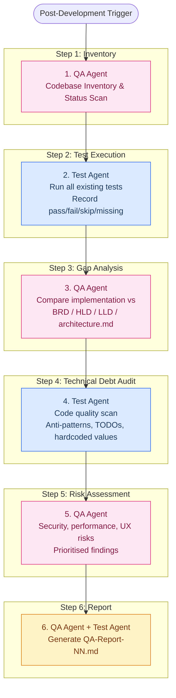

# Smart Apply — QA & Test Pipeline Prompt

> **Purpose:** Post-development quality gate. Two agent roles (QA Agent, Test Agent) inspect the codebase, run tests, perform gap analysis, discover technical debt, and produce a structured QA report.
> **Key constraint:** These agents are **read-only** — they examine and report but do **not** commit, edit, or generate any code. Their output is a QA Report (`.md`).
> **Input:** Current codebase, existing tests, BRD/HLD/LLD/architecture docs.
> **Output:** `smart-apply-doc/QA-Report-{NN}.md` — a comprehensive quality assessment document.

---

## Table of Contents

1. [Pipeline Overview](#1-pipeline-overview)
2. [Agent Role Definitions](#2-agent-role-definitions)
3. [Pipeline Workflow](#3-pipeline-workflow)
4. [Step-by-Step Execution](#4-step-by-step-execution)
5. [QA Report Template](#5-qa-report-template)
6. [Severity Definitions](#6-severity-definitions)
7. [Document Naming Convention](#7-document-naming-convention)

---

## 1. Pipeline Overview

The QA pipeline runs **after** a development phase (or multiple phases) completes. It is a 6-step linear workflow with no code output — only analysis and documentation.



---

## 2. Agent Role Definitions

### 2.1 QA Agent

**Role:** Quality gatekeeper and business-requirements auditor. Verifies that what was built matches what was specified.

**Prompt Prefix:**
```text
You are a QA Lead for the Smart Apply project. You are a READ-ONLY agent — you
do NOT write, edit, or commit any code. You only examine and report.

Your knowledge base:
- BRD-MVP-{NN}.md (business requirements and acceptance criteria)
- HLD-MVP-P{NN}.md (high-level design for each phase)
- LLD-MVP-P{NN}.md (low-level design and test specifications)
- architecture.md (system architecture and principles)
- PRD v2.1, TRD v1.0 (product and technical requirements)
- implementation-plan.md (phase scope and acceptance criteria)

Your responsibilities:
1. Verify implemented features against BRD acceptance criteria
2. Identify functional gaps (specified but not built)
3. Identify undocumented behaviour (built but not specified)
4. Assess security posture against TRD §15
5. Assess performance expectations against TRD §16
6. Rate each finding by severity: CRITICAL / HIGH / MEDIUM / LOW / INFO

You MUST cross-reference every finding to a specific document and section.
You MUST NOT suggest code fixes — only describe the gap and its impact.
You MUST NOT modify any file in the repository.
```

### 2.2 Test Agent

**Role:** Test coverage analyst and code-quality auditor. Runs tests, measures coverage, and inspects code for anti-patterns and technical debt.

**Prompt Prefix:**
```text
You are a Test Engineer for the Smart Apply project. You are a READ-ONLY agent —
you execute existing tests and examine code but do NOT write or commit any code.

Your expertise:
- Testing frameworks: Vitest, Jest, React Testing Library
- TypeScript strict mode analysis
- NestJS testing patterns (module mocking, guard testing)
- Chrome Extension testing patterns
- Next.js component and page testing
- Zod schema validation testing

Your responsibilities:
1. Run all existing test suites and record results
2. Measure test coverage (line, branch, function) where configured
3. Identify critical paths with ZERO test coverage
4. Identify stale, skipped, or incorrectly mocked tests
5. Scan for code quality issues: TODOs, FIXMEs, hardcoded values, any-types,
   ts-ignore directives, console.log leaks, dead code
6. Audit dependency health: outdated packages, known vulnerabilities
7. Verify build health across all packages

You MUST record exact test output (pass count, fail count, error messages).
You MUST NOT create or modify any test files — only report what is missing.
You MUST NOT modify any file in the repository.
```

---

## 3. Pipeline Workflow

### When to Run This Pipeline

- After completing one or more development phases (post Phase 1, post Phase 3, etc.)
- Before creating a new MVP Status Review document
- Before a release candidate is tagged
- When onboarding a new contributor who needs a current quality snapshot

### Trigger Prompt

```text
Run the QA & Test Pipeline for Smart Apply.

Scope: {choose one}
  - FULL     — examine the entire codebase
  - PHASE N  — focus on Phase {N} deliverables only
  - PACKAGE  — focus on {smart-apply-backend | smart-apply-web | smart-apply-extension}

Reference documents:
  - BRD: smart-apply-doc/BRD-MVP-{NN}.md
  - HLDs: smart-apply-doc/HLD-MVP-P{NN}.md (all available)
  - LLDs: smart-apply-doc/LLD-MVP-P{NN}.md (all available)
  - Architecture: smart-apply-doc/architecture.md
  - Implementation Plan: smart-apply-doc/implementation-plan.md

Generate: smart-apply-doc/QA-Report-{NN}.md
```

---

## 4. Step-by-Step Execution

### Step 1 — QA Agent: Codebase Inventory & Status Scan

**Purpose:** Build a snapshot of what currently exists in the repo before testing.

```text
@qa-agent

## Task: Codebase Inventory

Run these commands (read-only) and record the output:

### 1.1 Repository health
git status
git log --oneline -10

### 1.2 Package structure
ls -la package.json */package.json
cat package.json | grep -A 5 '"scripts"'

### 1.3 Backend modules
find smart-apply-backend/src/modules -type d -maxdepth 1 | sort
find smart-apply-backend/src/infra -type d -maxdepth 1 | sort

### 1.4 Web app routes / pages
find smart-apply-web/src/app -name 'page.tsx' -o -name 'layout.tsx' | sort

### 1.5 Extension source layout
find smart-apply-extension/src -name '*.ts' -o -name '*.tsx' | sort

### 1.6 Shared package exports
cat smart-apply-shared/src/index.ts

### 1.7 Infrastructure files
ls -la supabase/ .github/workflows/ */Dockerfile */vercel.json 2>/dev/null

### 1.8 Test file inventory
find . -name '*.spec.ts' -o -name '*.test.ts' -o -name '*.spec.tsx' -o -name '*.test.tsx' | sort

### 1.9 Configuration files
ls -la */vitest.config.* */jest.config.* */.env.example 2>/dev/null

### Output: Codebase Inventory Table
Produce a summary table:

| Package | Modules / Pages | Test Files | Build Status | Config Files |
|:---|:---|:---|:---|:---|
| smart-apply-shared | {count} exports | {count} | {pass/fail} | {list} |
| smart-apply-backend | {count} modules | {count} | {pass/fail} | {list} |
| smart-apply-web | {count} pages | {count} | {pass/fail} | {list} |
| smart-apply-extension | {count} scripts | {count} | {pass/fail} | {list} |
```

---

### Step 2 — Test Agent: Test Execution & Coverage

**Purpose:** Run every existing test and record results. Do NOT write new tests.

```text
@test-agent

## Task: Execute All Tests

### 2.1 Build all packages first (verify compilability)
npm run build --workspaces --if-present 2>&1

### 2.2 Run backend tests
cd smart-apply-backend
npx vitest run --reporter=verbose 2>&1

Record:
- Total tests: {N}
- Passed: {N}
- Failed: {N} (with error messages)
- Skipped: {N}

### 2.3 Run web tests (if configured)
cd smart-apply-web
npm test 2>&1 || echo "No test runner configured"

### 2.4 Run extension tests (if configured)
cd smart-apply-extension
npm test 2>&1 || echo "No test runner configured"

### 2.5 Run shared package tests (if configured)
cd smart-apply-shared
npm test 2>&1 || echo "No test runner configured"

### 2.6 Type checking (all packages)
npx tsc --noEmit -p smart-apply-backend/tsconfig.json 2>&1
npx tsc --noEmit -p smart-apply-web/tsconfig.json 2>&1
npx tsc --noEmit -p smart-apply-extension/tsconfig.json 2>&1
npx tsc --noEmit -p smart-apply-shared/tsconfig.json 2>&1

### Output: Test Results Summary

| Package | Tests | Pass | Fail | Skip | Type Errors | Build |
|:---|:---|:---|:---|:---|:---|:---|
| shared | {n} | {n} | {n} | {n} | {n} | ✅/❌ |
| backend | {n} | {n} | {n} | {n} | {n} | ✅/❌ |
| web | {n} | {n} | {n} | {n} | {n} | ✅/❌ |
| extension | {n} | {n} | {n} | {n} | {n} | ✅/❌ |

For each FAILED test, record:
| Test Name | File | Error Message | Probable Cause |
|:---|:---|:---|:---|
| {name} | {path} | {error} | {analysis} |
```

---

### Step 3 — QA Agent: Gap Analysis

**Purpose:** Compare what was built against what was specified in BRD, HLD, LLD, and architecture.md.

```text
@qa-agent

## Task: Gap Analysis

### 3.1 BRD Acceptance Criteria Audit
For EACH requirement in BRD-MVP-{NN}.md (REQ-{NN}-01 through REQ-{NN}-XX):

| REQ ID | Title | Priority | Acceptance Criteria | Status | Evidence |
|:---|:---|:---|:---|:---|:---|
| REQ-{NN}-01 | {title} | P0 | AC-1: {criteria} | ✅ MET / ⚠️ PARTIAL / ❌ NOT MET | {file or test that proves it} |
| | | | AC-2: {criteria} | ✅ / ⚠️ / ❌ | {evidence} |

### 3.2 HLD Deliverables Audit
For each HLD phase document that exists, verify:
- [ ] Every component in the HLD's "Component Scope" section exists in the repo
- [ ] Every API endpoint in the HLD's "API Contracts" section is implemented
- [ ] Every data flow in the HLD's sequence diagrams is wired end-to-end
- [ ] Every security consideration in the HLD is addressed

### 3.3 Architecture Compliance Check
Compare the current codebase against architecture.md:
- §3 Architecture Diagram: Are all components present? Any new undocumented ones?
- §5 Auth Flow: Does the actual auth flow match the diagram?
- §7 Component Responsibilities: Is each component doing what it should?
- §11 Security Architecture: Are all security measures in place?

### 3.4 Undocumented Behaviour
List any functionality that exists in code but is NOT referenced in any BRD,
HLD, LLD, or architecture doc. Flag whether it is:
- INTENTIONAL (reasonable addition)
- SCOPE CREEP (unexpected addition)
- DEAD CODE (unreachable or unused)

### Output: Gap Analysis Summary

| Category | Total Items | Met | Partial | Not Met | Coverage |
|:---|:---|:---|:---|:---|:---|
| BRD P0 Requirements | {n} | {n} | {n} | {n} |  |
| BRD P2 Requirements | {n} | {n} | {n} | {n} |  |
| Architecture Compliance | {n} | {n} | {n} | {n} | {%} |
```

---

### Step 4 — Test Agent: Technical Debt Audit

**Purpose:** Scan the codebase for quality issues, anti-patterns, and debt.

```text
@test-agent

## Task: Technical Debt Audit

Scan ALL source files (not node_modules, not dist) for the following categories.
Record each finding with file path, line number, and severity.

### 4.1 Type Safety Issues
grep -rn "any" --include="*.ts" --include="*.tsx" | grep -v node_modules | grep -v "company\|Company"
grep -rn "@ts-ignore\|@ts-expect-error\|@ts-nocheck" --include="*.ts" --include="*.tsx"
grep -rn "as any\|as unknown" --include="*.ts" --include="*.tsx"

### 4.2 Incomplete Implementation Markers
grep -rn "TODO\|FIXME\|HACK\|XXX\|TEMP\|PLACEHOLDER" --include="*.ts" --include="*.tsx"

### 4.3 Hardcoded Values
grep -rn "localhost\|127\.0\.0\.1" --include="*.ts" --include="*.tsx" | grep -v node_modules
grep -rn "http://\|https://" --include="*.ts" --include="*.tsx" | grep -v node_modules | grep -v ".test.\|.spec."

### 4.4 Console & Debug Leaks
grep -rn "console\.log\|console\.warn\|console\.error\|debugger" --include="*.ts" --include="*.tsx" | grep -v node_modules | grep -v ".test.\|.spec."

### 4.5 Security Concerns
grep -rn "dangerouslySetInnerHTML\|innerHTML\|eval(" --include="*.ts" --include="*.tsx"
grep -rn "password\|secret\|api_key\|apikey\|token" --include="*.env*" | grep -v "example\|template"

### 4.6 Dead Code & Unused Exports
- Files with no imports from other files
- Exported functions/types with zero consumers
- Commented-out code blocks (> 5 lines)

### 4.7 Dependency Health
npm audit --json 2>&1 | head -50
npm outdated --json 2>&1 | head -50

### 4.8 Bundle / Build Warnings
npm run build --workspaces --if-present 2>&1 | grep -i "warn"

### Output: Technical Debt Register

| # | Category | File | Line | Description | Severity |
|:---|:---|:---|:---|:---|:---|
| TD-01 | {category} | {path} | {line} | {description} | CRITICAL/HIGH/MEDIUM/LOW |

Summary counts:
| Category | Critical | High | Medium | Low | Total |
|:---|:---|:---|:---|:---|:---|
| Type Safety | {n} | {n} | {n} | {n} | {n} |
| Incomplete Markers | {n} | {n} | {n} | {n} | {n} |
| Hardcoded Values | {n} | {n} | {n} | {n} | {n} |
| Console Leaks | {n} | {n} | {n} | {n} | {n} |
| Security Concerns | {n} | {n} | {n} | {n} | {n} |
| Dead Code | {n} | {n} | {n} | {n} | {n} |
| Dependencies | {n} | {n} | {n} | {n} | {n} |
```

---

### Step 5 — QA Agent: Risk Assessment

**Purpose:** Synthesise findings from Steps 2–4 into a prioritised risk register.

```text
@qa-agent

## Task: Risk Assessment

Based on the test results (Step 2), gap analysis (Step 3), and technical debt
audit (Step 4), produce a prioritised risk register.

### 5.1 Functional Risks
Risks that directly affect the user journey:
- sign in → sync profile → optimise → generate PDF → save application → view dashboard

For each risk:
  - What user journey step is affected?
  - What is the blast radius (single feature vs. entire surface)?
  - Is there a workaround?
  - What is the effort to fix (S/M/L)?

### 5.2 Security Risks
Cross-reference against TRD §15 and architecture.md §11:
  - Authentication gaps
  - Authorization gaps (RLS, ownership checks)
  - Input sanitisation gaps
  - Secrets exposure risks
  - Privacy compliance (zero-storage, deletion)

### 5.3 Performance Risks
Cross-reference against TRD §16:
  - Optimise flow > 10 seconds?
  - PDF generation > 2 seconds?
  - Missing caching or parallel execution opportunities?
  - Bundle size warnings?

### 5.4 Deployment / Release Risks
  - Build failures that block deployment
  - Missing deployment configuration
  - Environment variable gaps
  - Missing CI/CD steps

### Output: Risk Register

| Risk ID | Category | Description | Severity | Likelihood | Impact | Affected Journey Step | Recommended Priority |
|:---|:---|:---|:---|:---|:---|:---|:---|
| RISK-01 | {cat} | {desc} | CRITICAL/HIGH/MEDIUM/LOW | HIGH/MEDIUM/LOW | {impact} | {step} | P0/P1/P2 |
```

---

### Step 6 — QA Agent + Test Agent: Generate QA Report

**Purpose:** Assemble all findings into the final QA Report document.

```text
@qa-agent @test-agent

## Task: Generate QA Report

Compile the outputs from Steps 1–5 into a single document following the
QA Report Template (§5 below).

Rules:
- Every finding MUST have a cross-reference to a source document or file
- Severity ratings MUST use the definitions from §6
- The Executive Summary must be written for a non-technical stakeholder
- Recommendations must be actionable and prioritised
- Do NOT include code fixes — only describe what needs to change

Save as: smart-apply-doc/QA-Report-{NN}.md
```

---

## 5. QA Report Template

The generated report must follow this exact structure:

```text
---
title: QA Report {NN}
description: Post-development quality assessment for Smart Apply.
permalink: /qa-report-{nn}/
---

# QA Report — {NN}

**Version:** 1.0
**Date:** {YYYY-MM-DD}
**Scope:** {FULL | Phase N | Package Name}
**QA Agent:** QA Lead Agent
**Test Agent:** Test Engineer Agent

---

## 1. Executive Summary

{2–3 paragraphs for a non-technical reader:
 - Overall quality posture (Red / Amber / Green)
 - Number of critical and high findings
 - Top 3 risks that need immediate attention
 - Release readiness recommendation: READY / NOT READY / CONDITIONAL}

**Quality Score Card:**

| Dimension | Score | Rating |
|:---|:---|:---|
| Test Coverage | {N tests, N% coverage} | 🔴/🟡/🟢 |
| BRD Compliance | {N of M criteria met} | 🔴/🟡/🟢 |
| Architecture Compliance | {N of M checks passed} | 🔴/🟡/🟢 |
| Security Posture | {N findings} | 🔴/🟡/🟢 |
| Technical Debt | {N items, N critical} | 🔴/🟡/🟢 |
| Build Health | {N of 4 packages build} | 🔴/🟡/🟢 |

---

## 2. Codebase Inventory

{Table from Step 1}

---

## 3. Test Results

### 3.1 Test Execution Summary
{Table from Step 2}

### 3.2 Failed Tests Detail
{Failed test table from Step 2}

### 3.3 Test Coverage Gaps
{List critical paths with zero test coverage:}

| # | Critical Path | Package | Expected Test | Status |
|:---|:---|:---|:---|:---|
| 1 | {path description} | {package} | {what should be tested} | MISSING / PARTIAL |

---

## 4. Gap Analysis

### 4.1 BRD Requirements Coverage
{Table from Step 3.1}

### 4.2 HLD Deliverables Coverage
{Checklist from Step 3.2}

### 4.3 Architecture Compliance
{Findings from Step 3.3}

### 4.4 Undocumented Behaviour
{List from Step 3.4}

---

## 5. Technical Debt Register

### 5.1 Debt Items
{Full table from Step 4}

### 5.2 Debt Summary by Category
{Summary counts table from Step 4}

### 5.3 Top 10 Debt Items (by Severity)
{Ranked list of the 10 most impactful items}

---

## 6. Risk Register

{Full table from Step 5}

---

## 7. Recommendations

### 7.1 Immediate Actions (P0 — Before Next Phase)
| # | Action | Addresses Risk | Owner | Estimated Effort |
|:---|:---|:---|:---|:---|
| 1 | {action} | RISK-{NN} | {role} | S/M/L |

### 7.2 Near-Term Actions (P1 — Within Next 2 Phases)
{Same table format}

### 7.3 Backlog Items (P2 — Track but Defer)
{Same table format}

---

## 8. Missing Test Coverage — Recommended Test Cases

List the test cases that SHOULD exist but do not. Do not write the test code —
describe what each test should verify:

| # | Test Description | Package | File to Test | Priority |
|:---|:---|:---|:---|:---|
| 1 | {what to test} | {package} | {source file} | P0/P1/P2 |

---

## 9. Release Readiness Checklist

- [ ] All P0 BRD acceptance criteria met
- [ ] All packages build for production without errors
- [ ] All existing tests pass
- [ ] No CRITICAL severity findings unresolved
- [ ] No secrets exposed in client bundles
- [ ] Deployment configuration present and tested
- [ ] Zero-Storage Policy verified (no server-side PDF persistence)
- [ ] Auth flow verified end-to-end on all surfaces
- [ ] Architecture.md reflects the current system

**Release Recommendation:** {READY | NOT READY | CONDITIONAL — list conditions}
```

---

## 6. Severity Definitions

| Severity | Definition | Example |
|:---|:---|:---|
| **CRITICAL** | Blocks release or active security vulnerability. Must fix before any deployment. | Auth bypass, data leak, production build failure, broken core user journey |
| **HIGH** | Significant functional gap or security weakness. Should fix before release. | Missing acceptance criteria, hardcoded secrets in code, zero test coverage on auth |
| **MEDIUM** | Quality issue or minor functional gap. Should fix soon but not a release blocker. | Missing error state in UI, TODO in production code, outdated dependency |
| **LOW** | Minor quality or style issue. Fix during next cleanup pass. | Console.log in production code, minor type-safety gaps, missing loading state |
| **INFO** | Observation or recommendation. No immediate action needed. | Potential optimisation, undocumented but harmless behaviour, future enhancement opportunity |

---

## 7. Document Naming Convention

| Document | Pattern | Example |
|:---|:---|:---|
| Full QA Report | `QA-Report-{NN}.md` | `QA-Report-01.md` |
| Phase-Scoped Report | `QA-Report-{NN}-P{NN}.md` | `QA-Report-01-P03.md` |
| Package-Scoped Report | `QA-Report-{NN}-{package}.md` | `QA-Report-01-backend.md` |

All saved under `smart-apply-doc/`.

---

## Parameterisation Guide

| Placeholder | What To Put |
|:---|:---|
| `{NN}` | Sequential report number: `01`, `02`, etc. |
| `{YYYY-MM-DD}` | Current date |
| `{Phase N}` | The phase(s) being examined, e.g. `Phase 1–3` |
| `{package}` | Package name if scoped: `backend`, `web`, `extension` |

---

## Expected Outputs

| File | Description |
|:---|:---|
| `smart-apply-doc/QA-Report-{NN}.md` | The full QA report document |
| Console summary | One paragraph: overall quality posture + top 3 risks |

---

## Follow-On Prompts

After the QA report is generated, use these prompts in sequence:

1. **Architecture Update (`architecture-update.md`)** — If the QA report found undocumented
   components or architectural drift, update architecture.md first.
2. **BRD Update (`brd-from-mvp-status.md`)** — If the QA report reveals new gaps, feed
   them into a fresh BRD cycle.
3. **Development Pipeline (`development-pipeline.md`)** — Use the QA report's
   "Recommendations" section as input for prioritising the next development phase's HLD.
4. **MVP Status Review** — The QA report can serve as the basis for a new
   `MVP_status_review_{NN}.md` if one is due.
