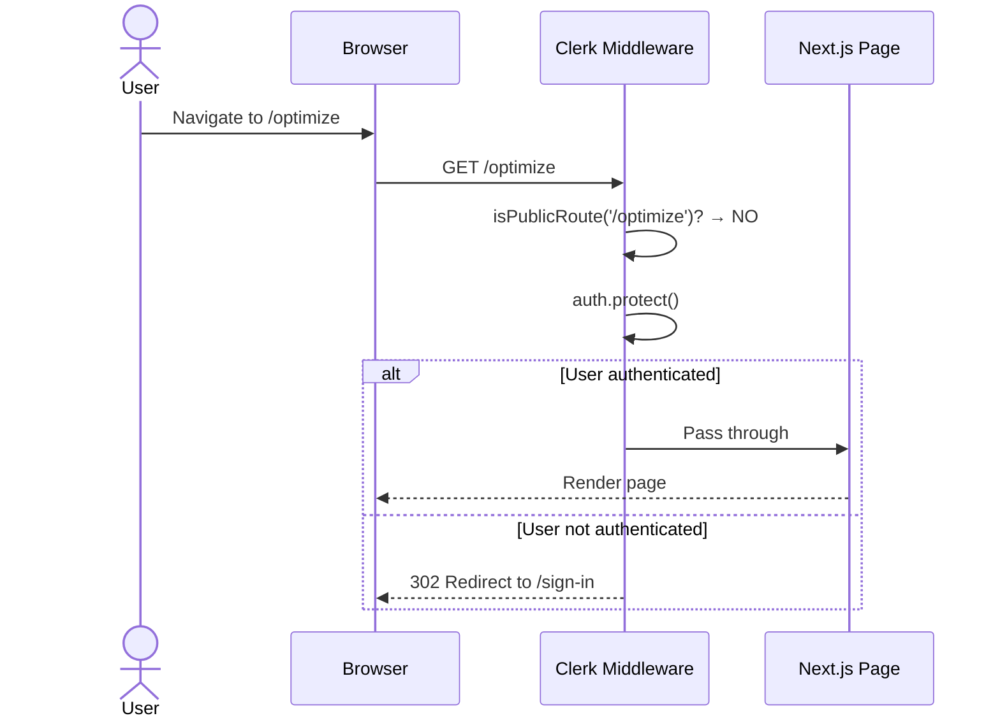
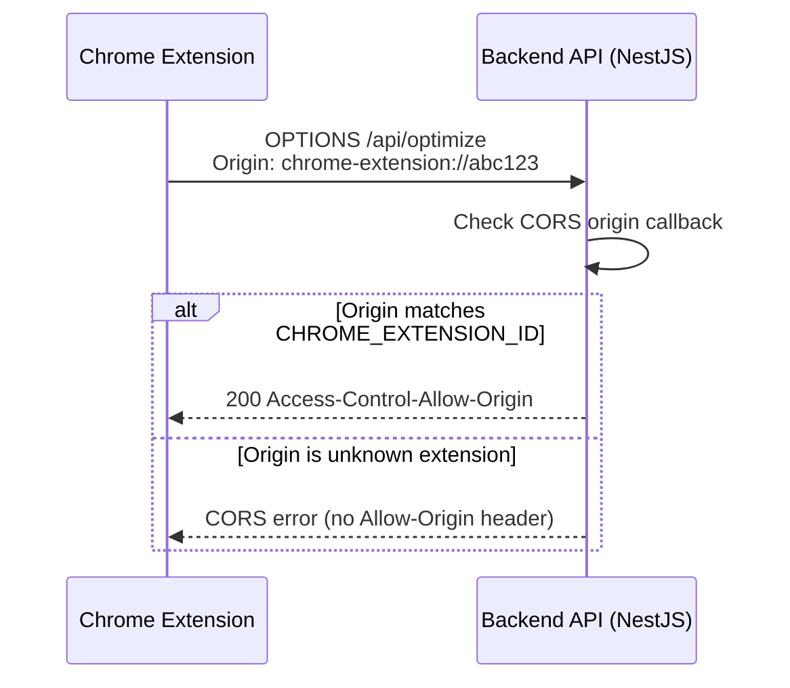
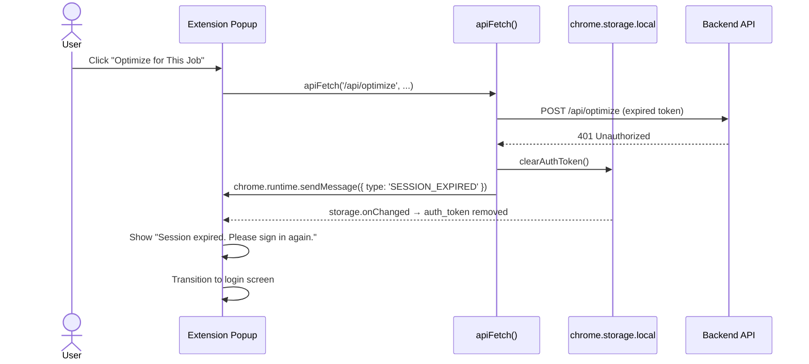
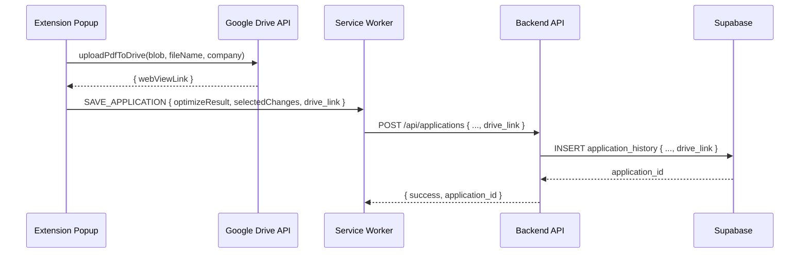
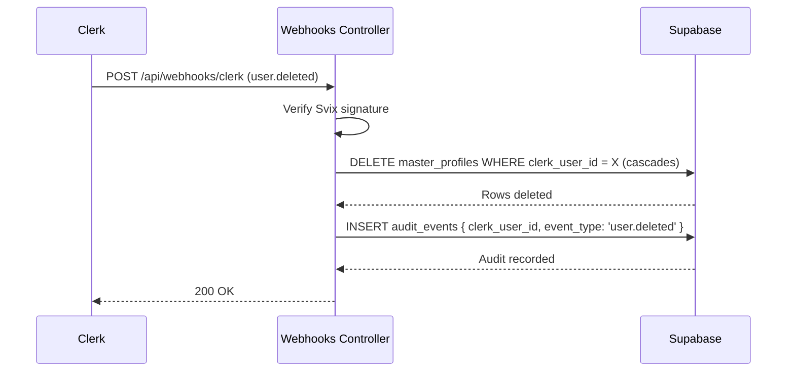
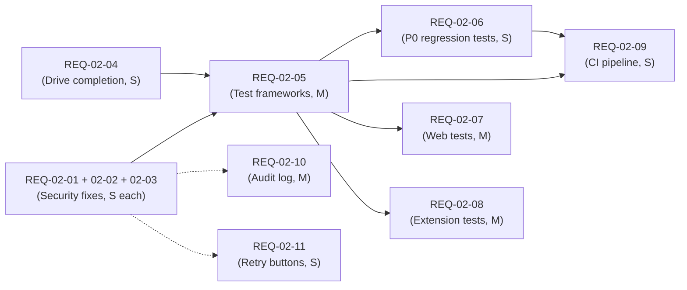

# HLD-MVP-P04 — Security, Testing & Quality Hardening

**Version:** 1.0  
**Date:** 2026-03-29  
**Phase:** Security, Testing & Quality Hardening  
**Source:** BRD-MVP-02.md (driven by QA-Report-01 findings + Arch-Review-QA-01)  
**Prerequisite:** All P01–P03 phases complete and verified.

---

## 1. Phase Objective

### Business Goal

Close all security gaps identified in QA-Report-01, establish automated test coverage across all four packages, complete the Google Drive integration, and build a CI pipeline that guards quality on every merge. After this phase the product reaches **CONDITIONALLY READY for beta deployment**.

### User-Facing Outcome After This Phase

- All web portal routes require authentication — unauthenticated access to `/optimize` or `/settings` is impossible.
- The Smart Apply API rejects requests from unauthorized Chrome extensions.
- Expired sessions in the Chrome extension gracefully redirect to re-login instead of silently failing.
- Google Drive upload works end-to-end with shareable links persisted in application history.
- Error states in the extension popup include "Retry" buttons for transient failures.
- Account deletion produces an auditable record.

---

## 2. Component Scope

### Repos Affected

| Repo | Changes |
|:---|:---|
| `smart-apply-web` | REQ-02-01 (middleware route protection inversion) |
| `smart-apply-backend` | REQ-02-02 (CORS restriction), REQ-02-10 (audit_events table + migration), REQ-02-13 (structured logging — P2) |
| `smart-apply-extension` | REQ-02-03 (401 handling), REQ-02-04 (Drive OAuth + drive_link passthrough), REQ-02-11 (retry buttons), REQ-02-12 (bundle size — P2), REQ-02-16 (type casts — P2) |
| `smart-apply-shared` | REQ-02-05 (test framework setup) |
| `supabase/` | REQ-02-10 (new migration for `audit_events` table) |
| CI (`.github/workflows/`) | REQ-02-09 (full pipeline), REQ-02-14 (ESLint + Prettier — P2) |

### REQ Mapping

| REQ | Title | Priority | Repos |
|:---|:---|:---|:---|
| REQ-02-01 | Fix Web Middleware Route Protection | P0 | web |
| REQ-02-02 | Restrict CORS to Specific Extension ID | P0 | backend |
| REQ-02-03 | Complete Extension 401 Handling | P0 | extension |
| REQ-02-04 | Complete Google Drive Integration | P0 | extension |
| REQ-02-05 | Establish Test Frameworks for All Packages | P0 | shared, web, extension |
| REQ-02-06 | P0 Regression Test Suite | P1 | web, shared |
| REQ-02-07 | Web Component Test Coverage | P1 | web |
| REQ-02-08 | Extension Service Worker & PDF Test Coverage | P1 | extension |
| REQ-02-09 | Complete CI Pipeline Coverage | P1 | CI |
| REQ-02-10 | Account Deletion Audit Log | P1 | backend, supabase |
| REQ-02-11 | Extension Error State Retry Buttons | P1 | extension |
| REQ-02-12 | Extension Popup Bundle Size Reduction | P2 | extension |
| REQ-02-13 | Structured Logging Strategy | P2 | backend, extension |
| REQ-02-14 | ESLint + Prettier CI Integration | P2 | all, CI |
| REQ-02-15 | Resolve npm Audit Vulnerabilities | P2 | all |
| REQ-02-16 | Fix Unsafe Type Casts in Extension | P2 | extension |

### Explicitly Out of Scope

- New features (cover letter, multi-template, batch PDF, interview coaching)
- Performance load testing beyond bundle size
- Chrome Web Store submission
- Monitoring dashboards / APM
- Mobile-native application

---

## 3. Architecture Decisions

### AD-01: Invert Web Route Protection Model (REQ-02-01)

**Decision:** Replace the protected-route blocklist pattern with a public-route allowlist in `smart-apply-web/src/middleware.ts`. All routes are protected by default; only explicitly listed public routes bypass authentication.

**Current State:**
```typescript
const isProtectedRoute = createRouteMatcher([
  '/dashboard(.*)',
  '/profile(.*)',
  '/auth/extension-callback',
]);
// Only routes listed above are protected
```

**Target State:**
```typescript
const isPublicRoute = createRouteMatcher([
  '/sign-in(.*)',
  '/sign-up(.*)',
  '/api/webhooks(.*)',
  '/',
]);
// Everything NOT in this list is protected
```

**Rationale:** Eliminates the class of bug where new routes are accidentally left unprotected (RISK-01). This is the standard Clerk pattern (`publicRoutes`). Architecture.md §5 mandates auth on all user-facing routes.

**Reference:** architecture.md §5 (Authentication & Authorization Flow)

### AD-02: Environment-Based CORS Extension Restriction (REQ-02-02)

**Decision:** Replace the wildcard `chrome-extension://` regex in `main.ts` CORS config with a specific extension ID loaded from `CHROME_EXTENSION_ID` env var. In development mode only (`NODE_ENV !== 'production'`), fall back to accepting all extension origins.

**Current State:**
```typescript
/^chrome-extension:\/\//.test(origin)  // matches ANY extension
```

**Target State:**
```typescript
const extId = config.get<string>('CHROME_EXTENSION_ID');
if (extId) {
  origin === `chrome-extension://${extId}`
} else if (config.get('NODE_ENV') !== 'production') {
  /^chrome-extension:\/\//.test(origin)  // dev-only fallback
}
```

**Rationale:** Prevents third-party extensions from making authorized API requests (RISK-02). The env var pattern matches the existing `ALLOWED_ORIGINS` approach in `main.ts`.

**Reference:** architecture.md §5 (Auth key rules — extension stores token in `chrome.storage.local`)

### AD-03: Extension API Client 401 Interceptor (REQ-02-03)

**Decision:** Modify `apiFetch()` in `smart-apply-extension/src/lib/api-client.ts` to detect 401 responses, clear the stored auth token via `clearAuthToken()`, and broadcast a `SESSION_EXPIRED` message to the popup so it transitions to the login screen with an informational message.

**Design:**
1. `apiFetch()` checks `res.status === 401` before the generic error throw.
2. On 401: calls `clearAuthToken()` from `auth.ts` to remove `auth_token` from `chrome.storage.local`.
3. The popup's existing `chrome.storage.onChanged` listener already detects token removal and transitions to the login screen.
4. Additionally, broadcast `chrome.runtime.sendMessage({ type: 'SESSION_EXPIRED' })` so the popup can show "Session expired. Please sign in again." before transitioning.

**Rationale:** The popup already listens for `auth_token` storage changes (see `App.tsx` `onStorageChanged`). Clearing the token is sufficient to trigger the login screen. The additional message provides UX context.

**Reference:** architecture.md §5 (extension stores token in `chrome.storage.local`)

### AD-04: Google Drive OAuth Client ID via Build-Time Env (REQ-02-04)

**Decision:** Replace `GOOGLE_OAUTH_CLIENT_ID_PLACEHOLDER` in `manifest.ts` with Vite's `process.env.VITE_GOOGLE_OAUTH_CLIENT_ID` substitution at build time. Additionally, fix the SAVE_APPLICATION flow to pass `drive_link` from the popup to the service worker and then to the API body.

**Design:**
1. `manifest.ts`: `client_id: process.env.VITE_GOOGLE_OAUTH_CLIENT_ID || 'GOOGLE_OAUTH_CLIENT_ID_PLACEHOLDER'`
2. Service worker `handleSaveApplication()`: Accept `drive_link` in the payload and include it in the `CreateApplicationRequest` body.
3. Popup `handleGeneratePdf()`: Already computes `driveLink` — ensure it's passed in the SAVE_APPLICATION message payload (current code already does this, but the service worker ignores it).

**Rationale:** The code already implements Drive upload end-to-end; the only blockers are the placeholder client ID and the missing `drive_link` pass-through in the service worker.

**Reference:** architecture.md §4.2 (Resume Optimization Flow — Drive upload step), §7 (extension responsibility: Google Drive upload)

### AD-05: Test Framework Configuration Strategy (REQ-02-05)

**Decision:** Configure Vitest for all four packages with appropriate environments:

| Package | Test Environment | Key Mocks |
|:---|:---|:---|
| `smart-apply-shared` | `node` | None (pure logic) |
| `smart-apply-web` | `jsdom` | Clerk auth context, Next.js router, fetch |
| `smart-apply-extension` | `node` | `globalThis.chrome` (storage, runtime, tabs, identity APIs) |
| `smart-apply-backend` | `node` | Already configured |

**Rationale:** Vitest is already used in the backend. Using the same runner across all packages keeps configuration consistent and allows a single CI command pattern (`npm test`).

**Reference:** architecture.md §7 (component responsibilities)

### AD-06: Audit Events Table Design (REQ-02-10)

**Decision:** Create an `audit_events` table in Supabase with NO RLS (service-role-only access). Schema:

```sql
CREATE TABLE audit_events (
  id uuid DEFAULT gen_random_uuid() PRIMARY KEY,
  clerk_user_id text NOT NULL,
  event_type text NOT NULL,
  metadata jsonb DEFAULT '{}'::jsonb,
  created_at timestamptz DEFAULT now()
);
-- No RLS — accessed via service role only
```

The backend WebhooksController writes to this table after successful account deletion. The table is append-only — no UPDATE or DELETE operations are exposed.

**Rationale:** Minimal schema that stores only the user ID and event type (no PII). Service-role-only access prevents user-facing queries. The append-only pattern ensures audit integrity.

**Reference:** architecture.md §6 (Data Model), §4.5 (Account Deletion Flow)

### AD-07: Extension Retry Button Pattern (REQ-02-11)

**Decision:** Refactor the popup's error display to include a "Retry" button alongside every error message. The retry button re-dispatches the original message type (`TRIGGER_SYNC` or `TRIGGER_OPTIMIZE`) to the service worker. Implement via a reusable `ErrorWithRetry` component that takes `message: string` and `onRetry: () => void`.

**Rationale:** Users currently must close and reopen the popup to retry failed operations. A retry button reduces friction and handles transient network errors gracefully.

**Reference:** architecture.md §7 (extension responsibility: user review UI)

---

## 4. Data Flow

### 4.1 Route Protection Flow (REQ-02-01)



### 4.2 CORS Restriction Flow (REQ-02-02)



### 4.3 Extension 401 Handling Flow (REQ-02-03)



### 4.4 Google Drive Link Persistence Flow (REQ-02-04)



### 4.5 Account Deletion Audit Flow (REQ-02-10)



---

## 5. API Contracts

### 5.1 Existing Endpoints — No Changes Required

All existing API endpoints (`/api/profile/*`, `/api/optimize`, `/api/applications`, `/api/account`, `/api/webhooks/clerk`, `/health`) remain unchanged in their request/response schemas. The only backend changes are:

1. **CORS origin validation logic** in `main.ts` (REQ-02-02) — affects which origins are allowed, not the API contract.
2. **Audit event insertion** in `webhooks.controller.ts` (REQ-02-10) — internal DB write, no API contract change.
3. **Structured logging** (REQ-02-13, P2) — internal change, no API contract impact.

### 5.2 Extension Message Protocol Changes

**Modified Message: `SAVE_APPLICATION`**

```typescript
// Current message payload:
{ type: 'SAVE_APPLICATION', payload: { optimizeResult: OptimizeResponse; selectedChanges: number[] } }

// Updated message payload:
{ type: 'SAVE_APPLICATION', payload: { optimizeResult: OptimizeResponse; selectedChanges: number[]; drive_link?: string } }
```

The service worker's `handleSaveApplication()` must read `payload.drive_link` and include it in the `CreateApplicationRequest` body sent to `POST /api/applications`.

**New Message: `SESSION_EXPIRED`**

```typescript
{ type: 'SESSION_EXPIRED' }
```

Broadcasted by `apiFetch()` on 401 response. The popup listens and displays an expiry message before transitioning to the login screen.

---

## 6. Security Considerations

### 6.1 Route Protection (REQ-02-01)

- **Threat:** Unauthenticated users accessing protected pages.
- **Mitigation:** Inverted middleware model — all routes protected by default, only `/sign-in`, `/sign-up`, `/`, and `/api/webhooks` are public.
- **Validation:** Integration tests verify that `/dashboard`, `/profile`, `/optimize`, `/settings` all reject unauthenticated requests.

### 6.2 CORS Restriction (REQ-02-02)

- **Threat:** Third-party extensions making API calls with stolen tokens.
- **Mitigation:** CORS only allows the specific Chrome extension ID (from env var) and the web portal origin.
- **Validation:** Unit tests verify CORS accept/reject behavior. Production must have `CHROME_EXTENSION_ID` set.

### 6.3 Token Handling (REQ-02-03)

- **Threat:** Expired token remains in storage, causing silent failures.
- **Mitigation:** 401 response triggers immediate token clearance and user notification.
- **Validation:** Tests mock 401 response and verify token is removed from `chrome.storage.local`.

### 6.4 Audit Trail (REQ-02-10)

- **Threat:** Account deletion without verifiable record (GDPR/CCPA compliance risk).
- **Mitigation:** Append-only `audit_events` table with no PII — only `clerk_user_id` and `event_type`.
- **No RLS:** Table accessed via service role only; user-facing queries are not exposed.

### 6.5 Google Drive OAuth (REQ-02-04)

- **Threat:** Placeholder OAuth client ID allows no scope restriction.
- **Mitigation:** Real client ID configured at build time; `drive.file` scope limits access to files created by the app.
- **Validation:** Build process rejects `PLACEHOLDER` value with a warning.

---

## 7. Dependencies & Integration Points

### 7.1 Phase Dependencies

| This Phase | Depends On | Notes |
|:---|:---|:---|
| REQ-02-01 (route protection) | P01 Clerk middleware setup | Modifies existing middleware |
| REQ-02-02 (CORS) | P01 backend bootstrap | Modifies `main.ts` CORS config |
| REQ-02-03 (401 handling) | P01 extension auth bridge | Modifies `api-client.ts` |
| REQ-02-04 (Drive) | P03 Drive upload code | Modifies `manifest.ts` + service worker |
| REQ-02-05 (test frameworks) | All P01–P03 code | Adds test infra around existing code |
| REQ-02-06 (regression tests) | REQ-02-01, REQ-02-05 | Tests depend on security fixes + test infra |
| REQ-02-07/08 (component tests) | REQ-02-05 | Depends on test framework setup |
| REQ-02-09 (CI) | REQ-02-05 | CI runs test suites set up in REQ-02-05 |
| REQ-02-10 (audit log) | P01 webhooks controller | Extends existing webhook handler |

### 7.2 External Dependencies

| External Service | Requirement | Owner |
|:---|:---|:---|
| Google Cloud Console | OAuth consent screen + client ID for REQ-02-04 | Product Owner |
| Chrome Web Store (dev) | Extension ID for REQ-02-02 CORS | Engineering Lead |
| GitHub Actions | CI workflow for REQ-02-09, REQ-02-14 | Engineering |

### 7.3 Internal Sequencing



Security fixes and Drive completion are parallelizable and have no mutual dependencies. Test framework setup must follow security fixes (so regression tests can validate them). CI pipeline depends on test frameworks being configured.

---

## 8. Acceptance Criteria Summary

### Unit-Testable

| REQ | Test | Expected Outcome |
|:---|:---|:---|
| REQ-02-01 | Middleware rejects unauthenticated `/optimize` | 302 redirect to `/sign-in` |
| REQ-02-01 | Middleware rejects unauthenticated `/settings` | 302 redirect to `/sign-in` |
| REQ-02-01 | Middleware allows unauthenticated `/sign-in` | 200 OK |
| REQ-02-01 | Middleware allows unauthenticated `/` | 200 OK |
| REQ-02-02 | CORS allows configured extension ID | `Access-Control-Allow-Origin` present |
| REQ-02-02 | CORS rejects unknown extension | No `Allow-Origin` header |
| REQ-02-02 | CORS allows web portal origin | `Access-Control-Allow-Origin` present |
| REQ-02-02 | Dev mode: CORS allows any extension | Fallback works when no `CHROME_EXTENSION_ID` |
| REQ-02-03 | `apiFetch` on 401 clears auth token | `chrome.storage.local.remove('auth_token')` called |
| REQ-02-03 | `apiFetch` on 401 broadcasts SESSION_EXPIRED | Message sent via `chrome.runtime.sendMessage` |
| REQ-02-04 | Service worker passes `drive_link` to API body | `CreateApplicationRequest.drive_link` is set |
| REQ-02-06 | All protected routes reject unauthenticated requests | 302 redirects |
| REQ-02-06 | Shared Zod schemas validate correct inputs | Parse succeeds |
| REQ-02-06 | Shared Zod schemas reject invalid inputs | ZodError thrown |
| REQ-02-10 | Webhook handler writes audit event after deletion | `audit_events` row exists |
| REQ-02-10 | Audit event contains no PII | Only `clerk_user_id`, `event_type`, `timestamp` |
| REQ-02-11 | Error states render "Retry" button | Button visible in DOM |
| REQ-02-11 | Retry button re-triggers original operation | Message dispatched |

### Integration-Testable

| REQ | Test | Expected Outcome |
|:---|:---|:---|
| REQ-02-05 | `npm test` in each package | Vitest runs and reports results |
| REQ-02-09 | CI pipeline on PR | All 4 packages typecheck, build, and test |
| REQ-02-04 | Extension build with `VITE_GOOGLE_OAUTH_CLIENT_ID` | Manifest contains real client ID |

### Manual Verification

| REQ | Check | Expected Outcome |
|:---|:---|:---|
| REQ-02-04 | Upload PDF to Drive after optimization | File appears in `Smart-Apply/{company}/` |
| REQ-02-04 | Application history record | `drive_link` column populated |
| REQ-02-12 | Build output size | Popup chunk ≤ 500 kB |
| REQ-02-15 | `npm audit` | 0 high-severity vulnerabilities |
