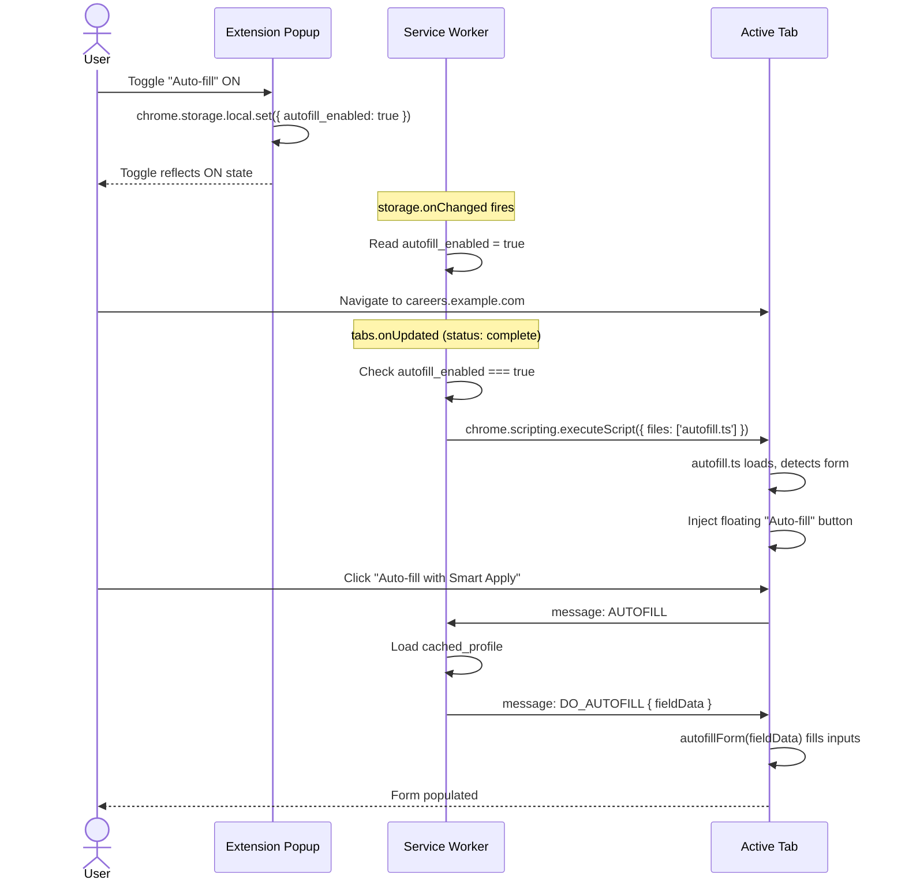
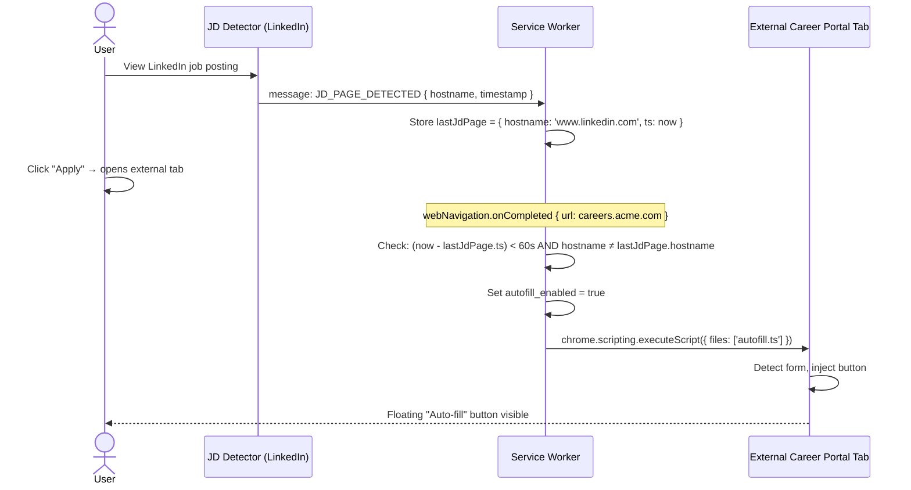
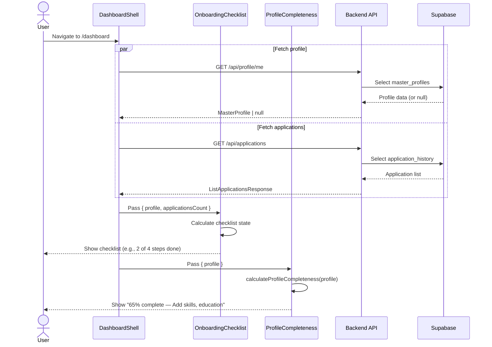
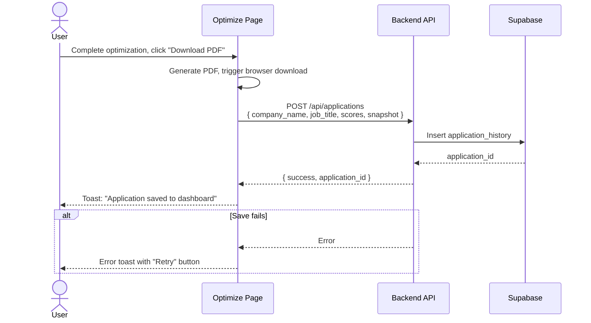
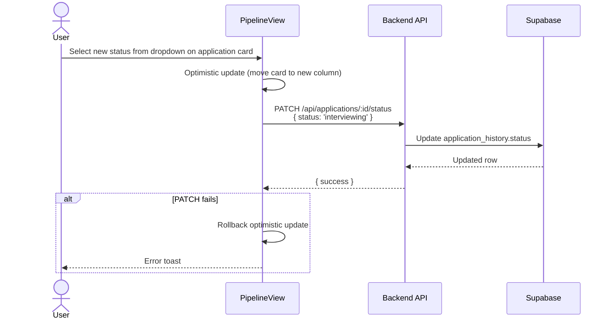

# HLD-MVP-P06 — Cross-Site Autofill & Dashboard Enrichment

**Version:** 1.0  
**Date:** 2026-03-30  
**Phase:** Cross-Site Autofill Activation & Web Dashboard Enrichment  
**Source:** BRD-MVP-04.md (REQ-04-01 through REQ-04-08)  
**Prerequisite:** Phase P05 (Test Coverage Completion) approved.

---

## 1. Phase Objective

### Business Goal

Close the two product gaps identified during local testing: (1) extend autofill to work on **any** career portal the user is redirected to, not just the five hardcoded domains; (2) transform the web dashboard from an empty shell into an actionable home base with onboarding, quick actions, profile completeness, and a pipeline view.

### User-Facing Outcome After This Phase

- **Extension:** A toggle in the popup lets users enable autofill on any page. When the user clicks "Apply" on a job posting that redirects to an external career portal, the extension automatically injects the autofill script on the destination page. The user sees the familiar floating "Auto-fill with Smart Apply" button without any manual intervention.
- **Web Dashboard:** New users see a guided onboarding checklist. Returning users see quick-action buttons, a profile completeness meter, and a pipeline/Kanban view of their applications. The web optimize flow now saves an application record after PDF download.

---

## 2. Component Scope

### Repos Affected

| Repo | Impact | Justification |
|:---|:---|:---|
| smart-apply-extension | **HIGH** — manifest update, new service-worker logic, popup UI change | REQ-04-01 (toggle), REQ-04-02 (programmatic injection), REQ-04-03 (auto-activate) |
| smart-apply-web | **HIGH** — 4 new dashboard widgets, optimize flow change | REQ-04-04 (onboarding), REQ-04-05 (quick actions), REQ-04-06 (completeness), REQ-04-07 (pipeline), REQ-04-08 (save application) |
| smart-apply-shared | **LOW** — Add profile completeness utility type | Helper for completeness calculation shared between web and extension |
| smart-apply-backend | **NONE** | All required endpoints already exist (GET /api/profile/me, POST /api/applications, PATCH /api/applications/:id/status, GET /api/applications) |
| supabase | **NONE** | No schema changes required |

### REQ Mapping

| REQ | Title | Repos | Priority |
|:---|:---|:---|:---|
| REQ-04-01 | Extension Autofill Toggle in Popup | extension | P0 |
| REQ-04-02 | Programmatic Autofill Script Injection on Any Domain | extension | P0 |
| REQ-04-03 | Auto-Activate Autofill on External Application Redirect | extension | P0 |
| REQ-04-04 | Dashboard Onboarding Checklist | web | P1 |
| REQ-04-05 | Dashboard Quick Actions Bar | web | P1 |
| REQ-04-06 | Dashboard Profile Completeness Meter | web, shared | P1 |
| REQ-04-07 | Dashboard Application Status Pipeline View | web | P1 |
| REQ-04-08 | Web Optimize Flow — Save Application Record | web | P1 |

### Explicitly Out of Scope

- P2 requirements (REQ-04-09 activity feed, REQ-04-10 extension status, REQ-04-11 ATS trend chart) — deferred to next phase
- Platform-specific ATS adapters (Workday step handling, etc.) — deferred per PRD §7
- Drag-and-drop status reordering in pipeline view — deferred per BRD-MVP-04 Open Question #3; status changes via dropdown only
- Autofill auto-disable timeout — deferred per BRD-MVP-04 Open Question #1
- Backend changes — all required API endpoints exist

---

## 3. Architecture Decisions

### AD-01: Programmatic Script Injection via `chrome.scripting.executeScript`

**Decision:** Use `chrome.scripting.executeScript` (Manifest V3 API) to inject `autofill.ts` into any active tab on demand, rather than expanding `content_scripts` match patterns to `<all_urls>`.

**Rationale (architecture.md §7, §11):**
- The content_scripts approach statically injects on every page load, wasting resources and raising security concerns.
- `chrome.scripting.executeScript` requires the `scripting` permission and works with `activeTab`, which only grants access to the tab the user explicitly interacts with (e.g., clicking the extension icon or activating the toggle).
- This aligns with NFR-03: injection occurs only when explicitly enabled by the user or triggered by a detected apply-redirect.
- `activeTab` is already declared in the manifest. Adding `scripting` is the only permission change.

**Manifest Changes:**
```
permissions: ['storage', 'activeTab', 'identity', 'scripting', 'tabs']
```
- `scripting` — required for `chrome.scripting.executeScript`
- `tabs` — required for `chrome.tabs.onUpdated` listener to detect navigation events for auto-activate (REQ-04-03)

**Content Script Architecture:**
- The existing `content_scripts` block in manifest remains unchanged — autofill still loads statically on the 5 known domains.
- For all other domains, the service worker injects `autofill.ts` programmatically when the toggle is on or auto-activation triggers.
- The autofill script is idempotent: if already present (static injection), programmatic injection is a no-op (checked via `document.getElementById('smart-apply-autofill-btn')`).

### AD-02: Toggle State Persistence in `chrome.storage.local`

**Decision:** Store the autofill toggle state in `chrome.storage.local` under key `autofill_enabled`. The service worker reads this value on tab navigation events to decide whether to inject.

**Rationale (architecture.md §5):**
- Extension already uses `chrome.storage.local` for auth tokens, cached profiles, and optimization context.
- `chrome.storage.local` persists across browser sessions and is accessible from both the popup and the service worker.
- No backend persistence needed — this is a client-side user preference.

**State Flow:**
1. User toggles in popup → popup writes `chrome.storage.local.set({ autofill_enabled: true/false })`
2. Service worker listens to `chrome.storage.onChanged` for the key
3. On `chrome.tabs.onUpdated` (status === 'complete'), service worker checks `autofill_enabled` → if true, calls `chrome.scripting.executeScript` on the active tab

### AD-03: Auto-Activate on External Redirect Detection

**Decision:** Use `chrome.webNavigation.onCompleted` combined with a "recent JD context" check to detect when a user navigates from a job posting page to an external career portal, and automatically enable autofill injection.

**Rationale:**
- When the user clicks "Apply" on LinkedIn/Indeed, the browser typically opens a new tab or redirects to `careers.somecompany.com`. The extension must detect this transition.
- The service worker already stores `last_optimize_context` with company/jobTitle/sourceUrl. We extend this with a `last_jd_page` flag set by the JD detector.
- When `webNavigation.onCompleted` fires and `last_jd_page` was recently set (within 60 seconds) and the new URL is on a different domain, the service worker auto-enables `autofill_enabled` and injects the script.

**New Permission:**
```
permissions: [..., 'webNavigation']
```
- Required for `chrome.webNavigation.onCompleted` which provides richer URL/tab context than `chrome.tabs.onUpdated` alone.

**Detection Heuristic:**
1. JD detector content script sends `JD_PAGE_DETECTED` message to service worker
2. Service worker stores `{ url, hostname, timestamp }` in memory (not storage — ephemeral)
3. On `webNavigation.onCompleted` for any tab:
   - If `Date.now() - lastJdPage.timestamp < 60_000` AND new hostname ≠ lastJdPage.hostname
   - Then: set `autofill_enabled = true`, inject autofill on the new tab
4. This handles both new-tab redirects and same-tab navigations

### AD-04: Dashboard Widget Architecture — Composition Pattern

**Decision:** Each new dashboard section (onboarding checklist, quick actions, profile completeness, pipeline view) is an independent React component composed within `DashboardShell`. Data fetching is co-located per component using TanStack Query with independent query keys.

**Rationale (architecture.md §7, copilot-instructions.md):**
- Aligns with "prefer composition over inheritance" and "lift state only when sibling components need it."
- Each widget has its own data requirements: onboarding needs profile + applications count, completeness needs profile fields, pipeline needs applications grouped by status.
- Independent `useQuery` hooks per widget enable parallel data loading and isolated error boundaries.
- `DashboardShell` already fetches applications — widgets that need application data can share the same `queryKey: ['applications']` to avoid duplicate fetches (TanStack Query deduplication).

**Component Hierarchy:**
```
DashboardShell
├── OnboardingChecklist   (shown when setup incomplete; REQ-04-04)
├── QuickActions          (always shown; REQ-04-05)
├── ProfileCompleteness   (always shown; REQ-04-06)
├── StatsCards            (existing — always shown when data exists)
├── PipelineView | ApplicationsTable  (toggle; REQ-04-07)
```

### AD-05: Profile Completeness Calculation — Shared Pure Function

**Decision:** Define a `calculateProfileCompleteness()` pure function in `smart-apply-shared` that takes a profile object and returns a score (0–100) plus a list of missing sections.

**Rationale:**
- Completeness calculation is deterministic and stateless — belongs in the shared package.
- Both the web dashboard (REQ-04-06) and potentially the extension popup can use it.
- Avoids backend roundtrip for what is fundamentally a client-side check.

**Scoring Weights:**
| Section | Weight | Condition |
|:---|:---|:---|
| full_name | 15 | non-empty string |
| email | 10 | non-empty string |
| summary | 20 | ≥ 50 characters |
| base_skills | 20 | ≥ 3 items |
| experiences | 25 | ≥ 1 item with role + company + description |
| education | 10 | ≥ 1 item |
| **Total** | **100** | |

### AD-06: Pipeline View — Status Grouping with Optimistic Updates

**Decision:** Implement the pipeline view as a column-based grouped layout (not a full drag-and-drop Kanban) where each status column renders a card list. Status changes occur via a dropdown select on each card, with optimistic updates via TanStack Query's `useMutation`.

**Rationale:**
- Drag-and-drop is deferred per BRD-MVP-04 Open Question #3.
- Dropdown status changes are simpler, fully keyboard-accessible (NFR-06), and avoid the complexity of DnD libraries.
- Optimistic updates provide instant feedback: the UI moves the card immediately while the `PATCH /api/applications/:id/status` call runs in the background.
- The toggle between table view and pipeline view persists in `localStorage`.

**Status Columns:** `applied` | `interviewing` | `offer` | `rejected` | `withdrawn`  
(Matches the status lifecycle in architecture.md §6)

### AD-07: Web Optimize Save — Post-Download Hook

**Decision:** After the user clicks "Download PDF" in the web optimize flow, the web app calls `POST /api/applications` to save the application record with optimization metadata, then displays a success toast. This mirrors the extension's behavior in `handleGeneratePdf()`.

**Rationale (architecture.md §4.4):**
- The extension already saves application records after PDF generation (service-worker `handleSaveApplication`).
- The web flow currently stops at PDF download — this creates a data gap where web-originated optimizations never appear in the dashboard.
- The save call uses the same endpoint and schema as the extension, maintaining API parity.

---

## 4. Data Flow

### 4.1 Programmatic Autofill Injection Flow (REQ-04-01, REQ-04-02)



### 4.2 Auto-Activate on External Redirect Flow (REQ-04-03)



### 4.3 Dashboard Onboarding & Completeness Flow (REQ-04-04, REQ-04-06)



### 4.4 Web Optimize Save Flow (REQ-04-08)



### 4.5 Pipeline View Status Update Flow (REQ-04-07)



---

## 5. API Contracts

### No New Endpoints Required

All API endpoints needed for this phase already exist:

| Endpoint | Method | Purpose | Phase Introduced |
|:---|:---|:---|:---|
| `/api/profile/me` | GET | Fetch user profile (for completeness + onboarding) | P02 |
| `/api/applications` | GET | List applications (for dashboard, pipeline) | P04 |
| `/api/applications` | POST | Create application record (for web optimize save) | P04 |
| `/api/applications/:id/status` | PATCH | Update application status (for pipeline view) | P04 |

### Shared Schema Usage

| Schema | Package | Used By |
|:---|:---|:---|
| `MasterProfile` | @smart-apply/shared | OnboardingChecklist, ProfileCompleteness, DashboardShell |
| `ListApplicationsResponse` | @smart-apply/shared | PipelineView, DashboardShell |
| `CreateApplicationRequest` | @smart-apply/shared | Web optimize save flow |
| `ApplicationStatus` (type) | @smart-apply/shared | PipelineView status columns |

### New Shared Utility

```typescript
// smart-apply-shared/src/profile-completeness.ts
export interface ProfileCompletenessResult {
  score: number;              // 0–100
  missingSections: string[];  // e.g., ['summary', 'base_skills', 'education']
  sectionScores: Record<string, { weight: number; earned: number }>;
}

export function calculateProfileCompleteness(
  profile: { full_name?: string; email?: string; summary?: string; base_skills?: string[]; experiences?: unknown[]; education?: unknown[] } | null
): ProfileCompletenessResult;
```

---

## 6. Security Considerations

### 6.1 Extension Permissions — Minimal Privilege

- **`scripting`** — Required for `chrome.scripting.executeScript`. This does NOT grant persistent access; each injection targets a specific tab and requires `activeTab` grant (user clicking extension icon or interacting with popup).
- **`tabs`** — Required for `chrome.tabs.onUpdated` to detect page load completions. Grants access to tab URL and status but NOT tab content.
- **`webNavigation`** — Required for `chrome.webNavigation.onCompleted` for redirect detection. Grants URL info for navigation events.
- **The extension does NOT request `<all_urls>` host permissions.** Programmatic injection via `activeTab` + `scripting` is scoped to user-initiated tab interactions per Chrome's security model.

### 6.2 Content Script Security (architecture.md §11)

- The autofill script **only writes** profile data into form fields. It does not read back form values, extract page content, or send any page data externally (NFR-04).
- The injected script is the same `autofill.ts` bundle used by static injection — no separate untrusted code.
- Injection is gated: only occurs when `autofill_enabled === true` (user opted in) or auto-activate triggers (confirmed JD context within 60s window).

### 6.3 Dashboard Widget Security

- All dashboard API calls are authenticated via Clerk JWT (architecture.md §5).
- Profile and applications data are scoped by `clerk_user_id` via Supabase RLS — no cross-user data exposure.
- The `PATCH /api/applications/:id/status` endpoint validates the status value against the allowed enum (`applied`, `interviewing`, `offer`, `rejected`, `withdrawn`) via Zod schema.
- No new API inputs introduced — all boundaries already validated.

### 6.4 Input Validation

- The autofill toggle value is boolean — no injection vector.
- `lastJdPage` detection uses hostname comparison only — no user-supplied string interpolation.
- Pipeline view status dropdown values are hardcoded enum options — no free-text input.

---

## 7. Dependencies & Integration Points

### From Previous Phases

| Dependency | Phase | Status |
|:---|:---|:---|
| Auth guard on all API endpoints | P01 | ✅ Implemented |
| GET /api/profile/me | P02 | ✅ Implemented |
| Autofill content script (autofill.ts) | P05 | ✅ Implemented |
| JD detector content script (jd-detector.ts) | P03 | ✅ Implemented |
| POST /api/applications | P04 | ✅ Implemented |
| PATCH /api/applications/:id/status | P04 | ✅ Implemented |
| StatsCards, ApplicationsTable components | P04 | ✅ Implemented |
| DashboardShell with TanStack Query setup | P04 | ✅ Implemented |
| Web optimize flow (OptimizeForm + OptimizeResults) | P03/P04 | ✅ Implemented |
| Shared Zod schemas (MasterProfile, etc.) | P01–P04 | ✅ Implemented |

### From This Phase (For Future Phases)

| Output | Used By |
|:---|:---|
| `autofill_enabled` storage key + injection logic | P2 features (auto-disable timeout, REQ-04 Open Q #1) |
| `calculateProfileCompleteness()` shared function | Extension popup profile indicator (future) |
| Pipeline view component | P2 drag-and-drop enhancement |
| Onboarding checklist component | Future checklist steps (e.g., "Connect Google Drive") |
| `JD_PAGE_DETECTED` message type | Future analytics, apply-flow tracking |

### External Services

| Service | Usage in This Phase | Integration Pattern |
|:---|:---|:---|
| Chrome APIs | `chrome.scripting`, `chrome.tabs`, `chrome.webNavigation`, `chrome.storage` | Extension background service worker |
| Clerk | JWT auth for dashboard API calls (existing) | No changes |
| Supabase | Profile + applications data (existing) | No changes |

---

## 8. Acceptance Criteria Summary

### Workstream A: Cross-Site Autofill (P0)

| # | Criterion | Test Type |
|:---|:---|:---|
| A1 | Popup displays autofill toggle; toggle state persists in chrome.storage.local | Unit + Manual |
| A2 | Toggle ON → navigating to any website with a form → autofill button appears within 2s | Manual |
| A3 | Toggle OFF → no injection on non-manifest domains | Unit + Manual |
| A4 | `scripting` and `webNavigation` permissions declared in manifest | Unit (manifest check) |
| A5 | User clicks "Apply" on LinkedIn JD → external tab opens → autofill auto-injects within 2s | Manual |
| A6 | Auto-activate sets toggle to ON (sticky until user disables) | Unit |
| A7 | JD_PAGE_DETECTED message sent by jd-detector on job pages | Unit |
| A8 | Programmatic injection is idempotent — no duplicate buttons if script already present | Unit |
| A9 | Injection on restricted pages (chrome://) shows user-friendly error (NFR-08) | Unit |

### Workstream B: Dashboard Enrichment (P1)

| # | Criterion | Test Type |
|:---|:---|:---|
| B1 | New user sees onboarding checklist with ≥4 steps | Component |
| B2 | Completed checklist steps are checked off based on profile + applications data | Component |
| B3 | All checklist items are dismissed when all steps complete | Component |
| B4 | Quick actions bar renders 4 buttons, each navigates to correct route | Component |
| B5 | Profile completeness meter shows correct % based on profile data | Unit + Component |
| B6 | Missing sections in completeness meter link to /profile | Component |
| B7 | Pipeline view groups applications by status columns | Component |
| B8 | Status dropdown on pipeline card triggers PATCH and updates UI optimistically | Component + Integration |
| B9 | Table/pipeline view toggle persists in localStorage | Component |
| B10 | Web optimize "Download PDF" also saves application via POST /api/applications | Component + Integration |
| B11 | All new components keyboard-accessible with visible focus indicators (NFR-06) | Manual |
| B12 | Dashboard layout responsive across mobile/tablet/desktop (NFR-07) | Manual |

---

## End of HLD-MVP-P06
