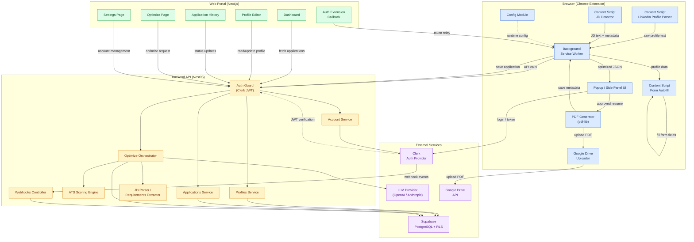
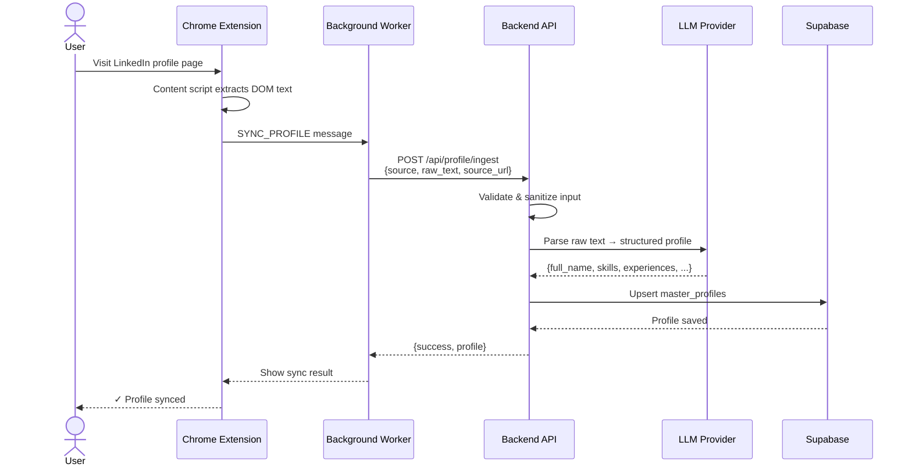
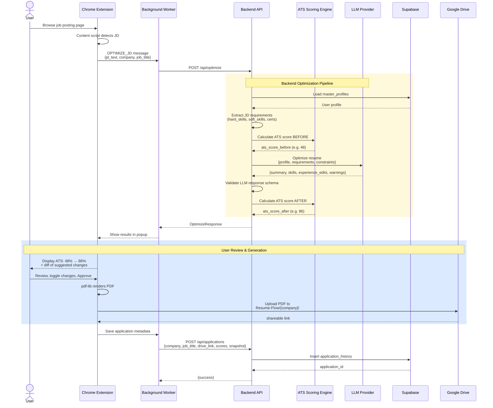
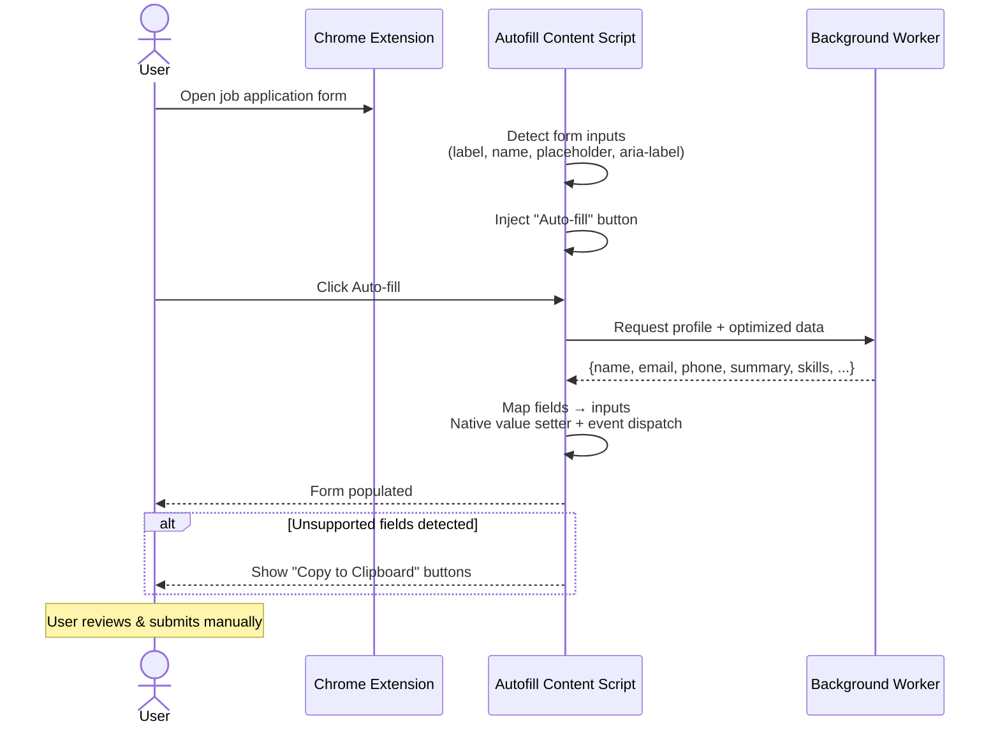
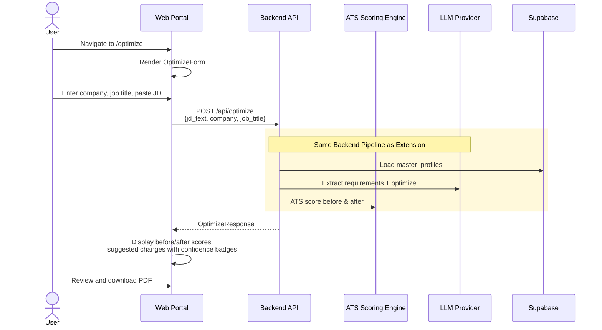
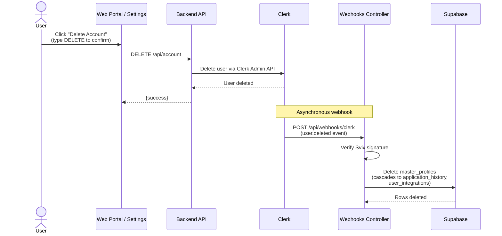
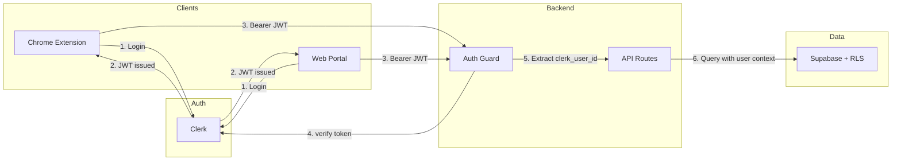
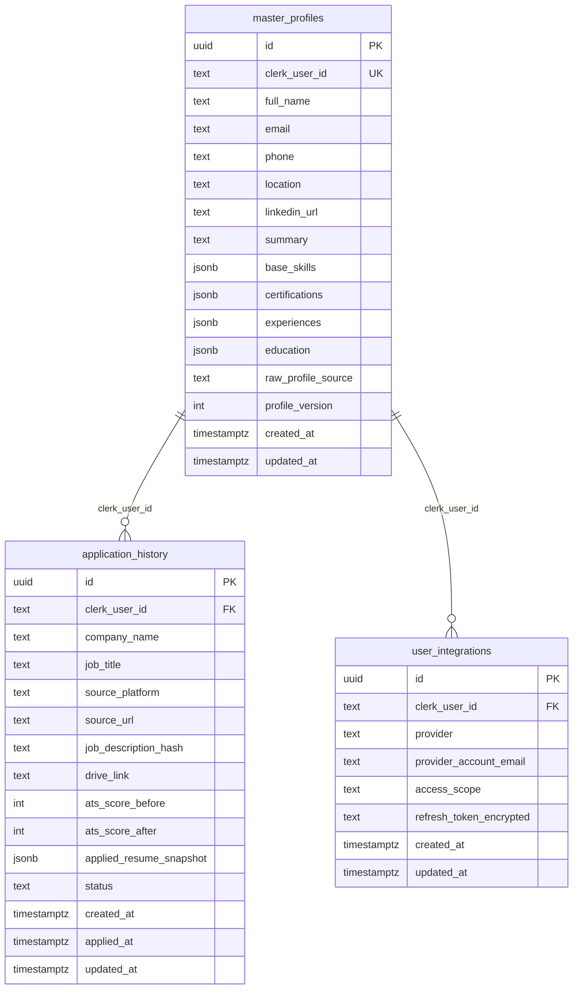
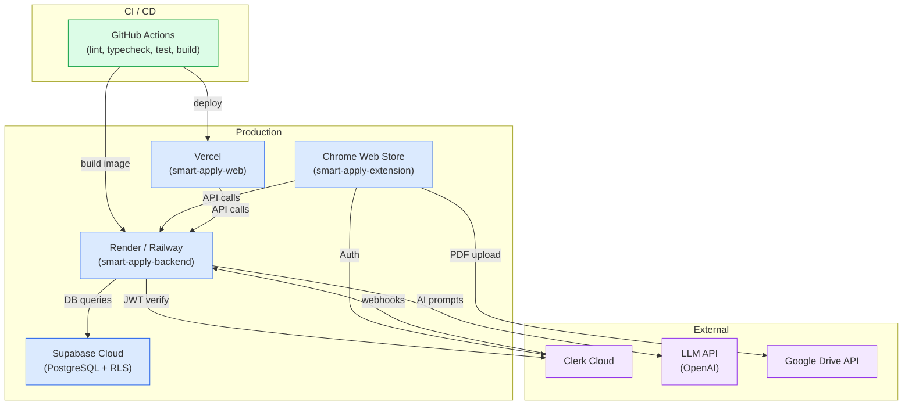
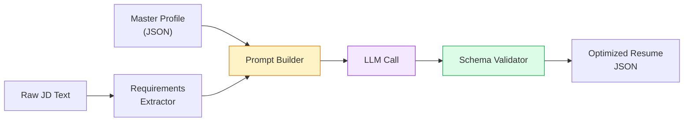

# Smart Apply — High-Level Architecture

> Based on **PRD v2.1** and **TRD v1.0**
> This document defines the system-level architecture, component responsibilities, and data flows.
> Business Requirements Document (BRD), Detailed HLD, and LLD will follow.

---

## 1. System Context

Smart Apply is a semi-automated AI assistant that helps job seekers tailor resumes for specific job descriptions, calculate ATS compatibility scores, generate PDF resumes, and auto-fill application forms — all while keeping the human in the loop.

### Core Principles
- **Client-first processing** — scraping, PDF rendering, and form fill happen in the browser
- **Server-side intelligence** — AI reasoning, scoring, and orchestration run on the backend
- **Zero resume file storage** — generated PDFs live in the user's Google Drive, never on our servers
- **Explicit user approval** — AI suggestions and final submission always require human confirmation

---

## 2. Repository Structure (Polyrepo)

```
smart-apply-shared/       Zod schemas + TypeScript types (npm package)
smart-apply-backend/      NestJS API — auth, scoring, LLM orchestration, webhooks
smart-apply-web/          Next.js web portal — dashboard, profile, optimize, settings
smart-apply-extension/    Chrome Extension (Manifest V3) — scraping, PDF, autofill
smart-apply-doc/          PRD, TRD, BRD, HLD, LLD, OpenAPI spec, architecture docs
supabase/                 Database migrations and Supabase local config
```

Each repo is independently buildable and deployable. `smart-apply-shared` is consumed via `file:` references in development and published as an npm package for CI/CD.

---

## 3. High-Level Architecture Diagram



---

## 4. Core Data Flow Diagrams

### 4.1 Profile Ingestion Flow



### 4.2 Resume Optimization Flow (Core Loop)



### 4.3 Form Autofill Flow



### 4.4 Web-Based Resume Optimization Flow



### 4.5 Account Deletion Flow (Webhook Cascade)



---

## 5. Authentication & Authorization Flow



**Key Rules:**
- Extension stores token in `chrome.storage.local`
- Web portal uses Clerk's built-in Next.js middleware
- Extension auth bridge: web portal hosts `/auth/extension-callback` that relays Clerk tokens to the extension via `chrome.runtime.sendMessage`
- Backend verifies JWT using `@clerk/backend` `verifyToken()`
- Clerk webhooks (user.deleted) are received by the backend Webhooks Controller with Svix signature verification
- Supabase enforces row-level security: `clerk_user_id = auth.jwt()->>'sub'`
- Google Drive scope limited to `drive.file` (only files created by app)

---

## 6. Data Model Overview



**Status Lifecycle:** `draft` → `generated` → `applied` → `interviewing` → `offer` / `rejected` / `withdrawn`

**Schema Management:** Database schema is migration-managed via `supabase/migrations/`. RLS policies are active on all tables, scoping data to the authenticated `clerk_user_id` via a `current_clerk_user_id()` SQL function. Cascading deletes are configured: deleting a `master_profiles` row cascades to `application_history` and `user_integrations`.

---

## 7. Component Responsibilities

| Component | Responsibility | Tech Stack |
|:---|:---|:---|
| **smart-apply-extension** | DOM scraping (LinkedIn/Indeed), JD detection, user review UI, PDF rendering (pdf-lib), form autofill, Google Drive upload, runtime config | React, Tailwind, Manifest V3, Vite, pdf-lib |
| **smart-apply-backend** | Auth verification, profile CRUD, JD parsing, ATS scoring, LLM orchestration, application metadata, Clerk webhook handling, account deletion | NestJS 11, Clerk, Supabase, OpenAI, Zod, Vitest |
| **smart-apply-web** | Dashboard, application history, profile editor/upload, optimize page, settings, auth extension callback | Next.js 15, React 19, Clerk, TanStack Query, shadcn/ui, pdfjs-dist |
| **smart-apply-shared** | Shared types, Zod schemas, enums | TypeScript, Zod |
| **smart-apply-doc** | PRD, TRD, BRD, HLD, LLD, OpenAPI, architecture | Markdown |
| **supabase/** | Database migrations, RLS policies, local dev config | Supabase CLI |

---

## 8. Deployment Architecture



**Deployment Artefacts:**
- **Backend:** Multi-stage Dockerfile (Node 20-alpine), port 3001
- **Web:** `vercel.json` with monorepo build config (`npm -w @smart-apply/web run build`)
- **CI:** GitHub Actions workflow (`ci.yml`) — TypeScript compile check for all 4 workspaces, backend Vitest suite, Next.js production build

---

## 9. ATS Scoring Engine (Heuristic)

```
Total: 100 points
├── Hard Skills Match:      50 pts (exact + synonym matching)
├── Role/Domain Relevance:  20 pts (job title ↔ experience titles)
├── Seniority Alignment:    10 pts (years/level match)
├── Soft Skills & Certs:    10 pts (keyword presence)
└── Keyword Coverage:       10 pts (density across resume sections)
```

Synonym map supports equivalences like `Node` ↔ `Node.js`, `Postgres` ↔ `PostgreSQL`. Keyword spam is capped. Score is labeled as an **internal heuristic**, not a guarantee of ATS passage.

**Section Weighting:** Resume sections contribute differently — skills carry full weight, experience sections are weighted at 80%, and summary at 60%. This prevents over-indexing on summary keyword stuffing.

---

## 10. AI Orchestration Pipeline



**Implementation:** Uses OpenAI GPT-4o via three methods:
- `extractRequirements()` — parses JD text into hard_skills, soft_skills, certifications
- `optimizeResume()` — generates resume edits with per-edit confidence scores (≥ 0.6 threshold)
- `parseProfileText()` — converts raw scraped/uploaded text into structured profile JSON

All outputs are validated with Zod schemas. Failed calls retry once before surfacing an error. Token usage is logged per call.

**LLM Constraints (from TRD §10.3):**
- No fabricated experience or certifications
- Minimal edit over full rewrite
- Infer adjacent skills only with explicit caution
- Low-confidence suggestions flagged in `warnings[]`
- Output validated against strict JSON schema

**LLM Output Contract:**
```json
{
  "summary": "string",
  "skills": ["string"],
  "experience_edits": [
    {
      "company": "string",
      "original_bullet": "string",
      "revised_bullet": "string",
      "inserted_keywords": ["string"],
      "confidence": 0.91
    }
  ],
  "warnings": ["string"]
}
```

---

## 11. Security Architecture

| Layer | Measure |
|:---|:---|
| **Auth** | Clerk JWT — verified on every API request |
| **Webhook verification** | Clerk webhooks verified via Svix signature; rawBody enabled on backend for signature integrity |
| **Data isolation** | Supabase RLS — `clerk_user_id = auth.jwt()->>'sub'` |
| **Storage** | Zero resume file storage on server; PDFs in user's Drive only |
| **Secrets** | Server-only env vars; extension bundle contains no secrets |
| **CORS** | Backend allows only `localhost:3000` (web) and `chrome-extension://` origins |
| **Input sanitization** | DOM-extracted text sanitized before backend processing |
| **XSS prevention** | No unsafe HTML rendering in diff UI |
| **Account deletion** | Clerk webhook (`user.deleted`) → cascading hard delete in Supabase via admin client |
| **Google Drive** | `drive.file` scope only — cannot access user's other files |
| **PII** | No PII in logs; raw JD stored temporarily only |

---

## 12. Development Phases (from TRD §23)

| Phase | Scope | Status |
|:---|:---|:---|
| **Phase 1** | Clerk auth, Supabase schema + RLS, Web Portal shell, Extension shell + auth bridge | ✅ Done — Auth guard, RLS policies, Next.js/Extension shells, auth callback bridge all wired |
| **Phase 2** | LinkedIn profile parser, profile ingest API, master profile CRUD, web profile upload | ✅ Done — LinkedIn content script, profile service, LLM-powered text parsing, drag-drop upload |
| **Phase 3** | JD extractor, optimize API, ATS scoring engine, LLM response validation, web optimize page | ✅ Done — Full scoring engine with synonym matching, GPT-4o orchestration, web-based optimize form + results |
| **Phase 4** | Review UI, PDF generation, Google Drive upload, application_history | 🟡 In Progress — PDF generation (pdf-lib), Google Drive upload, and application save implemented; extension review UI expanded |
| **Phase 5** | Autofill engine, LinkedIn Easy Apply support, clipboard fallback | 🟡 In Progress — Autofill content script with field detection and native value setter implemented; clipboard fallback present |
| **Phase 6** | Observability, QA hardening, Chrome Web Store release | 🔴 Not Started |

---

## Next Documents

- ~~**BRD** — Business Requirements Document~~ → `BRD-MVP-01.md` ✅
- ~~**HLD** — Detailed High-Level Design per component~~ → `HLD-MVP-P01.md`, `HLD-MVP-P02.md`, `HLD-MVP-P03.md` ✅
- ~~**LLD** — Low-Level Design (class diagrams, API contracts, DB migrations)~~ → `LLD-MVP-P01.md`, `LLD-MVP-P02.md`, `LLD-MVP-P03.md` ✅
- **AI Prompt Spec** — System prompts, few-shot examples, guardrails
- **Deployment Runbook** — Environment setup, CI/CD, monitoring
