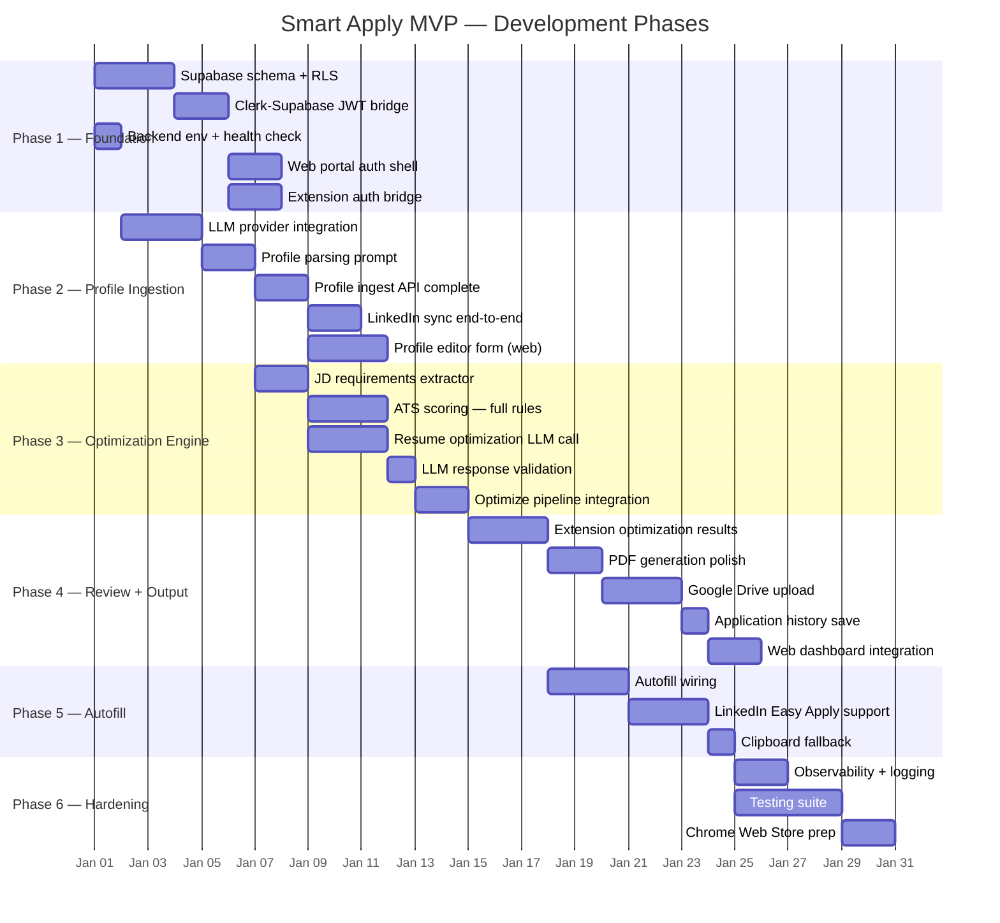
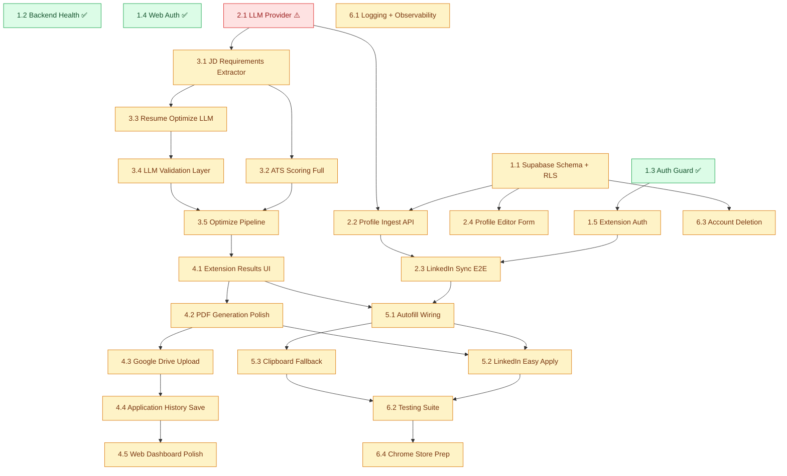

# Smart Apply — Implementation Plan

> Based on **PRD v2.1**, **TRD v1.0**, and **Architecture Document**
> This plan maps the 6 TRD development phases into granular, actionable engineering tasks.

---

## Current Status Summary

| Package | Status | What Exists | What's Missing |
|:---|:---|:---|:---|
| **smart-apply-shared** | ✅ ~100% | Zod schemas, TypeScript types for profile, application, optimization | None for MVP |
| **smart-apply-backend** | 🟡 ~60% | Auth guard, profile CRUD, optimize pipeline skeleton, scoring heuristic shell, application CRUD | LLM integration (6 stubs), profile text parsing, role/seniority scoring |
| **smart-apply-web** | 🟡 ~70% | Dashboard, stats cards, applications table, profile viewer, Clerk auth, API client | Profile edit form, optimization results UI, resume preview |
| **smart-apply-extension** | 🟡 ~65% | Manifest V3, content scripts (LinkedIn/Indeed), popup shell, pdf-lib generator, message bus, auth storage | Background handler API calls, optimization results UI, autofill wiring |

---

## Phase Overview



---

## Phase 1 — Foundation & Auth Wiring

**Goal:** Every surface (extension, web, backend) can authenticate a user end-to-end and the database is ready to receive data.

### Task 1.1 — Supabase Schema & RLS Deployment

**Repo:** `smart-apply-backend` + Supabase dashboard
**Status:** Not started

**Steps:**
1. Create migration SQL from `resume_flow_schema.sql` for the three core tables:
   - `master_profiles`
   - `application_history`
   - `user_integrations`
2. Enable RLS on all three tables.
3. Create RLS policies mapping `clerk_user_id` to `auth.jwt()->>'sub'`.
4. Set up Supabase JWT secret to accept Clerk-issued tokens.
5. Test: insert a row as user A, verify user B cannot read it.

**Acceptance Criteria:**
- [ ] All three tables exist in Supabase with correct column types
- [ ] RLS policies prevent cross-user data access
- [ ] Clerk JWT `sub` claim maps correctly to `clerk_user_id`

**Dependencies:** None

---

### Task 1.2 — Backend Environment & Health Validation

**Repo:** `smart-apply-backend`
**Status:** ✅ Done — `health.controller.ts` exists, `main.ts` bootstraps on port 3001

**Verify:**
- `GET /health` returns `{ status: 'ok', timestamp }`.
- CORS allows `localhost:3000` and `chrome-extension://*`.
- Environment variables load: `CLERK_SECRET_KEY`, `SUPABASE_URL`, `SUPABASE_SERVICE_ROLE_KEY`.

---

### Task 1.3 — Clerk Auth Guard Validation

**Repo:** `smart-apply-backend`
**Status:** ✅ Done — `clerk-auth.guard.ts` and `current-user.decorator.ts` exist

**Verify:**
- Request with valid Clerk Bearer JWT → `request.userId` is set.
- Request with invalid/missing JWT → 401 Unauthorized.
- `@CurrentUser()` decorator extracts `userId` correctly.

---

### Task 1.4 — Web Portal Auth Shell

**Repo:** `smart-apply-web`
**Status:** ✅ Done — Clerk middleware protects `/dashboard` and `/profile`

**Verify:**
- Unauthenticated users redirected to `/sign-in`.
- Authenticated users can access `/dashboard` and `/profile`.
- `api-client.ts` attaches Bearer token to all API calls.

---

### Task 1.5 — Extension Auth Bridge

**Repo:** `smart-apply-extension`
**Status:** ✅ Partially done — `auth.ts` stores/retrieves token, popup has login screen

**Remaining Steps:**
1. Wire the popup login flow to obtain a Clerk session token.
2. Store the token via `auth.ts` → `chrome.storage.local`.
3. Verify `api-client.ts` reads the stored token and attaches it as `Authorization: Bearer <token>`.
4. Add token refresh or re-login prompt on 401.

**Acceptance Criteria:**
- [ ] User can log in from the extension popup
- [ ] Token persists across popup open/close
- [ ] API calls include Bearer token
- [ ] 401 response triggers re-login prompt

**Dependencies:** Task 1.3 (backend auth guard)

---

## Phase 2 — Profile Ingestion

**Goal:** A user can sync their LinkedIn profile through the extension, have the backend parse it into structured data via LLM, and view/edit the profile on the web portal.

### Task 2.1 — LLM Provider Integration ⚠️ CRITICAL BLOCKER

**Repo:** `smart-apply-backend`
**Status:** 🔴 Stubbed — `llm.service.ts` has 6 TODO methods returning placeholders

**Steps:**
1. Choose LLM provider (OpenAI recommended for MVP; Anthropic as alternative).
2. Install SDK:
   ```bash
   npm install openai
   ```
3. Add environment variables:
   ```env
   LLM_PROVIDER=openai
   LLM_API_KEY=sk-...
   LLM_MODEL=gpt-4o-mini
   ```
4. Implement `LlmService` with two core methods:

   **`extractRequirements(jdText: string)`** — Extracts hard skills, soft skills, certifications from JD text.
   ```typescript
   // Input: raw JD text
   // Output: { hard_skills: string[], soft_skills: string[], certifications: string[] }
   // Prompt: system prompt enforcing JSON-only output + extraction rules
   ```

   **`optimizeResume(profile, requirements, constraints)`** — Returns minimal keyword injections.
   ```typescript
   // Input: master profile JSON + extracted requirements + constraints
   // Output: { summary, skills, experience_edits[], warnings[] }
   // Prompt: system prompt with anti-hallucination rules (TRD §10.3)
   ```

5. Add **`parseProfileText(rawText: string)`** — Parses raw LinkedIn text into structured profile.
   ```typescript
   // Input: raw text extracted from LinkedIn DOM
   // Output: { full_name, email, phone, location, summary, base_skills[], experiences[], education[] }
   ```

6. Add JSON schema validation on all LLM responses (use Zod `.safeParse()`).
7. Add timeout handling (10s timeout → retry once → graceful error).
8. Add structured logging for LLM calls (latency, token usage, validation pass/fail).

**Acceptance Criteria:**
- [ ] `extractRequirements()` returns valid JSON matching schema
- [ ] `optimizeResume()` returns diff-style edits with confidence scores
- [ ] `parseProfileText()` extracts structured profile from raw LinkedIn text
- [ ] Invalid LLM responses are caught by Zod validation
- [ ] Timeout/retry logic prevents hanging requests
- [ ] No API keys in extension bundle or client code

**Dependencies:** None — can start immediately

---

### Task 2.2 — Profile Ingestion API — LLM Integration

**Repo:** `smart-apply-backend`
**Status:** 🟡 Partially done — endpoint exists but doesn't call LLM

**File:** `profiles.service.ts` → `ingestProfile()` method

**Steps:**
1. In `ingestProfile()`, after receiving `raw_text`:
   - Call `llmService.parseProfileText(raw_text)` to extract structured data.
   - Validate the LLM response against the profile Zod schema.
   - Upsert into `master_profiles` with the structured fields.
   - Store `raw_text` in `raw_profile_source` for audit.
   - Increment `profile_version` on updates.
2. Handle `overwrite` flag: if `false` and profile exists, return existing without re-parsing.
3. Return the structured profile in the response.

**Acceptance Criteria:**
- [ ] `POST /api/profile/ingest` with raw LinkedIn text → returns structured profile
- [ ] Profile is saved to Supabase with all fields populated
- [ ] Subsequent calls with `overwrite: false` skip LLM re-parsing
- [ ] Invalid LLM output returns a meaningful error to the client

**Dependencies:** Task 2.1 (LLM service)

---

### Task 2.3 — Extension → Backend Profile Sync (End-to-End)

**Repo:** `smart-apply-extension`
**Status:** 🟡 Content script works, background handler is a stub

**File:** `service-worker.ts` → `SYNC_PROFILE` handler

**Steps:**
1. In the `SYNC_PROFILE` message handler:
   ```typescript
   // 1. Get the auth token
   const token = await getToken();
   // 2. Call the backend
   const result = await apiClient.post('/api/profile/ingest', {
     source: message.source,       // 'linkedin'
     raw_text: message.rawText,
     source_url: message.sourceUrl
   });
   // 3. Cache the profile locally
   await storage.set('cached_profile', result.profile);
   // 4. Notify the popup
   return { success: true, profile: result.profile };
   ```
2. Add error handling: network failure, 401, 500 → user-friendly messages.
3. Update `linkedin-profile.ts` content script button to show loading spinner during sync.
4. Update popup to reflect sync result (success notification or error).

**Acceptance Criteria:**
- [ ] Click "Sync to Smart Apply" on LinkedIn → profile parsed and saved
- [ ] Popup shows the synced profile summary
- [ ] Errors (network, auth, server) show appropriate user messages
- [ ] Profile is cached locally for offline popup display

**Dependencies:** Task 1.5 (extension auth), Task 2.2 (ingest API)

---

### Task 2.4 — Profile Editor Form (Web Portal)

**Repo:** `smart-apply-web`
**Status:** 🔴 View-only — `profile-editor.tsx` displays but has no edit UI

**Steps:**
1. Add form inputs for editable fields:
   - `full_name` — text input
   - `email` — email input
   - `phone` — tel input
   - `location` — text input
   - `summary` — textarea
   - `base_skills` — tag input (add/remove chips)
   - `experiences` — repeatable fieldset (company, role, start_date, end_date, description bullets)
   - `education` — repeatable fieldset (institution, degree, field, graduation_date)
2. Use React Hook Form + Zod resolver with schemas from `@smart-apply/shared`.
3. Wire save button to `PATCH /api/profile/me`.
4. Handle loading, saving, success, and error states.
5. Add keyboard accessibility: tab navigation, visible focus indicators.
6. Make form responsive (mobile-friendly).

**Acceptance Criteria:**
- [ ] User can edit all profile fields in-browser
- [ ] Changes save to backend and persist on reload
- [ ] Validation errors shown inline (from Zod schema)
- [ ] Loading spinner during save
- [ ] Success toast on save
- [ ] Skills rendered as add/remove chips
- [ ] Experience/education sections are repeatable (add/remove entries)

**Dependencies:** Task 1.4 (web auth), Task 1.1 (database)

---

## Phase 3 — Optimization Engine

**Goal:** The backend can accept a JD, extract requirements, compute ATS scores before/after, call the LLM for minimal keyword injection, and return a validated optimization result.

### Task 3.1 — JD Requirements Extractor

**Repo:** `smart-apply-backend`
**Status:** 🔴 Stubbed in `llm.service.ts`

**Steps:**
1. Implement `extractRequirements()` in `LlmService`:
   - System prompt: "You are a job description analyst. Extract exactly three lists from the JD text..."
   - Output schema:
     ```json
     {
       "hard_skills": ["Node.js", "SQL", "AWS"],
       "soft_skills": ["communication", "teamwork"],
       "certifications": ["AWS Solutions Architect"]
     }
     ```
   - Validate output with Zod.
2. Add fallback: if LLM fails, attempt basic regex/keyword extraction as degraded mode.
3. Normalize skill names (trim, lowercase for comparison, preserve original casing for display).

**Acceptance Criteria:**
- [ ] Given a real JD, returns categorized skill lists
- [ ] Output passes Zod validation
- [ ] Fallback extraction works without LLM
- [ ] Response time < 3 seconds

**Dependencies:** Task 2.1 (LLM provider)

---

### Task 3.2 — ATS Scoring Engine — Complete Implementation

**Repo:** `smart-apply-backend`
**Status:** 🟡 Partially done — hard skills (50pts) + soft skills (10pts) + keyword density (10pts) implemented; role (20pts) and seniority (10pts) return fixed values

**File:** `scoring.service.ts`

**Steps:**
1. **Role/Domain Relevance (20 pts):**
   - Extract job title keywords from JD (e.g., "Backend Engineer" → ["backend", "engineer"]).
   - Compare against experience role titles in the profile.
   - Scoring: exact title match = 20, partial keyword overlap = proportional (e.g., 3 of 4 keywords = 15).
   - Include synonym mapping: "Software Engineer" ↔ "Software Developer", "Backend" ↔ "Server-side".

2. **Seniority Alignment (10 pts):**
   - Detect seniority keywords in JD: "senior", "lead", "principal", "junior", "mid-level", "entry".
   - Calculate total years of experience from profile `experiences[]` (sum of date ranges).
   - Map: Junior (0-2yr), Mid (2-5yr), Senior (5-10yr), Lead/Principal (10+yr).
   - If seniority band matches → 10pts; one band off → 5pts; more → 0pts.

3. **Add keyword spam cap:**
   - Same keyword appearing 5+ times doesn't increase score beyond 3 occurrences.

4. **Add section-aware weighting:**
   - Skills in the `base_skills` array: full weight.
   - Skills found in `experiences[].description`: 80% weight.
   - Skills found only in `summary`: 60% weight.

**Acceptance Criteria:**
- [ ] Score accurately reflects hard skill coverage
- [ ] Role relevance score differentiates matching vs. non-matching titles
- [ ] Seniority score uses actual experience years
- [ ] Keyword spam is capped
- [ ] Total always sums to ≤ 100
- [ ] Unit tests cover edge cases (empty profile, missing JD, exact match)

**Dependencies:** Task 3.1 (requirements extractor provides the input)

---

### Task 3.3 — Resume Optimization LLM Call

**Repo:** `smart-apply-backend`
**Status:** 🔴 Stubbed in `llm.service.ts`

**Steps:**
1. Implement `optimizeResume()` in `LlmService`:
   - **System prompt** (per TRD §10.3):
     ```
     You are a resume optimization assistant. Your job is to inject missing
     keywords from the job description into the user's existing resume with
     minimal changes. Rules:
     - Do NOT fabricate experience or certifications
     - Do NOT generate new work history entries
     - Prefer inserting keywords into existing bullets over creating new ones
     - Only infer adjacent skills with explicit caution
     - Flag low-confidence changes in the warnings array
     - Return strictly valid JSON matching the output schema
     ```
   - **User prompt**: Include the full master profile JSON + extracted requirements + job title.
   - **Output schema**:
     ```json
     {
       "summary": "optimized summary string",
       "skills": ["merged skill list"],
       "experience_edits": [
         {
           "company": "Acme",
           "original_bullet": "Built backend APIs",
           "revised_bullet": "Built backend APIs using Node.js and AWS Lambda",
           "inserted_keywords": ["AWS Lambda"],
           "confidence": 0.92
         }
       ],
       "warnings": ["AWS certification inferred but not confirmed"]
     }
     ```
2. Validate LLM response with Zod `OptimizeResponseSchema`.
3. If validation fails: retry once with a stricter prompt addendum → then return error.
4. Log: prompt token count, response token count, latency, validation result.

**Acceptance Criteria:**
- [ ] Returns structured edits that match the output schema
- [ ] `experience_edits` reference real companies from the profile
- [ ] No fabricated experience entries
- [ ] Confidence scores present on all edits
- [ ] Warnings flagged for uncertain inferences
- [ ] Retry logic on schema validation failure

**Dependencies:** Task 2.1 (LLM provider), Task 3.1 (requirements as input)

---

### Task 3.4 — LLM Response Validation Layer

**Repo:** `smart-apply-backend`
**Status:** 🔴 Not started

**Steps:**
1. Create `llm-validators.ts` (or add to existing service):
   - Validate `extractRequirements` output against `ExtractedRequirementsSchema`.
   - Validate `optimizeResume` output against `OptimizeResponseSchema`.
   - Validate `parseProfileText` output against `ProfileSchema`.
2. Cross-validate LLM output against input:
   - Every `experience_edits[].company` must exist in the user's profile.
   - No skill should appear in `skills[]` that wasn't either in the original profile or the JD requirements.
   - `confidence` must be between 0 and 1.
3. Strip any unexpected fields from LLM output (defense against prompt injection in JD text).

**Acceptance Criteria:**
- [ ] Invalid JSON from LLM throws a structured error
- [ ] Cross-validation catches fabricated companies
- [ ] Unexpected fields are stripped silently
- [ ] Validation errors logged with the prompt context for debugging

**Dependencies:** Task 3.3 (needs LLM output to validate)

---

### Task 3.5 — Optimize Pipeline Full Integration

**Repo:** `smart-apply-backend`
**Status:** 🟡 Pipeline skeleton exists in `optimize.service.ts`

**Steps:**
1. Wire all components together in `optimizeResume()`:
   ```
   1. Load master profile from DB
   2. Extract requirements from JD text     → Task 3.1
   3. Calculate ATS score BEFORE            → Task 3.2 (profile vs requirements)
   4. Call LLM for optimization             → Task 3.3
   5. Validate LLM response                 → Task 3.4
   6. Build optimized profile (merge edits)
   7. Calculate ATS score AFTER             → Task 3.2 (optimized vs requirements)
   8. Return full response
   ```
2. Handle partial failures: if LLM fails, return the "before" score and requirements without edits.
3. Add request timing: total pipeline latency, per-step breakdown.
4. Ensure the response matches the API contract in `openapi.yaml`.

**Acceptance Criteria:**
- [ ] `POST /api/optimize` returns before/after scores + suggested changes
- [ ] Before score uses original profile; after score uses optimized profile
- [ ] Pipeline completes in < 10 seconds (TRD §16.1)
- [ ] Partial failure returns helpful error with whatever data was computed
- [ ] Response matches shared Zod schema `OptimizeResponseSchema`

**Dependencies:** Tasks 3.1–3.4

---

## Phase 4 — Review UI, PDF Generation & Drive Upload

**Goal:** The user can see optimization results, review/approve changes, generate a PDF, upload to Google Drive, and see the application saved in history.

### Task 4.1 — Extension Optimization Results UI

**Repo:** `smart-apply-extension`
**Status:** 🔴 Not started — popup has action buttons but no results display

**Steps:**
1. Wire the `OPTIMIZE_JD` handler in `service-worker.ts`:
   ```typescript
   // 1. Get token
   // 2. POST /api/optimize with JD text, company, job_title
   // 3. Return optimization result to popup
   ```
2. Create an optimization results screen in the popup:
   - **ATS Score Bar:** Show Before (e.g., 48%) → After (e.g., 86%) with animated progress bar.
   - **Suggested Changes List:** Each change shows:
     - Original bullet text (strikethrough)
     - Revised bullet text (highlighted additions)
     - Inserted keywords as tags
     - Confidence indicator (high/medium/low)
     - Checkbox (default: checked if confidence ≥ 0.7, unchecked otherwise)
   - **Warnings Section:** Display any LLM warnings.
   - **Action Buttons:** "Approve & Generate PDF" / "Cancel"
3. Handle loading state with progress indicator.
4. Handle error state with retry button.

**Acceptance Criteria:**
- [ ] ATS before/after scores displayed visually
- [ ] Each suggested change can be individually toggled
- [ ] Low-confidence changes default to unchecked
- [ ] Warnings displayed prominently
- [ ] "Approve & Generate" button only enabled when at least one change selected
- [ ] Loading/error states handled gracefully

**Dependencies:** Task 3.5 (optimize endpoint), Task 2.3 (extension ↔ backend wiring pattern)

---

### Task 4.2 — PDF Generation Polish

**Repo:** `smart-apply-extension`
**Status:** 🟡 Basic `pdf-generator.ts` exists with single-page layout

**Steps:**
1. Build the approved resume JSON from the user's toggle selections:
   - Merge accepted `experience_edits` into the profile copy.
   - Use the optimized `summary` and `skills` if the user accepted them.
   - Keep original values for rejected changes.
2. Enhance `pdf-generator.ts`:
   - ATS-friendly single-column template (no images, no columns, selectable text).
   - Section layout: Contact → Summary → Skills → Experience → Education.
   - Section-aware vertical spacing calculator.
   - Page overflow: continue on next page (not font size reduction).
   - Standard US Letter size (8.5" × 11").
3. Test with various profile sizes (many experiences vs. minimal).

**Acceptance Criteria:**
- [ ] Generated PDF is text-selectable
- [ ] Single-column ATS-friendly layout
- [ ] Multi-page overflow handled correctly
- [ ] All accepted edits reflected in the PDF
- [ ] Rejected edits show original text
- [ ] PDF renders in < 2 seconds (TRD §16.1)

**Dependencies:** Task 4.1 (user's approved selections)

---

### Task 4.3 — Google Drive Upload

**Repo:** `smart-apply-extension`
**Status:** 🔴 Not started

**Steps:**
1. Implement Google OAuth flow in the extension:
   - Use `chrome.identity.getAuthToken()` with `drive.file` scope.
   - Request token during onboarding or first upload.
   - Store consent status in `chrome.storage.local`.
2. Implement upload function:
   ```typescript
   async function uploadToDrive(
     pdfBytes: Uint8Array,
     fileName: string,
     folderName: string
   ): Promise<string> {
     // 1. Find or create "Resume-Flow" root folder
     // 2. Find or create company subfolder
     // 3. Upload PDF with multipart form
     // 4. Set file as publicly viewable via link
     // 5. Return shareable link
   }
   ```
3. File naming convention: `{FullName}_{JobTitle}_{YYYY-MM-DD}.pdf`
   - Example: `John_Doe_Backend_Engineer_2025-03-26.pdf`
4. Folder structure: `Resume-Flow/{Company_Name}/`
5. Handle errors: quota exceeded, permission denied, network failure → offer local download fallback.

**Acceptance Criteria:**
- [ ] Google OAuth consent flow works in extension
- [ ] PDF uploaded to correct folder structure
- [ ] Shareable link returned
- [ ] Local download fallback on upload failure
- [ ] `drive.file` scope only — no access to user's other files

**Dependencies:** Task 4.2 (PDF bytes to upload)

---

### Task 4.4 — Application History Save

**Repo:** `smart-apply-extension` + `smart-apply-backend`
**Status:** ✅ Backend endpoint exists; extension doesn't call it yet

**Steps:**
1. After successful Drive upload, call from extension:
   ```typescript
   await apiClient.post('/api/applications', {
     company_name: jobData.company,
     job_title: jobData.jobTitle,
     source_platform: jobData.platform,  // 'linkedin' | 'indeed'
     source_url: jobData.url,
     drive_link: driveShareableLink,
     ats_score_before: result.ats_score_before,
     ats_score_after: result.ats_score_after,
     status: 'generated',
     applied_resume_snapshot: approvedResumeJson
   });
   ```
2. Show success confirmation in popup with:
   - Link to the PDF in Drive.
   - Option to open the web dashboard.
3. Trigger status change to `applied` when user confirms they submitted the application.

**Acceptance Criteria:**
- [ ] Application metadata saved to Supabase after PDF upload
- [ ] Both ATS scores recorded
- [ ] Resume snapshot stored for history
- [ ] Success confirmation shown in extension popup
- [ ] Application appears in web dashboard

**Dependencies:** Task 4.3 (Drive link), Task 4.1 (optimization data)

---

### Task 4.5 — Web Dashboard — Drive Links & Score Display

**Repo:** `smart-apply-web`
**Status:** 🟡 Table exists but doesn't show Drive links or score improvement

**Steps:**
1. Update `ApplicationsTable` columns:
   - Add "ATS Score" column showing `before → after` with color coding.
   - Add "Resume" column with link to Google Drive PDF.
   - Add status dropdown for inline status updates.
2. Update `StatsCards`:
   - "Avg ATS Improvement" → calculate from `(after - before)` across all applications.
3. Add a detail/expand row showing the `applied_resume_snapshot` keywords.

**Acceptance Criteria:**
- [ ] ATS scores visible in the table
- [ ] Drive links open in new tab
- [ ] Status can be updated inline
- [ ] Stats cards show accurate aggregations

**Dependencies:** Task 4.4 (applications with full data)

---

## Phase 5 — Form Autofill

**Goal:** When a user opens a job application form, the extension can auto-populate fields from the master profile and optimized data.

### Task 5.1 — Autofill Message Wiring

**Repo:** `smart-apply-extension`
**Status:** 🟡 `autofill.ts` has field mapping logic but button triggers an unfinished handler

**Steps:**
1. Wire the autofill button in content scripts to send a message:
   ```typescript
   messageBus.send({
     type: 'AUTOFILL_REQUEST',
     tabId: currentTabId
   });
   ```
2. In `service-worker.ts`, handle `AUTOFILL_REQUEST`:
   ```typescript
   // 1. Load cached profile (from storage, or fetch from API)
   // 2. If a recent optimization exists, merge optimized summary/skills
   // 3. Send profile data back to the content script
   ```
3. In `autofill.ts`, receive the data and populate form fields using existing field mapping logic.
4. After population, highlight filled fields with a subtle border flash for user visibility.

**Acceptance Criteria:**
- [ ] Autofill button triggers data fetch from background
- [ ] Profile data populates matching form fields
- [ ] React-controlled inputs handled (native setter + event dispatch)
- [ ] Filled fields visually highlighted briefly

**Dependencies:** Task 2.3 (cached profile in extension)

---

### Task 5.2 — LinkedIn Easy Apply Support

**Repo:** `smart-apply-extension`
**Status:** 🟡 `dom-utils.ts` has selector registry for LinkedIn

**Steps:**
1. Map LinkedIn Easy Apply fields to profile fields:
   - First name / Last name → `full_name` (split)
   - Email → `email`
   - Phone → `phone`
   - Location / City → `location`
   - Resume upload → trigger file input with generated PDF
   - "Additional questions" → attempt heuristic matching
2. Handle multi-step modals: LinkedIn Easy Apply uses a paginated modal.
   - Detect modal transitions and re-scan for new fields on each step.
   - Attach autofill only to visible/active modal step.
3. Handle the resume upload input:
   - Intercept the file input and inject the generated PDF `Blob`.
4. Test against actual LinkedIn Easy Apply flows for at least 5 different job types.

**Acceptance Criteria:**
- [ ] Name, email, phone, location auto-filled on LinkedIn Easy Apply
- [ ] Multi-step modal handled (fields filled on each step)
- [ ] Resume PDF injected into file upload input
- [ ] No auto-click on Submit — user must submit manually
- [ ] Graceful degradation on unmapped fields

**Dependencies:** Task 5.1 (autofill wiring), Task 4.2 (PDF generation)

---

### Task 5.3 — Clipboard Fallback UX

**Repo:** `smart-apply-extension`
**Status:** 🔴 Not started

**Steps:**
1. When autofill detects unmapped fields or unsupported form structure:
   - Show a floating sidebar or popup section with each data point.
   - Each item has a "Copy" button → `navigator.clipboard.writeText()`.
   - Fields: name, email, phone, location, summary, skills (comma-separated), each experience bullet.
2. Track which fields were auto-filled vs. which needed manual copy.
3. Log the autofill coverage rate (metric from TRD §17.2).

**Acceptance Criteria:**
- [ ] Unmapped fields shown with copy buttons
- [ ] Copy-to-clipboard works reliably
- [ ] User can complete the form using copy buttons for unsupported fields
- [ ] Coverage metric tracked

**Dependencies:** Task 5.1

---

## Phase 6 — Observability, Testing & Release

**Goal:** Production-ready quality: structured logging, comprehensive tests, and Chrome Web Store submission.

### Task 6.1 — Structured Logging & Error Tracking

**Repo:** `smart-apply-backend`
**Status:** 🔴 Not started

**Steps:**
1. Add request ID middleware (generate UUID per request, attach to all logs).
2. Add request/response logging interceptor:
   - Log: method, path, status, latency, userId (from auth).
   - Do NOT log: request bodies containing PII, raw profile text, or tokens.
3. Add LLM-specific logging:
   - Prompt token count, completion token count, model name, latency.
   - Schema validation pass/fail.
   - Error type classification (timeout, rate limit, invalid response).
4. Add application metrics (can be simple structured JSON logs for MVP):
   - Optimize success rate.
   - Average ATS improvement.
   - JD parse failure rate.
   - Profile ingest success rate.
5. Add health check to verify DB connectivity and LLM reachability.

**Acceptance Criteria:**
- [ ] All requests have a unique request ID
- [ ] API latency logged for every endpoint
- [ ] LLM calls logged with token counts and latency
- [ ] No PII in logs
- [ ] Health check reports database and LLM status

**Dependencies:** None

---

### Task 6.2 — Testing Suite

**Repo:** All repos

**Steps:**

#### Backend Unit Tests
1. **ATS Scoring Engine** (`scoring.service.spec.ts`):
   - Empty profile → score 0.
   - Perfect match → score 100.
   - Synonym matching works (`Node` ↔ `Node.js`).
   - Keyword spam capped.
   - Role relevance calculation.
   - Seniority band matching.
2. **LLM Response Validation** (`llm-validators.spec.ts`):
   - Valid response passes.
   - Missing fields rejected.
   - Fabricated company caught by cross-validation.
   - Confidence out of range caught.
3. **Profile Ingest** (`profiles.service.spec.ts`):
   - Raw text → structured profile (with mocked LLM).
   - Overwrite flag behavior.
   - Upsert logic.

#### Backend Integration Tests
4. **Auth Guard** (`auth.guard.spec.ts`):
   - Valid JWT → passes.
   - Invalid JWT → 401.
   - Missing header → 401.
5. **Optimize Pipeline** (`optimize.service.spec.ts`):
   - Full pipeline with mocked LLM → returns before/after scores.
   - LLM failure → graceful degradation.

#### Extension Unit Tests
6. **PDF Generator** (`pdf-generator.spec.ts`):
   - Generates valid PDF bytes.
   - Handles empty experience list.
   - Multi-page overflow.
7. **Field Mapping** (`autofill.spec.ts`):
   - Known selectors matched correctly.
   - Unknown fields → clipboard fallback triggered.

#### Web Component Tests
8. **Profile Editor** (`profile-editor.spec.tsx`):
   - Renders all fields.
   - Form validation errors displayed.
   - Save triggers API call.
9. **Dashboard** (`dashboard-shell.spec.tsx`):
   - Loading state shown.
   - Error state shown.
   - Data rendered in table.

**Acceptance Criteria:**
- [ ] Scoring engine has ≥ 90% branch coverage
- [ ] LLM validation has ≥ 95% branch coverage
- [ ] All critical paths covered: auth, optimize, profile CRUD
- [ ] Tests pass in CI without external dependencies (all external calls mocked)

**Dependencies:** All Phase 1–5 tasks

---

### Task 6.3 — Account Deletion Flow

**Repo:** `smart-apply-backend`
**Status:** 🔴 Not started

**Steps:**
1. Set up Clerk webhook endpoint: `POST /api/webhooks/clerk`.
2. Verify webhook signature using Clerk SDK.
3. On `user.deleted` event:
   - Delete from `master_profiles` where `clerk_user_id` matches.
   - Delete from `application_history` where `clerk_user_id` matches.
   - Delete from `user_integrations` where `clerk_user_id` matches.
   - Log the deletion (without PII — just user ID and timestamp).
4. Ensure hard delete (not soft delete) per privacy policy.
5. Drive files are NOT deleted (user's property, per PRD §6).

**Acceptance Criteria:**
- [ ] Clerk `user.deleted` webhook triggers cascading hard delete
- [ ] All three tables cleaned
- [ ] Webhook signature verified (prevents spoofing)
- [ ] Deletion logged for audit

**Dependencies:** Task 1.1 (database schema)

---

### Task 6.4 — Chrome Web Store Release Prep

**Repo:** `smart-apply-extension`
**Status:** 🔴 Not started

**Steps:**
1. **Privacy Policy:** Draft a privacy policy page covering:
   - What data is collected (profile text, JD text — processed, not stored permanently on server).
   - What data is stored (master profile in Supabase, application metadata).
   - Where PDFs are stored (user's Google Drive only).
   - Account deletion process.
2. **Permission Justification:** Document why each permission is needed:
   - `storage` — persist auth token and cached profile.
   - `activeTab` — read page content when user clicks extension buttons.
   - Host permissions (`linkedin.com`, `indeed.com`) — content script injection.
3. **Store Listing:**
   - Description, screenshots (popup states, optimization flow).
   - Category: Productivity.
4. **Build & Package:**
   - Production build: `npm run build`.
   - Verify no source maps or API keys in the bundle.
   - Generate `.zip` for Chrome Web Store upload.
5. **Internal Testing:**
   - Load unpacked extension and test all flows end-to-end.
   - Test on Chrome Stable, Beta channels.

**Acceptance Criteria:**
- [ ] Privacy policy published
- [ ] Permission justifications documented
- [ ] Production build contains no secrets or source maps
- [ ] Extension tested end-to-end on Chrome Stable
- [ ] Store listing assets prepared (screenshots, description)

**Dependencies:** All Phase 1–5 tasks complete

---

## Dependency Graph



---

## Critical Path

The shortest path to a working demo:

```
2.1 LLM Provider → 2.2 Profile Ingest → 3.1 JD Extractor → 3.3 LLM Optimize
→ 3.5 Full Pipeline → 4.1 Results UI → 4.2 PDF → 4.3 Drive Upload → 4.4 Save
```

**Task 2.1 (LLM Provider Integration) is the single critical blocker.** Everything in Phases 3–4 depends on it. Start here.

---

## Parallel Work Streams

While the LLM integration progresses, the following tasks can proceed independently:

| Stream | Tasks | Owner Focus |
|:---|:---|:---|
| **Database** | 1.1 Supabase Schema + RLS | Backend |
| **Auth** | 1.5 Extension Auth Bridge | Extension |
| **Web UI** | 2.4 Profile Editor Form | Frontend |
| **Scoring** | 3.2 ATS Scoring (rule-based parts) | Backend |
| **Observability** | 6.1 Logging | Backend |
| **Account Lifecycle** | 6.3 Account Deletion Webhook | Backend |

---

## Environment Setup Checklist

Before starting development, ensure these are configured:

```
[ ] Clerk project created → CLERK_SECRET_KEY + CLERK_PUBLISHABLE_KEY
[ ] Supabase project created → SUPABASE_URL + SUPABASE_ANON_KEY + SUPABASE_SERVICE_ROLE_KEY
[ ] OpenAI API key obtained → LLM_API_KEY
[ ] Google Cloud project → GOOGLE_CLIENT_ID + GOOGLE_CLIENT_SECRET
[ ] Node.js ≥ 20 installed
[ ] npm workspaces verified: `npm install` from root
[ ] Backend starts: `cd smart-apply-backend && npm run start:dev`
[ ] Web starts: `cd smart-apply-web && npm run dev`
[ ] Extension builds: `cd smart-apply-extension && npm run dev`
```

---

## Completed Phases (Post-Original Plan)

### Phase P04 — Security, Testing & Quality Hardening ✅

**Status:** APPROVED_WITH_WARNINGS  
**Date:** 2025-01-27  
**Tests:** 66 passing across 4 packages  
**Deliverables:** BRD-MVP-02, HLD-MVP-P04, LLD-MVP-P04  
**Warnings:** W-01 through W-05 (test coverage gaps) → addressed in P05

### Phase P05 — Test Coverage Completion ✅

**Status:** APPROVED  
**Date:** 2025-01-27  
**Tests:** 85 passing across 3 packages (35 new tests added)  
**Deliverables:** BRD-MVP-03, HLD-MVP-P05, LLD-MVP-P05, REVIEW-P05  

**Summary of changes:**
- 5 new web component test files (OptimizeForm, OptimizeResults, DashboardShell, ProfileEditor, SettingsPage)
- 1 new extension test file (pdf-generator.spec.ts) + extended service-worker.spec.ts with OPTIMIZE_JD tests
- 1 new backend test file (cors.spec.ts) + extended webhooks.controller.spec.ts with audit tests
- 1 production code refactor: extracted `validateCorsOrigin()` from `main.ts` into `cors.ts` (behavior-preserving)
- Updated `smart-apply-web/vitest.config.ts` with `@/` path alias for test resolution
